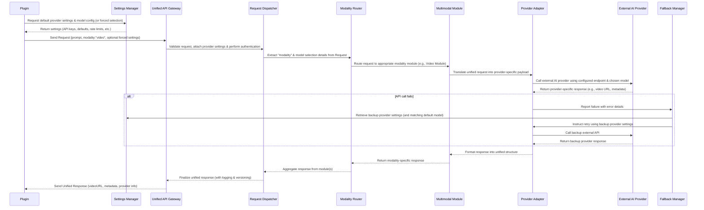
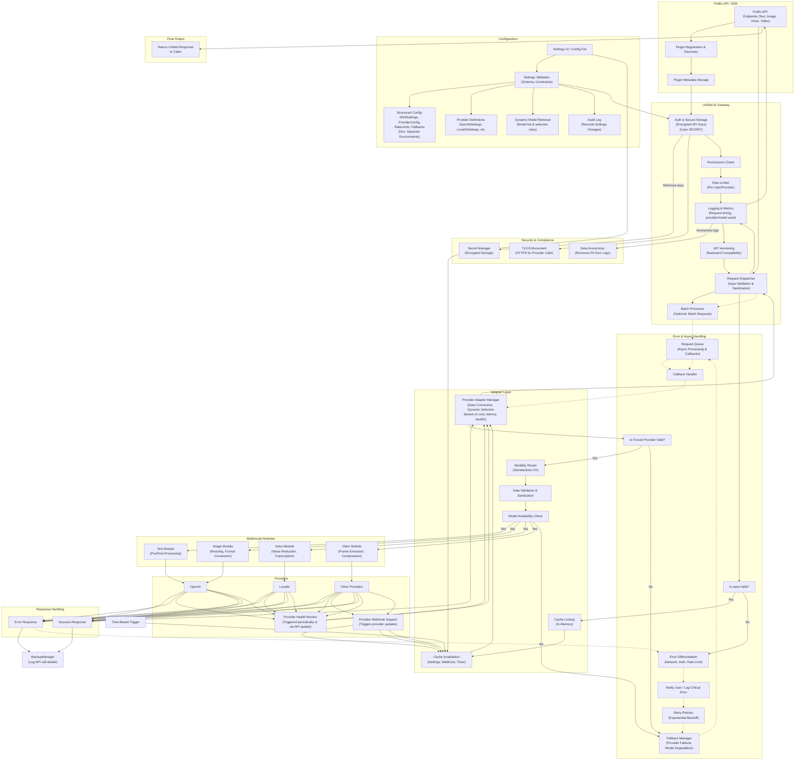

Nisaba Nexus Synthesis (NNS)

###### [[NNS.technical]]

----

###### [[NNS.settings]]

###### [[NNS.prototype]]

-----

So first step are 
	to create boiler obsidian plugin
		with BRAT capabilities
			so we can quickly deploy instance 
				and see how they interact with env

the setup this structure of code

### Sequence Diagram Participants

- **P (Plugin):**  
    The client-side plugin (e.g., an Obsidian plugin or another third-party plugin) that initiates the request. Its job is to capture user input (e.g., a prompt and the desired output type) and send a unified request without worrying about provider-specific details.
    
- **G (Unified API Gateway):**  
    The central entry point of the system. This layer is responsible for authentication, configuration management, logging, and caching. It receives the request from the plugin and then hands it off to the Request Dispatcher after initial validations.
    
- **R (Request Dispatcher):**  
    This component orchestrates the request flow after authentication. Its main role is to take the standardized request from the API Gateway and delegate it to the appropriate routing module, ensuring that all necessary processing steps are followed.
    
- **MR (Modality Router):**  
    The Modality Router examines the standardized request, specifically extracting the “modality” parameter (in this example, "video"). It then determines which specialized processing module should handle the request (e.g., Video Module) and routes it accordingly.
    
- **MM (Multimodal Module):**  
    The multimodal module for the requested type—in this case, the Video Module—takes over once the request is routed to it. Its job is to translate the unified request into a format that the provider adapter can understand. This involves mapping common parameters (like prompt and configuration settings) into the specific payload structure required by the external API.
    
- **A (Provider Adapter):**  
    The provider adapter acts as a translator between the unified request format and the API of a specific external AI provider. It converts the standardized, modality-specific request into the exact format that the external service (e.g., a video generation API) expects, and then it makes the call.
    
- **AP (External AI Provider):**  
    This represents the external service (such as an API for video generation) that processes the request and produces a modality-specific output (like a video URL or file). Once the request is processed, the provider returns its response back to the adapter.
    

---

### Step-by-Step Sequence Explanation

1. **Plugin Sends Request:**
    
    - **Action:**  
        The plugin (P) sends a unified request to the Unified API Gateway (G).
    - **Details:**  
        The payload includes parameters like the prompt and specifies the modality (in this example, `"modality": "video"`).
    - **Purpose:**  
        This ensures that the plugin remains simple and does not need to handle the complexities of multiple providers or modalities.

2. **Gateway Validates & Dispatches Request:**
    
    - **Action:**  
        The Unified API Gateway (G) receives the request and passes it to the Request Dispatcher (R).
    - **Details:**  
        During this phase, the gateway handles authentication (e.g., checking API keys), loads configuration settings, logs the request, and applies caching or rate limiting if necessary.
    - **Purpose:**  
        To secure and standardize the incoming request before further processing.

3. **Request Dispatcher Extracts Modality:**
    
    - **Action:**  
        The Request Dispatcher (R) extracts the `"modality"` parameter from the request and forwards the request to the Modality Router (MR).
    - **Details:**  
        This step ensures that the system knows what type of output is requested (video, in this case).
    - **Purpose:**  
        To route the request correctly based on the type of data (e.g., text, image, voice, video).

4. **Modality Router Routes Request:**
    
    - **Action:**  
        The Modality Router (MR) examines the modality and routes the request to the appropriate Multimodal Module (MM).
    - **Details:**  
        For a `"video"` modality, it directs the request to the Video Module.
    - **Purpose:**  
        To ensure specialized processing tailored to the modality is applied.

5. **Multimodal Module Translates Request:**
    
    - **Action:**  
        The Video Module (MM) takes the standardized request and translates it into a provider-specific format.
    - **Details:**  
        It adjusts the payload (e.g., formatting the prompt, setting parameters like resolution or style) so that it matches the requirements of the external video generation API.
    - **Purpose:**  
        To bridge the gap between the unified request format and the specific API contract of the chosen provider.

6. **Provider Adapter Calls External API:**
    
    - **Action:**  
        The Provider Adapter (A) receives the translated request from the Video Module and calls the external AI provider’s API (AP) for video generation.
    - **Details:**  
        This involves constructing an HTTP request that adheres to the provider’s specifications, sending it securely, and handling authentication tokens as needed.
    - **Purpose:**  
        To offload the actual AI processing task to a specialized external service.

7. **External AI Provider Processes Request:**
    
    - **Action:**  
        The external AI Provider (AP) processes the video generation request and returns a provider-specific response (e.g., a URL to the generated video).
    - **Details:**  
        The provider may include additional metadata (such as generation time or confidence scores) in its response.
    - **Purpose:**  
        To perform the complex task of generating the requested video output.

8. **Provider Adapter Formats the Response:**
    
    - **Action:**  
        The Provider Adapter (A) receives the response from the external provider and formats it into a unified structure.
    - **Details:**  
        It extracts key elements (like the video URL, any associated metadata) and ensures they conform to the unified response schema.
    - **Purpose:**  
        To hide provider-specific response details and present a consistent interface to the rest of the system.

9. **Multimodal Module Returns Modality-Specific Response:**
    
    - **Action:**  
        The Video Module (MM) receives the formatted response from the Provider Adapter and passes it back to the Modality Router (MR).
    - **Details:**  
        The response at this point is specific to the modality (video), but still standardized.
    - **Purpose:**  
        To allow further processing or aggregation if multiple providers were used.

10. **Modality Router Aggregates Response:**
    
    - **Action:**  
        The Modality Router (MR) aggregates the modality-specific response (and, if applicable, combines responses from multiple sources) and forwards it to the Request Dispatcher (R).
    - **Details:**  
        It might include logic to select the best response or merge multiple outputs.
    - **Purpose:**  
        To prepare a unified, coherent response for the client.

11. **Request Dispatcher Prepares Unified Response:**
    
    - **Action:**  
        The Request Dispatcher (R) receives the aggregated data from the Modality Router and finalizes the response format.
    - **Details:**  
        This unified response includes all necessary output (e.g., the video URL and any relevant metadata).
    - **Purpose:**  
        To provide a single, consistent response structure regardless of the modality or provider used.

12. **Unified API Gateway Sends Unified Response:**
    
    - **Action:**  
        Finally, the Unified API Gateway (G) sends the unified response back to the initiating Plugin (P).
    - **Details:**  
        The plugin receives a standardized output that it can then display or integrate into its UI.
    - **Purpose:**  
        To complete the request cycle and deliver the generated content to the end user in a consistent format.

---

### Summary

- **Plugin (P):** Initiates a request with parameters (prompt, modality).
- **Unified API Gateway (G):** Validates, configures, logs, and forwards the request.
- **Request Dispatcher (R):** Orchestrates routing and aggregates responses.
- **Modality Router (MR):** Determines which modality is required and routes the request accordingly.
- **Multimodal Module (MM):** Translates the request into provider-specific format for the given modality (e.g., Video Module for video requests).
- **Provider Adapter (A):** Calls the external AI provider's API, ensuring correct formatting and secure communication.
- **External AI Provider (AP):** Processes the request and returns a response.
- **Response Aggregation:** The response flows back through the layers, gets aggregated, and is sent as a unified response to the plugin.

![[NNS.OVERVIEW.DIAGRAM]]

and this overview

nice can see diagram right away wasnt expecting that 
	good stuff obsidiain
		do might get removed sadly ;(

## 1. Initialization & Configuration

### a. Loading Settings

- **Purpose:**  
    Load all necessary configuration parameters from persistent storage (e.g., Obsidian’s data storage or a configuration file). These settings include API endpoints, API keys, default providers, request parameters (e.g., temperature, max tokens), and security tokens.
    
- **Logic:**
    
    - On plugin load, read from storage (using Obsidian’s `loadData()` API).
    - Merge stored settings with default settings.
    - Provide a settings UI so users can update API keys, choose default providers, or modify parameters for different modalities (text, image, voice, video).

### b. Authentication & Security

- **Purpose:**  
    Ensure that sensitive data (such as API keys) is stored securely and not exposed to unauthorized users.
    
- **Logic:**
    
    - Store API keys securely, possibly using Obsidian’s encrypted storage mechanism.
    - Mask sensitive information in the UI (e.g., showing only a few characters).
    - Validate the settings before sending requests to ensure all necessary credentials are present.

---

## 2. User Interaction & Request Handling

### a. Command Registration & UI Integration

- **Purpose:**  
    Allow users to trigger the plugin via Obsidian commands, context menus, or even inline code blocks.
    
- **Logic:**
    
    - Register commands in the plugin’s `onload()` method (using Obsidian’s API).
    - Optionally, add a toolbar button or a side panel for users to input prompts and select modalities.
    - Use Obsidian’s modal dialogs for settings or prompt input if needed.

### b. Capturing User Input

- **Purpose:**  
    Accept a unified prompt from the user. This prompt includes the request text and a modality parameter (e.g., “text”, “image”, “voice”, “video”).
    
- **Logic:**
    
    - Listen for user commands or UI events.
    - Gather input fields (prompt text, modality, and optionally additional parameters like temperature).
    - Validate the input before sending the request (e.g., ensuring the prompt isn’t empty and that a valid modality is selected).

---

## 3. Forming a Unified Request

### a. Standardization

- **Purpose:**  
    Convert the raw user input into a unified request format that the AI Bridge expects.
    
- **Logic:**
    
    - Create a JSON object with keys such as:
        - `prompt`: the user’s prompt.
        - `modality`: indicates what type of output is needed (e.g., "text", "image", "voice", "video").
        - `provider` (optional): if the user wants to override the default provider.
        - Additional parameters: temperature, maxTokens, etc.
    - Ensure the request is in the correct format by running any necessary preprocessing (e.g., trimming whitespace).

---

## 4. Sending the Request to the AI Bridge

### a. HTTP Communication

- **Purpose:**  
    Transmit the standardized request to the unified AI Bridge via an HTTP API endpoint.
    
- **Logic:**
    
    - Use Obsidian’s native Node.js HTTP request libraries (or fetch) to send a POST request.
    - Include necessary headers, such as API keys (if not already handled by the gateway) and content-type headers (application/json).
    - Use asynchronous programming (e.g., async/await) to handle the network request without blocking the Obsidian UI.

### b. Error Handling & Retries

- **Purpose:**  
    Manage network errors or timeouts gracefully.
    
- **Logic:**
    
    - Wrap the HTTP call in try-catch blocks.
    - If the request fails (e.g., due to a timeout or network error), notify the user with a clear message (using Obsidian’s Notice API).
    - Optionally, implement a retry mechanism with exponential backoff if the error is transient.

---

## 5. Receiving and Processing the Response

### a. Unified Response Parsing

- **Purpose:**  
    Process the unified response returned from the AI Bridge so that it can be displayed in Obsidian.
    
- **Logic:**
    
    - Once the HTTP request returns, parse the JSON response.
    - The response should contain a standardized output (e.g., generated text, image URL, voice file URL, video URL) along with metadata.
    - Validate the response and handle any errors that may have been returned by the AI Bridge (for example, if a provider failed to generate content).

### b. Displaying the Output

- **Purpose:**  
    Present the result to the user in an intuitive and useful manner within Obsidian.
    
- **Logic:**
    
    - Depending on the modality:
        - **Text:** Display in a new note or as an inline block.
        - **Image:** Embed the image in a note (using markdown image syntax).
        - **Voice:** Provide an audio player to play the synthesized voice output.
        - **Video:** Embed a video player or provide a link to view the video.
    - Use Obsidian’s UI API to create a modal, sidebar, or inline view for the output.
    - Optionally, cache the response locally for offline access or future reference.

---

## 6. Logging and Monitoring

### a. Local Logging

- **Purpose:**  
    Record all interactions (requests and responses) for debugging and auditing.
    
- **Logic:**
    
    - Log requests and responses in the console (during development) or into a local file.
    - Use Obsidian’s internal logging facilities if available.
    - Ensure sensitive data (like API keys) are never logged in plaintext.

### b. Error Reporting

- **Purpose:**  
    Report errors back to the user in a non-disruptive manner.
    
- **Logic:**
    
    - Use Obsidian’s Notice API to display error messages.
    - Provide guidance on how to resolve common issues (e.g., “Check your API key in settings”).

---

## 7. Extensibility for Future Development

### a. Modular Code Structure

- **Purpose:**  
    Ensure that as new modalities or providers are added (image, voice, video), the plugin’s code remains manageable.
    
- **Logic:**
    
    - Isolate the connection logic (sending/receiving requests) from the UI logic.
    - Define clear interfaces for the request/response process.
    - Allow other developers to hook into events (e.g., after receiving a response) so they can extend functionality without modifying core code.

### b. API Exposure for Third-Party Plugins

- **Purpose:**  
    Enable other Obsidian plugins to use the AI Bridge without duplicating connection logic.
    
- **Logic:**
    
    - Expose a global API (e.g., via the window object) that provides methods like `invokeAI(prompt, options)`.
    - Document this API so that third-party developers know how to interact with your plugin.

---

## Summary of Obsidian Plugin Logic

1. **Initialization:**
    
    - Load configuration and settings.
    - Set up authentication and secure storage.
2. **User Interaction:**
    
    - Capture user input (prompt and modality).
    - Provide an intuitive UI (command palette, modal dialog, side panel).
3. **Request Standardization & Transmission:**
    
    - Convert input into a standardized JSON request.
    - Send the request to the unified AI Bridge via HTTP (with proper security).
4. **Response Handling:**
    
    - Parse and validate the unified response.
    - Display the output appropriately (text, image, voice, video).
5. **Logging & Monitoring:**
    
    - Log activities and errors securely.
    - Report issues to the user using non-intrusive notifications.
6. **Extensibility:**
    
    - Provide a modular, documented global API for future plugins to build on top of your connection layer.

This breakdown ensures that the Obsidian plugin remains a lightweight connection layer focused solely on handling requests to the AI Bridge, leaving the heavy lifting (provider adaptation, modality routing, security, etc.) to the underlying architecture. This separation of concerns promotes both rapid development and long-term maintainability, allowing the plugin to evolve as new AI modalities and providers emerge.

----

found this 
	which his capable of doing image generator
		find who he implements his code
https://github.com/qgrail/obsidian-ai-assistant

fork which allows for local LLMs
	https://github.com/dh1011/obsidian-ai-assistant

We got this guy 
	big props truly, but 
		not in the direction we are looking for 
			seems like very boiler plate missing key foundation 
				and thats where we can step in
					we want a connection to all>..
https://github.com/HongjianTang/obsidian-ai-interface

THis could be useful but pretty old
https://github.com/clementpoiret/ai-mentor

-----
