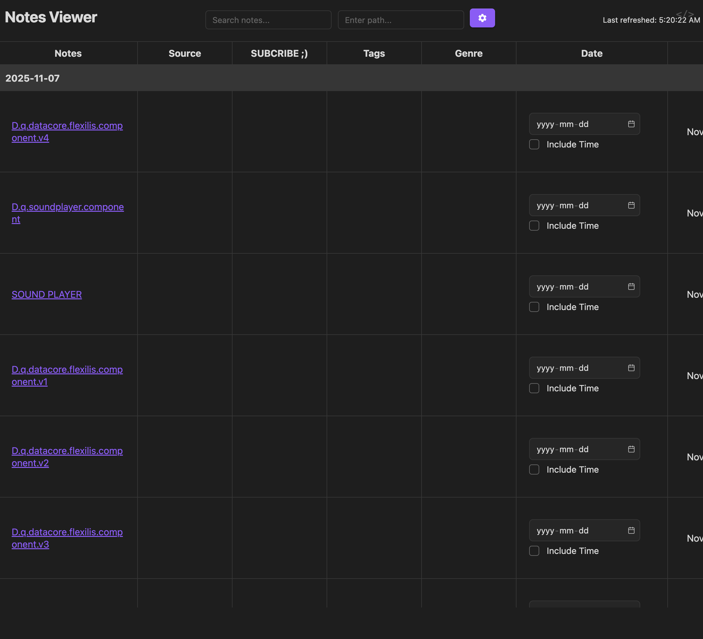

### Tab: DATACORE.flexilis v4

- **Description**: A highly modular and intelligent data grid component that automatically adapts its presentation based on the underlying data types in your notes. It separates its core logic, components, and styles into distinct, manageable blocks, making it highly customizable. With the introduction of high-performance row virtualization, it can now smoothly handle thousands of entries, while new cell types for dates, booleans, and tags make data interaction more intuitive and powerful than ever before.

- **Does**:

    - **Modular Architecture**: The entire component is broken down into logical parts (View, Components, Helpers, Styles, Settings), which are loaded dynamically. This makes the code easier to understand, maintain, and customize.
    - **Automatic Cell Typing & Rendering**:
        - Intelligently detects the data type of a frontmatter property (using Obsidian's metadata manager or property name heuristics).
        - **Date/Time Cells**: Renders a dedicated, editable UnifiedDateCell for date and datetime properties, complete with a calendar picker and an optional time input.
        - **Checkbox Cells**: Displays boolean true/false values as interactive checkboxes.
        - **Tag & List Cells**: Renders multi-value fields (like tags or ingredients) as a list of "chips" that can be edited, with a UI for adding and removing items.
    - **High-Performance Virtualization**:
        - Automatically enables a **virtualized renderer** when pagination is turned off.
        - This allows the grid to display and scroll through thousands of rows with minimal performance impact by only rendering the items currently visible on screen.
    - **Live Display Customization**: A new "Display Settings" panel in the edit mode allows users to:
        - Toggle text truncation on or off for all cells.
        - Adjust the height of table rows in real-time.
    - **Advanced Grouping Engine**: The grouping logic has been significantly enhanced to correctly handle:
        - **Multi-value fields**: A single note can now appear under multiple group headers if it has multiple tags, ingredients, etc.
        - **Chronological Sorting**: Groups based on date or datetime fields are automatically sorted chronologically instead of alphabetically.
    - **Retains Core Editing Features**: Continues to support live saving of frontmatter changes, file deletion, and full column management (add, remove, reorder, and regroup).

- **Can’t**:    

    - **Undo Data Edits**: Changes made to cells are saved directly to the note's frontmatter. There is no built-in undo/redo functionality for these edits.
    - **Full-Dataset Grouping with Pagination**: When pagination is enabled, grouping is performed only on the currently visible page of data, not the entire dataset. To see a complete, aggregated group view, pagination must be disabled.
    - **Initial Load Time for Massive Queries**: While virtualization makes scrolling fast, the initial Dataview query to fetch and filter a very large number of files (tens of thousands) can still be slow.
    - **Edit Complex YAML**: The frontmatter parsing is designed for simple key-value pairs and lists. It may not reliably update deeply nested or complex YAML structures.

- **Disclaimer & License**:   

    - **Experimental Nature**: This component is entirely AI-generated and should be considered experimental. It is a work-in-progress that may contain bugs or behave unexpectedly. Users are encouraged to iterate and refine the code to fit their needs.
    - **Editor Recommendation**: For optimal editing performance and to prevent potential data loss when the table re-renders, it is highly recommended to have the **Hover Editor** plugin enabled.
    - **License**: This project is licensed under the **GNU General Public License v3.0 (GPL-3.0)**. You are free to download, modify, and redistribute the files, provided you adhere to the terms of the GPLv3 license. The full license text can be found at [https://www.gnu.org/licenses/gpl-3.0.html](https://www.google.com/url?sa=E&q=https%3A%2F%2Fwww.gnu.org%2Flicenses%2Fgpl-3.0.html).

-----

### Components

###### [DATACORE.flexilis Viewer v4](D.q.datacore.flexilis.viewer.v4.md)

###### [DATACORE.flexilis Component v4](D.q.datacore.flexilis.component.v4.md)

