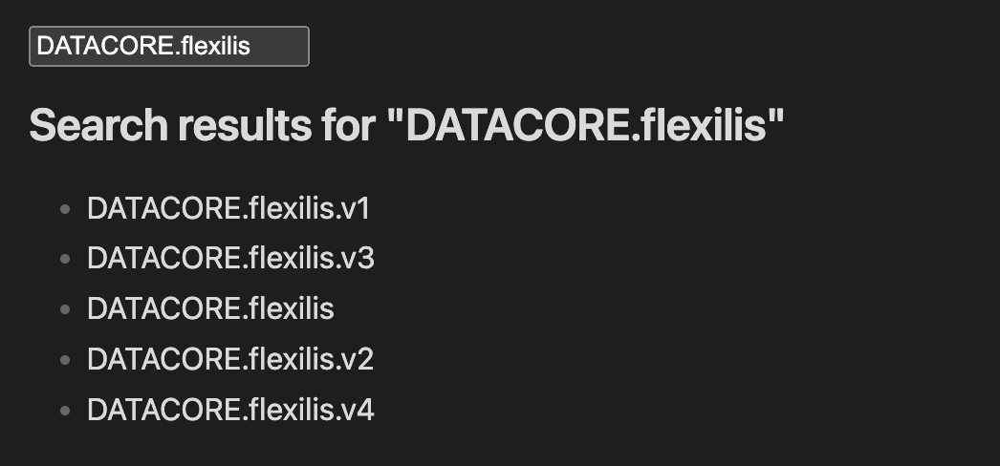

### Tab: Search Query

- **Description**: A minimalist example component designed to teach the basics of **dynamic querying** in Datacore. It creates a reactive search interface where a user's text input is immediately used to filter a list of files in the vault. It demonstrates the power of combining React's useState hook with Datacore's useQuery hook.

- **Does**:

    - **Live Search**:
        - Features a text input box bound to the component's state.
        - As the user types, the component re-renders and updates the search term instantly.
    - **Dynamic Query Generation**:
        - Constructs a Datacore query string on the fly: @page and $name.contains("...").
        - Fetches and returns only the files whose names match the input text.
    - **Conditional Rendering**:
        - Checks if results exist. If yes, it renders a clean unordered list (`<ul>`) of file names.
        - If no matches are found, it gracefully displays a "No files found" message.

- **Can’t**:

    - **Search File Content**: It restricts the search strictly to the **file name** ($name). It does not look inside the note's body or frontmatter.
    - **Open Files**: The list items are simple text elements (`<li>`). Clicking them does not open the note (though this could be easily added).
    - **Sort Results**: It displays results in the default order returned by Datacore; there is no sorting logic (e.g., by date or alphabetical).

-----

### COMPONENTS

###### [Search Query Viewer](D.q.searchquery.viewer.md)

###### [Search Query Component](D.q.searchquery.component.md)
