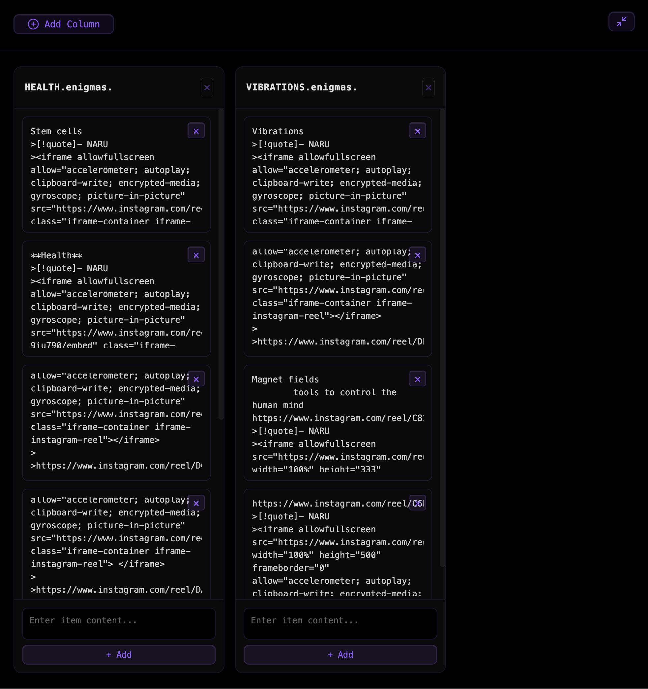

### Tab: Kanban

- **Description**: A powerful, file-driven Kanban board that visualizes markdown file sections as fully interactive cards. This advanced version introduces complete intra-lane reordering, allowing users to visually sort items within a column and have those changes written directly back to the source file. With an enhanced UI, including intuitive drop zones and a global file drop target, it provides a seamless, tactile interface for organizing content across multiple notes.

- **Does**:

    - **File-as-Column System**: Each column on the board represents a specific markdown file. An improved "Add Column" modal features a "Quick Add" section, which automatically lists available files from a predefined knowledge folder for rapid board setup.        
    - **Section-as-Item Parsing**: Intelligently parses each linked markdown file, splitting the content after a #### AENIGMAS marker into individual cards based on --- separators.
    - **Full Live File Manipulation**: All drag-and-drop actions on the board directly modify the source markdown files in real-time:
        - **Inter-Lane Moving**: Dragging a card from one column to another moves its text content from the source file to the target file.
        - **Intra-Lane Reordering**: Dragging and dropping a card within the same column physically reorders the sequence of text blocks in the corresponding markdown file, ensuring the visual order is always persisted.
        - **Inline Editing, Adding & Removing**: Supports live editing of card content, adding new cards (which appends content to the file), and deleting cards (which removes content from the file).
    - **Advanced Drag-and-Drop UI**:
        - **Intuitive Drop Indicators**: Visual "Drop Here" zones appear between cards when dragging, allowing for precise placement and reordering.
        - **Global File Drop Zone**: Users can drag markdown files directly from Obsidian's file explorer and drop them onto the board to instantly create new columns.
        - **Column Reordering**: The columns themselves can be reordered via drag-and-drop.
    - **Robust State Persistence**: Automatically saves the entire board state, including the order of columns and items, to a dedicated cache file (.datacore/dc.kanban/kanban-cache.json). This ensures the board's structure and layout are fully preserved across sessions.
    - **Immersive Full-Tab Mode**: Retains the ability to expand into a full-pane view for a focused, distraction-free Kanban experience.

- **Can’t**:
    
    - **Create New Files**: The component adds existing files as columns but does not have a feature to create new markdown files from within the UI.        
    - **Handle Complex Markdown within Items**: It treats each section between --- separators as a plain text block. It may not reliably parse or preserve complex internal structures like nested lists, frontmatter, or Dataview queries within a single card.
    - **Merge External Changes**: Since it directly writes to files, any edits made to a file outside of the Kanban view may be overwritten by subsequent actions on the board. There is no conflict resolution.
    - **Persist Non-File-Backed Columns**: While it is possible to have columns that are not linked to a file, the items within these columns are only stored in the session cache and are not saved to any markdown file.

-----

### Components

###### [Kanban Viewer](D.q.kanban.viewer.md)

###### [Kanban Component](D.q.kanban.component.md)

