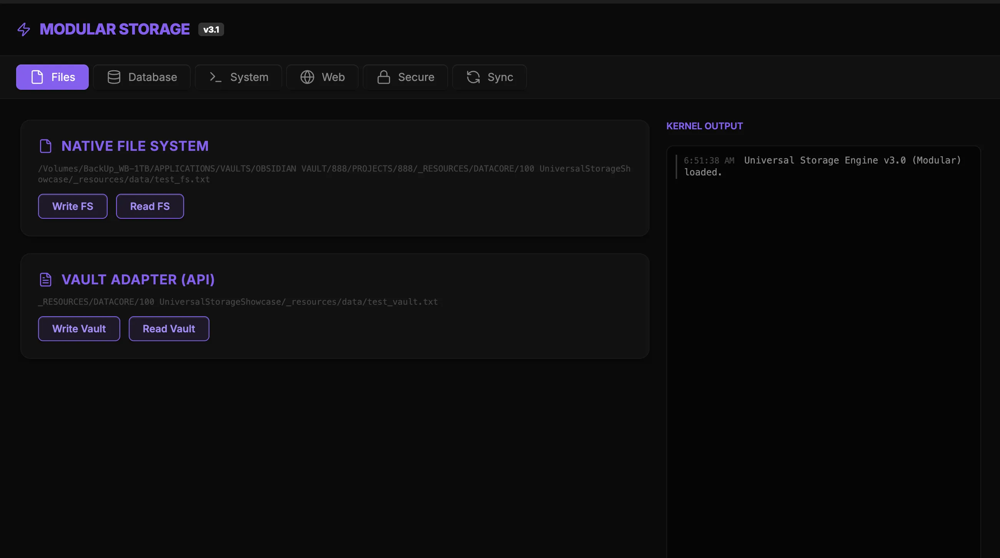

### Tab: Universal Storage Showcase

- **Description**: The Universal Storage Showcase is a high-fidelity diagnostic dashboard designed to demonstrate and verify 10+ data persistence methodologies within the BetoOS ecosystem. It provides a real-time feedback loop for evaluating the reliability and performance of various storage backends across native and browser-based environments.

- **Does**:

    - **Multi-Backend Support**:
        - Integrates and tests 10+ storage methodologies including Native FS, Obsidian Vault API, SQLite, IndexedDB, and LocalStorage.
        - Verifies remote nodes including MongoDB, LevelDB, Redis, S3, and Azure Blob.
    - **Telemetry & Monitoring**:
        - **Real-Time Dashboard**: Features live latency graphs and operations-per-second monitoring for performance benchmarking.
    - **Data Verification**:
        - Implements a synchronized "Data Persistence Verification" stream for immediate, high-fidelity proof-of-write.

- **Can't**:

    - **Production Persistence**: Designed strictly as a testing and diagnostic suite; not intended for high-volume production data storage.
    - **Latency Buffering**: Real-time telemetry is direct; high-latency storage nodes (e.g., S3) may show asynchronous delays in the dashboard.

------

### Components
###### [Universal Storage Viewer](D.q.universalstorage.viewer.md)
###### [Universal Storage Components {index.jsx}](_RESOURCES/DATACORE/100%20UniversalStorageShowcase/src/index.jsx)
