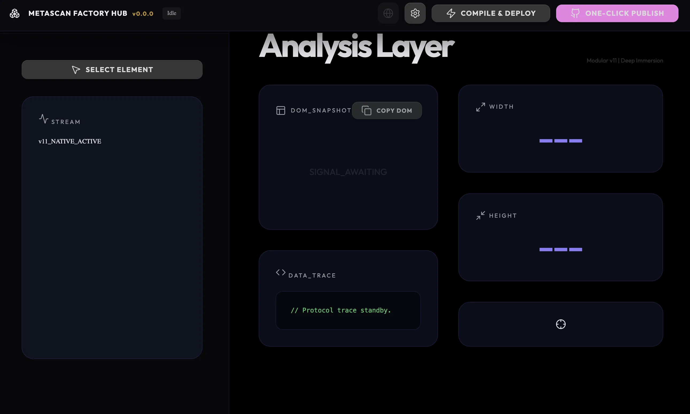

### Tab: Native Grab

- **Description**: A tactical plugin-factory and DOM inspection engine designed for high-fidelity Obsidian development. It enables developers to "grab" and analyze any Obsidian element (Meta-Scan) and manage the entire plugin lifecycle—from local deployment to GitHub publishing—within a single unified HUD.

- **Does**:

    - **Meta-Scan Analysis Layer**: Deep DOM inspection for Obsidian UI components, extracting metadata, class structures, and state properties.
    - **Recursive Node Discovery**: Traverses the active workspace tree to identify and isolate specific plugin-injected elements.
    - **Plugin Factory Pipeline**: Orchestrates one-click bundling of source code using standard Obsidian developer protocols.
    - **Resilient Deployment Engine**: Manages local plugin installation, manifest synchronization, and hot-reload triggers via CLIBridge.
    - **GitHub Publishing HUD**: Automates version-bumping, tag creation, and binary asset population to GitHub repositories.
    - **Secrets-Gated Auth**: Integrates with dc.app SecretStorage for secure, credential-managed publishing.

- **Can't**:

    - **Non-Standard Plugin Architectures**: Optimized for standard Obsidian structures; fragmented projects may require manual configuration.
    - **External Build Dependencies**: Requires host-level Node.js, npx, and esbuild for the synthesis pipeline.
    - **Bypass Plugin API**: Deployments and reloads are subject to official Obsidian Plugin API constraints.

------

### Components
###### [Native Grab Viewer](D.q.nativegrab.viewer.md)
###### [Native Grab Components {index.jsx}](_RESOURCES/DATACORE/101%20NativeGrab/src/index.jsx)
