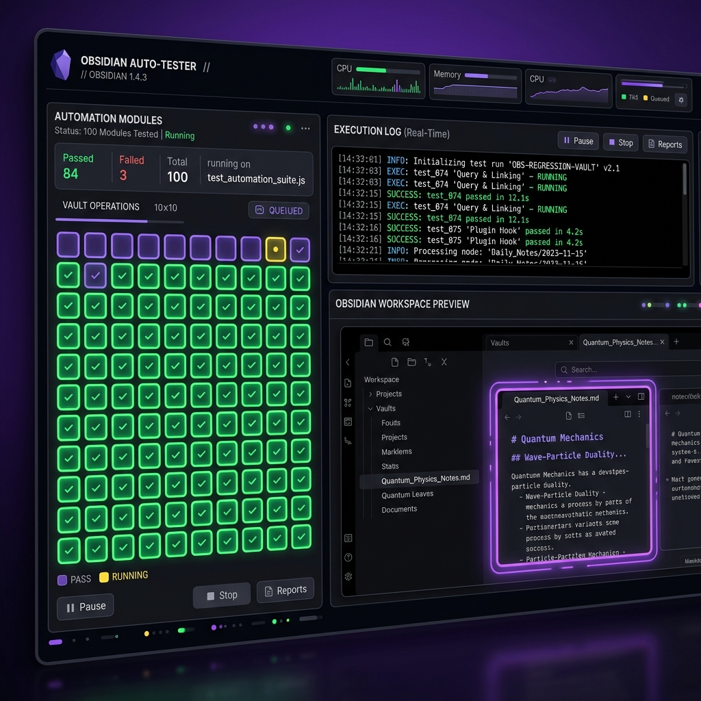

### Tab: Obsidian Automation CDP

- **Description**: An advanced automation and testing suite for Obsidian, utilizing the Chrome DevTools Protocol (CDP) via obsidian-cli for real-time interaction, DOM inspection, and visual regression testing.

- **Does**:
    - **Automated Interaction Sequences**:
        - Supports complex multi-step scenarios including page traversal, UI state audits, and interaction verification.
        - **Randomized Grid Test**: Features a 100-spot grid test to verify spatial UI responsiveness and collision detection.
    - **CDP-Powered DOM Inspection**:
        - Enables real-time inspection of the Obsidian workspace DOM using CSS selectors.
        - **Property Audits**: Can audit specific element properties such as text content, background colors, and visibility states.
    - **Visual Regression & Screenshots**:
        - Provides one-click high-fidelity screenshot capture of the current workspace state.
        - **Reality Verification**: Integrates an 'Anti-Cheat' system to prove real-time interaction via obsidian-cli.
    - **Component ID Targeting**: Allows for precise targeting and automation of specific UI components using unique HTML IDs.

- **Cannot**:
    - **Run on Mobile or Browser**: Requires the obsidian-cli tool and Node.js environment available only on desktop versions of Obsidian.
    - **Simulate Native OS Inputs**: Interaction is limited to the Chrome DevTools Protocol level within the Obsidian application window.

- **Disclaimer**:
    - This component is an advanced development tool designed for technical audits and automated testing. It requires obsidian-cli to be correctly configured in the system PATH. Use with caution when automating destructive UI actions.

---

### COMPONENTS

###### [Obsidian Automation CDP Viewer](ObsidianAutomationCDP.viewer.md)

###### [Obsidian Automation CDP Component {index.jsx}](111%20ObsidianAutomationCDP/src/index.jsx)
