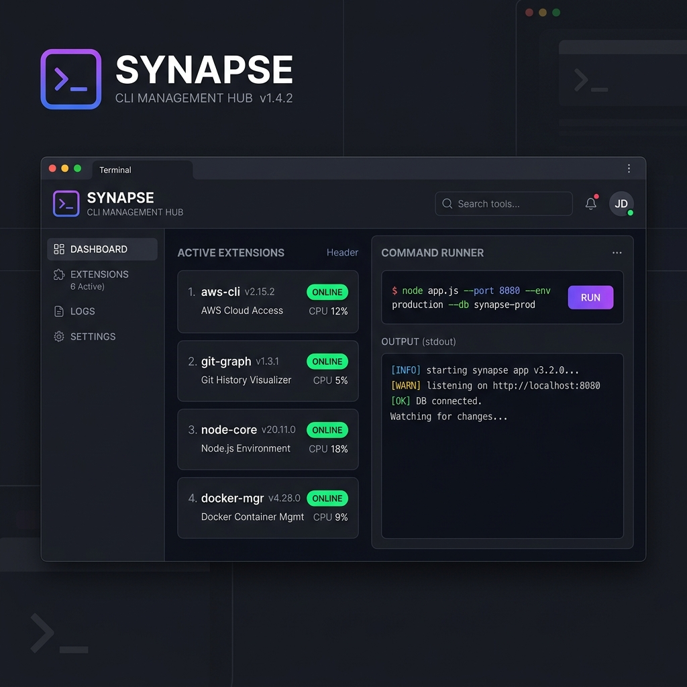

### Tab: CLI Extension Manager

- **Description**: A centralized hub for managing and deploying custom CLI extensions for Obsidian. It establishes a cross-platform protocol bridge enabling terminal-to-vault synchronization and the execution of complex vault commands from external environments.

- **Does**:
    - **Cross-Platform Protocol Bridge**:
        - Initializes a portable Node.js wrapper (`obsidian-bridge.js`) to bridge terminal commands to the vault.
        - Supports cross-environment synchronization via the `obsidian://` URI scheme.
    - **Extension Lifecycle Management**:
        - Centralized dashboard to view, register, and monitor active CLI extensions and handlers.
        - **System Sync**: Provides 'One-Click' synchronization to arm the system bridge within the vault's internal scripts.
    - **Real-Time Telemetry & Monitoring**:
        - Integrated terminal for monitoring CLI request traffic and execution logs.
        - **Background Monitor**: Background task monitor with progress indicators for heavy operations.

- **Cannot**:
    - **Function Without Node.js**: The bridge infrastructure fundamentally relies on Node.js being installed on the host system.
    - **Control External OS Processes Directly**: While it can receive commands from the shell, its primary focus is translating those commands into Obsidian-specific actions.

- **Disclaimer**:
    - Initializing the bridge modifies files within the `.obsidian/scripts` directory. Ensure you have backups of your configuration before performing a system sync.

---

### COMPONENTS

###### [CLI Extension Manager Viewer](D.q.cli.extension.manager.viewer.md)

###### [CLI Extension Manager Component {index.jsx}](112%20CLIExtensionManager/src/index.jsx)
