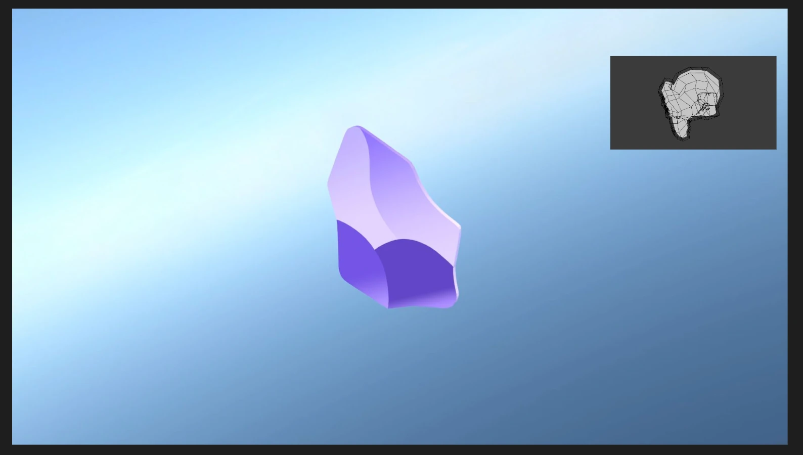

### Tab: Lottie Experiment

- **Description**: A specialized and resilient component for creating dynamic, layered scenes by overlaying multiple Lottie animations. It is designed to be highly robust, using fuzzy searching to locate animation files by name rather than a fixed path. The component also intelligently manages its own dependencies, loading and caching them for optimal performance and offline use.
    
- **Does**:
    
    - **Layered Animations**: Renders two Lottie animations simultaneously: a main animation that fills the background and a smaller overlay animation positioned in the top-right corner.
    - **Interactive Playback**: The overlay animation includes a built-in hover effect, pausing when the user's mouse is over it and resuming playback when the mouse leaves.
    - **Fuzzy File Search**: Instead of requiring exact file paths, the component accepts filenames (e.g., obsidian_lottie.json) for its props. It then uses Fuse.js to perform a fuzzy search across the entire vault to find the best matching animation file, making it highly resistant to broken links.
    - **Configurable Content**: The main and overlay animations are specified via the mainLottie and overlayLottie props, making the component easily reusable for different visual compositions.
    - **Dynamic Dependency Management with Caching**: It automatically checks for and loads required libraries (Fuse.js and lottie-player) from a CDN. Once downloaded, these scripts are saved to a local cache folder (.datacore/script_cache), enabling faster loads and full offline functionality on subsequent uses.
    - **Graceful Loading State**: Displays an animated "Loading..." indicator while it searches for files and loads its dependencies.

- **Can’t**:
    
    - **Render Other Media Types**: This component is built exclusively for rendering Lottie animations from .json files and cannot display standard images, videos, or other media formats.        
    - **Provide Advanced Animation Controls**: The only built-in interaction is the hover-to-pause effect on the overlay. It does not offer a UI for scrubbing, changing speed, or manually controlling playback.
    - **Customize Layout via Props**: The layout is fixed with one background and one top-right overlay. The position, size, or number of overlays cannot be changed without modifying the component's code.
    - **Function Offline on First Run**: It requires an internet connection the very first time it runs in order to download and cache its external script dependencies. After the initial setup, it is fully offline-capable.
    - **Disambiguate Similar Filenames**: The fuzzy search will automatically select the single best match it finds. If multiple animation files have very similar names, it may not always choose the one the user intended.

----

### Components

###### [Lottie Experiment Viewer](D.q.lottieexperiment.viewer.md)

###### [Lottie Experiment Component](D.q.lottieexperiment.component.md)

