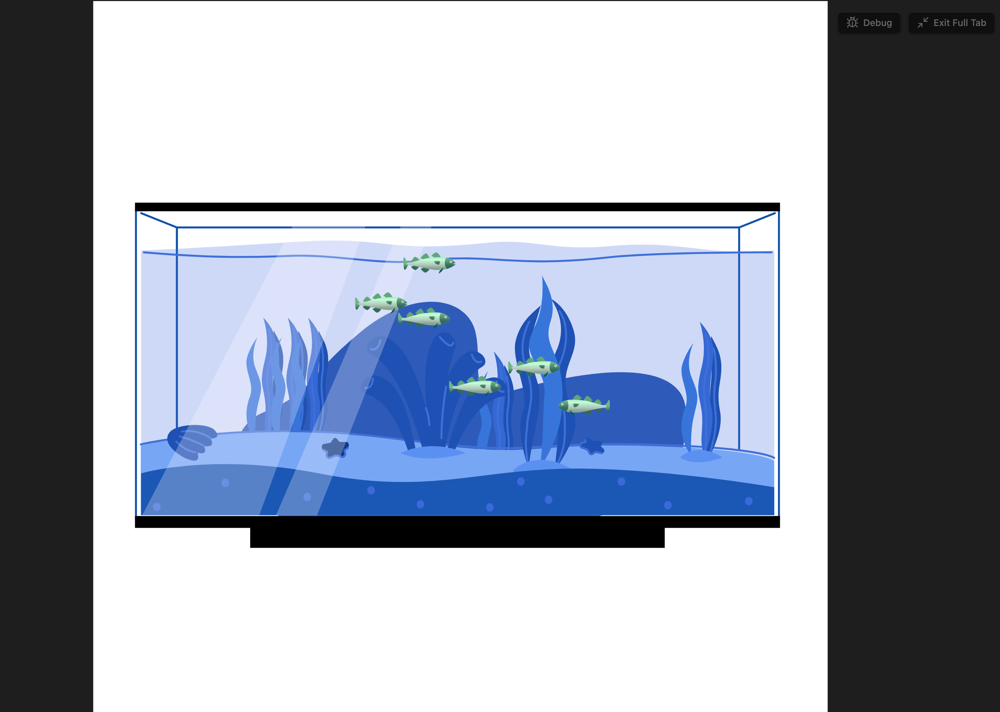
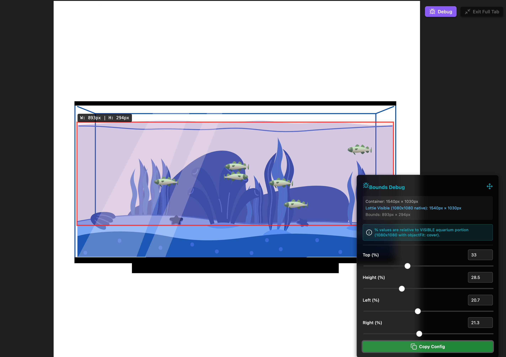

### Tab: Aquarium View {From FireStormFrontier 🫡]}

- **Description**: A gamified and highly interactive component that visualizes a list of items (such as tasks or daily habits) as individual, animated fish swimming within a dynamic Lottie-powered aquarium. It provides an immersive, full-pane experience with sophisticated animation logic, user interaction, and a powerful debug mode for fine-tuning the visual layout.
   
- **Does**:

    - **Gamified Visualization**: Transforms a simple list of items passed via the fishes prop into distinct, animated FishComponent instances, each representing an item with its own name.
    - **Dynamic & Autonomous Animation**:
        - Each fish swims independently within a defined "swim area," creating a lively and natural-feeling simulation.
        - The animation logic includes randomized behaviors for turning and changing vertical direction, ensuring each fish moves unpredictably.
        - Fish intelligently bounce off the edges of their designated swim area.
    - **Interactive Fish Behavior**:
        - **Hover Interaction**: Hovering over a fish with the mouse pauses its animation and reveals its name in a tooltip.
        - **Click-to-Pin**: Clicking on a fish "pins" it, causing it to become enlarged and permanently display its name until clicked again. This allows users to highlight or focus on specific items.
    - **Proportionally Scaled Swim Area**: The bounds for the swim area are not fixed but are calculated as percentages of the visible portion of the background Lottie animation. This ensures the swim area responsively adapts to the container's size and aspect ratio, always matching the background art.
    - **Developer Debug Mode**: Includes a toggleable debug menu that displays the swim area as a visible red rectangle. This menu provides sliders to adjust the top, height, left, and right bounds of the swim area in real-time, with a button to copy the resulting configuration to the clipboard.
    - **Resilient File Loading & Caching**:
        - Uses a fuzzy search to locate the required Lottie animation files (aquarium.json, fish.json), making it robust against changes in file location.
        - Dynamically loads and caches its script dependencies (lottie-player, Fuse.js) for fast subsequent loads and full offline capability after the first run.
    - **Immersive Full-Tab Mode**: Designed to run in a full-pane view for an immersive experience, with an option to switch back to a compact, inline mode.

- **Can’t**:
   
    - **Modify the Fish List**: The component is a visualizer; it can only display the list of items passed to it. It does not provide any UI to add, edit, or remove fish (tasks) from the list.  
    - **Persist Fish States**: The "pinned" state of a fish is temporary and will be reset when the component is reloaded.
    - **Customize Fish Appearance via Props**: The component is hard-coded to use a specific fish.json file for all fish. It is not possible to assign different animations to different fish without modifying the code.
    - **Function Offline on First Run**: It requires an internet connection for its initial run to download and cache the lottie-player and Fuse.js libraries. Subsequent uses are fully offline-capable.

-----

### Components

###### [Aquarium Viewer {FireStormFrontier 🫡}](D.q.Aquarium.viewer.md)

###### [Aquarium Component {FireStormFrontier 🫡}](D.q.aquarium.component.md)