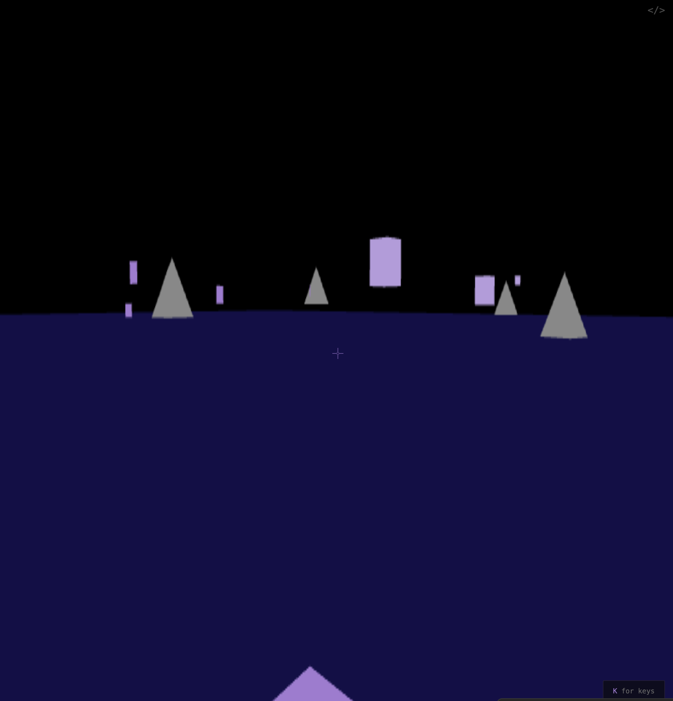
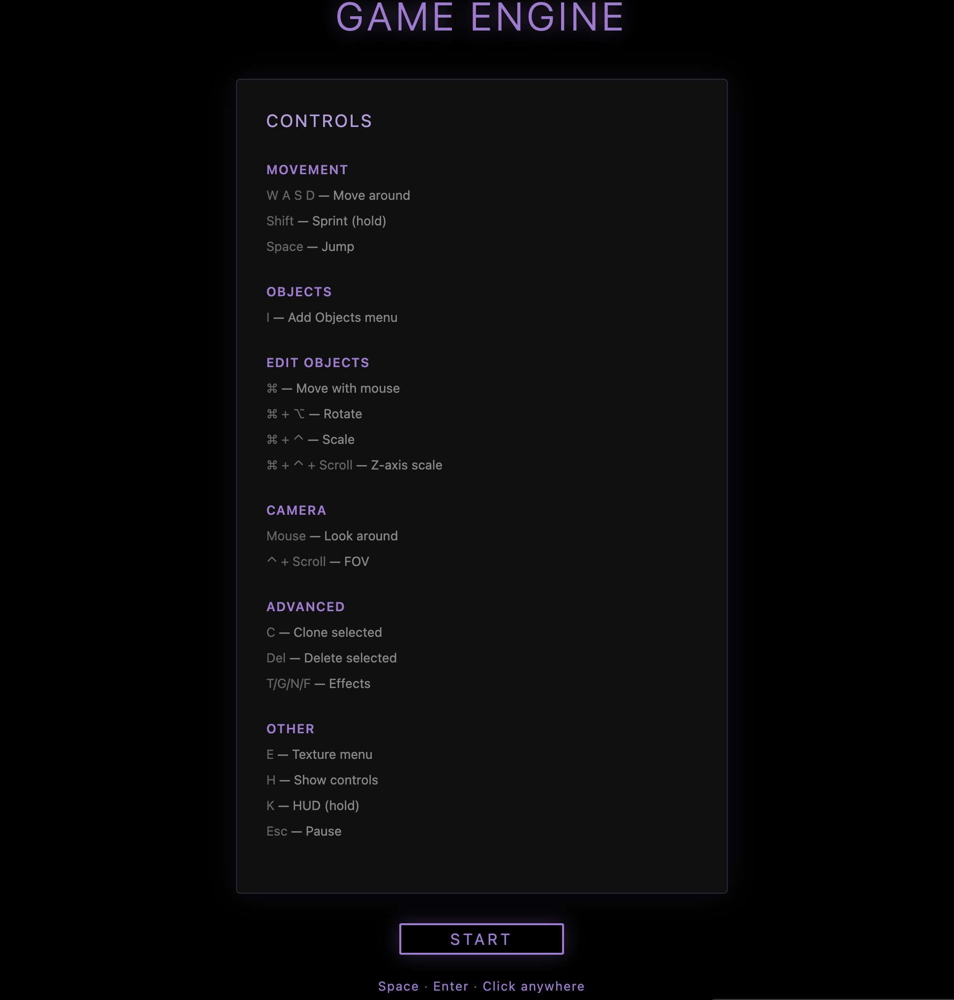

### Tab: Game Engine Build

- **Description**: A full-featured, first-person interactive 3D environment built with WebGL that functions as a "sandbox" world inside an Obsidian note. It allows users to navigate a 3D space, spawn and manipulate primitive objects, and, most uniquely, project images, Lottie animations, and even other live Datacore components onto surfaces as dynamic textures.
    
- **Does**:
    
    - **First-Person 3D Environment**:
        - Provides a complete first-person control scheme with WASD for movement, mouse for looking, Shift to sprint, and Space to jump.
        - Utilizes the Pointer Lock API for an immersive, game-like experience.
    - **In-World Object Manipulation & Building**:
        - Allows users to spawn primitive shapes (cubes, pyramids, panes) into the world via an "Add Object" menu.
        - Features a sophisticated direct manipulation system: users can point at objects and use modifier keys (⌘, ⌥, ⌃) with mouse movements to intuitively move, rotate, and scale them in 3D space.
        - Supports cloning objects with the C key and deleting them with the Delete key.
    - **Advanced Content Texturing**:
        - **Image & Lottie Textures**: Can apply standard image files or Lottie animations from the vault as textures onto the surfaces of 3D panes.
        - **Live Datacore View Texturing**: Its most powerful feature allows it to load another Datacore ViewComponent by its file name, render it to an offscreen canvas using html2canvas, and apply it as a live, dynamic texture to a pane in the 3D world.
    - **Dynamic Environment & Visuals**:
        - Includes a basic day/night cycle, a motion trail effect, and a wireframe rendering mode.
    - **Comprehensive UI & Menus**:
        - Provides a full suite of UI overlays, including a start menu, a pause menu, an object spawning menu, and a texture/view loading menu.
        - Includes an on-screen HUD (hold K) that displays all keybinds and a performance stats overlay.
    - **Immersive Full-Tab Experience**: Designed to run in a full-pane mode that takes over the entire Obsidian view, with a compact fallback option.

- **Can’t**:

    - **Persist the World State**: All spawned objects and their modifications are held in memory and are **completely lost** when the note is reloaded. It is a temporary sandbox, not a persistent world-building tool.
    - **Directly Interact with Rendered Views**: While a Datacore component can be rendered as a texture, the user cannot click buttons or interact with that component on the 3D surface. The texture is a visual-only representation.
    - **Create Complex Geometry**: The engine is limited to primitive shapes (cubes, pyramids, panes).
    - **Function Offline on First Run**: It requires an internet connection for its initial run to download and cache external libraries like lottie-player and html2canvas.

- **Disclaimer**:
   
    - This component is a highly experimental proof-of-concept. Its primary purpose is to **showcase the advanced capabilities** of the Datacore engine, such as WebGL integration, live component rendering, and complex user interaction. It is not intended to be a perfectly polished or bug-free application. Some features, particularly advanced interactions like object manipulation or live view texturing, may be inconsistent or broken.

----

### Components

###### [Game Engine Build Viewer](D.q.gameenginebuild.viewer.md)

###### [Game Engine Build Component](D.q.gameenginebuild.component.md)

