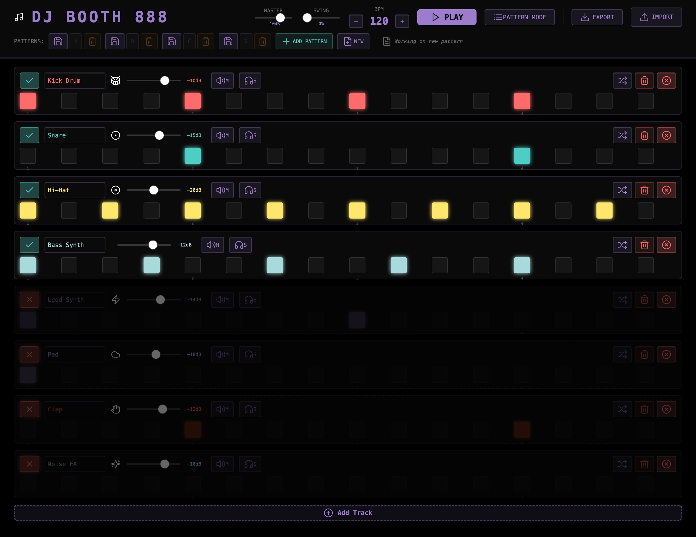
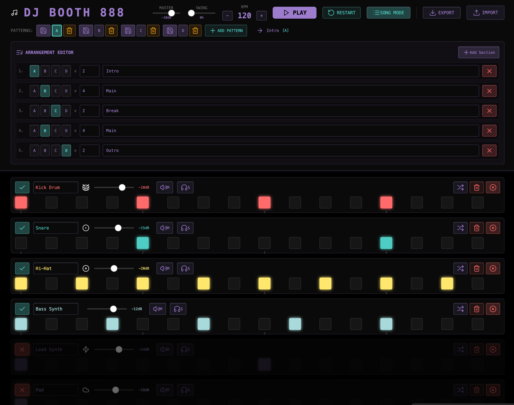

### Tab: Music Builder

- **Description**: A fully functional, multi-track step sequencer and digital audio workstation (DAW) built directly inside Obsidian using the Tone.js library. It provides a complete interface for composing rhythms and melodies, arranging them into a full song, and managing instruments and effects in real time. This component serves as a powerful showcase of Datacore's ability to host complex, interactive, state-managed applications.
    
- **Does**:
    
    - **Multi-Track Step Sequencer**:
        - Features a classic 16-step sequencer grid for programming patterns.
        - Supports multiple tracks, each with its own instrument, color, volume, mute, and solo controls.
        - Allows for dynamically adding or removing tracks from the composition.
    - **Built-in Synthesizer Engine**:
        - Powered by **Tone.js**, it generates all sounds in real time without needing any external audio files.
        - Includes a variety of built-in instruments, from drum sounds (kick, snare, hi-hat) to synths (bass, lead, pad) and FX (noise, risers), which can be assigned to any track.
    - **Advanced Composition & Arrangement**:
        - **Pattern System**: Users can create unique 16-step sequences and save them to a bank of pattern slots (A, B, C, D...). These patterns can be loaded back into the sequencer at any time.
        - **Song Arrangement Mode**: Provides a timeline-like interface to chain saved patterns together, allowing users to build a full song structure with repeating sections (e.g., Intro, Main, Break, Outro).
    - **Live Performance & Control**:
        - **Transport Controls**: Full control over playback (play/stop), with a real-time animated playhead indicating the current step.
        - **Global Controls**: Adjust the master volume, BPM (beats per minute), and swing/groove of the entire track on the fly.
    - **Project & Audio Export**:
        - **Save/Load Projects**: The entire state of the machine—including BPM, tracks, all patterns, and the song arrangement—can be exported to a single JSON file and imported later to resume work.
        - **Audio Rendering**: Can render the current pattern or the full song arrangement directly to a .webm audio file for sharing or use in other applications.
    - **Immersive Full-Pane Interface**: Designed to run in a full-pane mode that takes over the entire Obsidian view, creating a focused, app-like environment for music production.

- **Can’t**:
   
    - **Use External Audio Samples**: All sounds are generated by the internal synthesizers. The component cannot load or play external audio files like .wav or .mp3.   
    - **Compose Complex Melodies**: The pitch of synth notes is determined by pre-defined logic based on the step index. It does not include a piano roll or any interface for composing specific melodies or chords
    - **Automatically Save Projects**: The state of the machine is ephemeral and will be lost on reload. Users must manually use the "Export JSON" feature to save their work.
    - **Function Offline on First Run**: It requires an internet connection for its initial run to download and cache the Tone.js library. After this one-time setup, it is fully offline-capable.

- **Disclaimer**:
   
    - This component is a highly experimental and complex proof-of-concept. Its primary purpose is to **showcase the advanced capabilities** of the Datacore engine, demonstrating integration with a real-time audio synthesis library (Tone.js) and complex state management. It is not intended to be a perfectly polished or bug-free application. Users may encounter bugs, audio glitches, or features that are inconsistent. It serves as a powerful example of what is possible rather than a perfect, finished tool.

----

### Components

###### [Music Builder Viewer](D.q.musicbuilder.viewer.md)

###### [Music Builder Component](D.q.musicbuilder.component.md)

