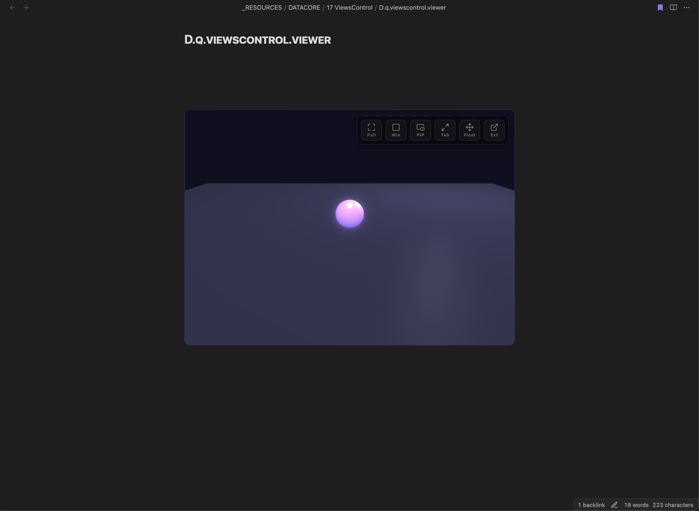
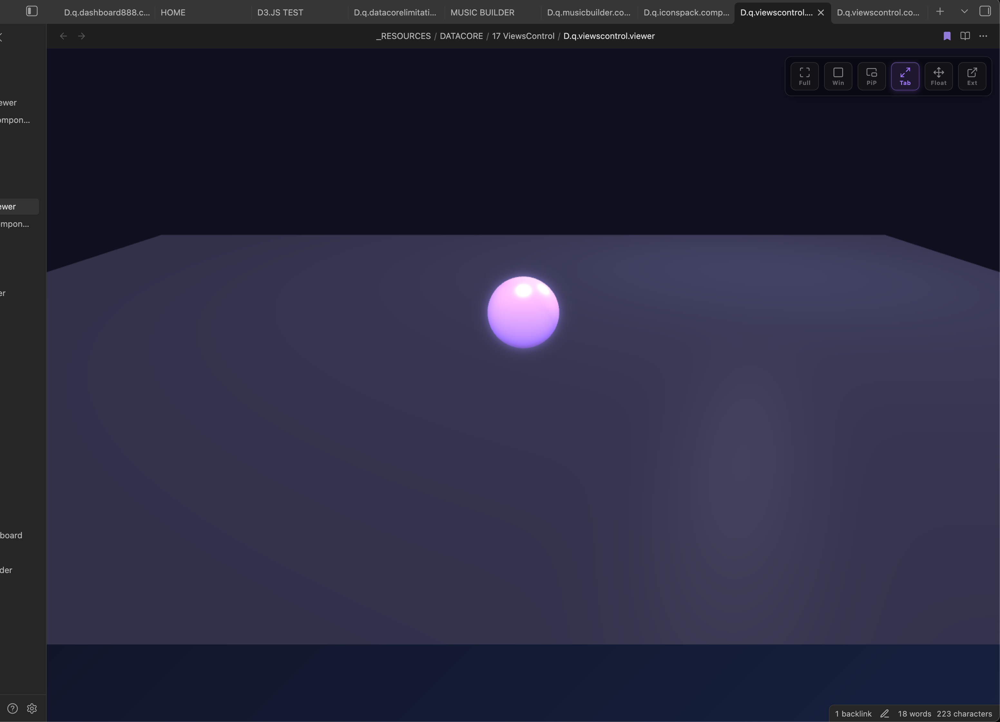
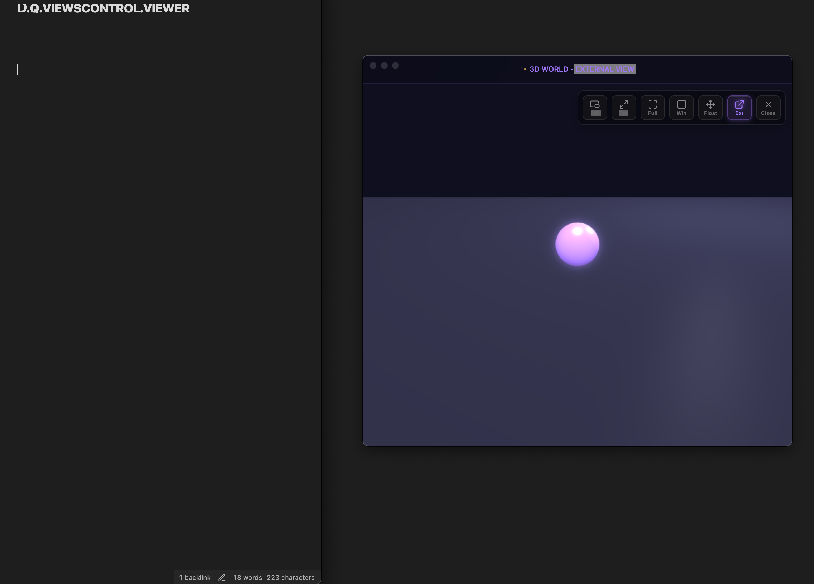
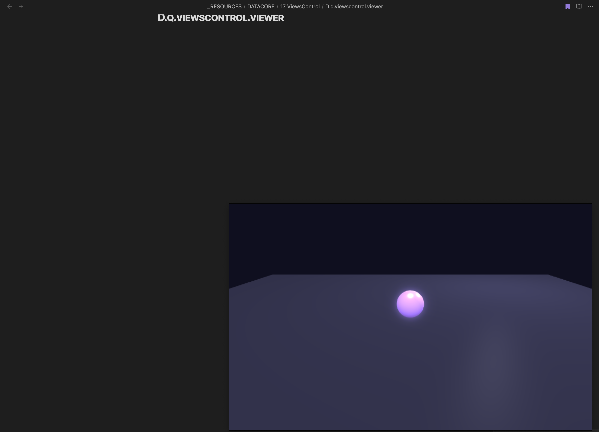
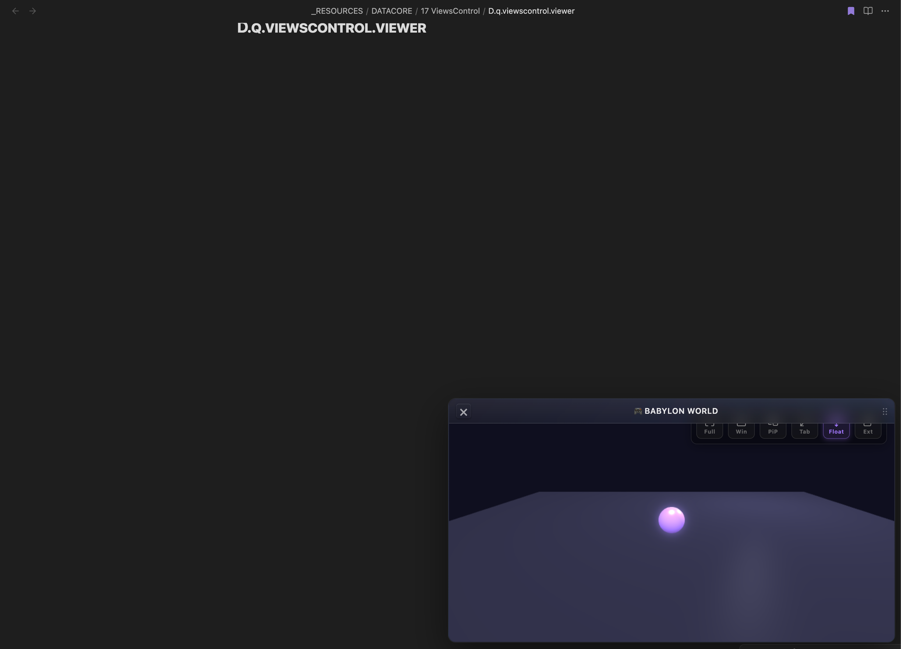
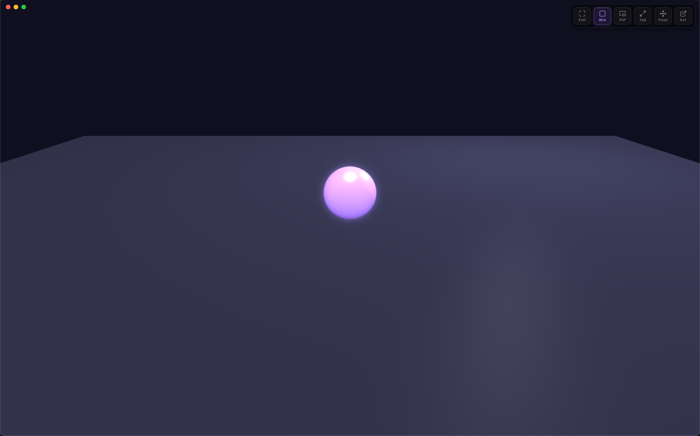
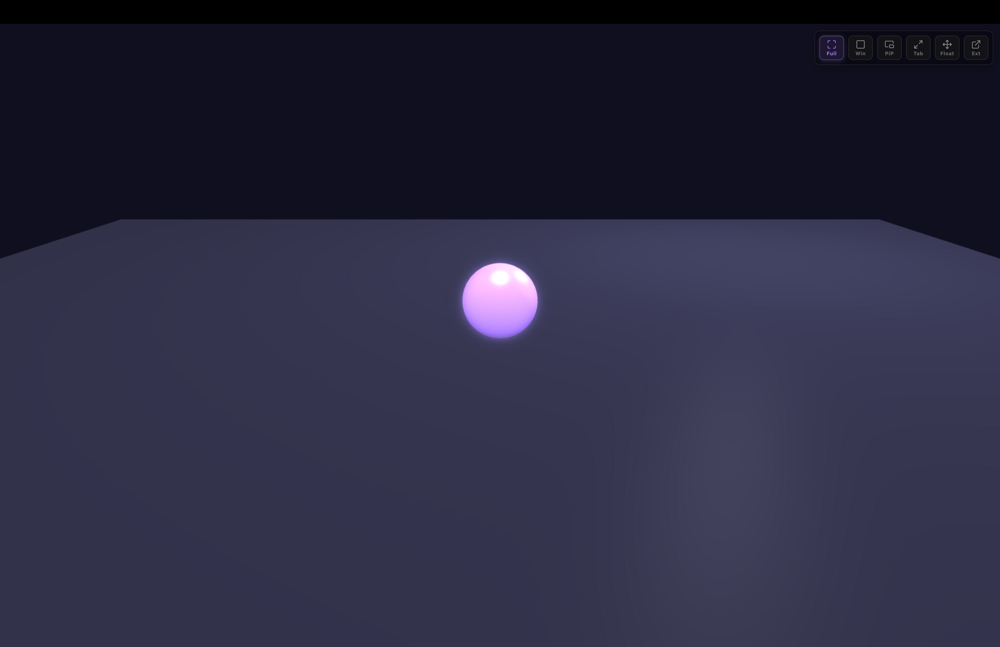

### Tab: ViewsControl

- **Description**: A sophisticated component that renders an interactive 3D world using Babylon.js and pairs it with an advanced set of screen mode controls. This system can transform the 3D canvas from a simple inline element into various immersive views, including a true, separate OS-level window for a native multi-display experience.
   
- **Does**:

    - **Interactive 3D Sandbox**: Renders a live Babylon.js scene featuring a player character that can be moved with keyboard controls (WASD or arrow keys). The scene includes dynamic lighting, a ground plane, and an orbit-style camera.  
    - **Advanced Multi-Window & Display Modes**: Provides a comprehensive suite of viewing options:
        - **External Window Mode**: Its most powerful feature, which uses Electron's BrowserWindow API to launch the 3D scene in a **completely separate, native OS-level window**. This new window can be moved to another monitor and contains its own set of mode controls.
        - **Native PiP Mode**: Uses the browser's native Picture-in-Picture API to create a **view-only** floating window from the 3D canvas. This window can be moved outside the main Obsidian application and stays on top of other programs.
        - **Float Mode (formerly "character")**: Renders the component as a smaller, **fully interactive** floating panel that stays inside the main application window. The panel is draggable from its header and resizable from its corners.
        - **Standard Modes**: Includes conventional Browser Fullscreen, Full Tab (fills the Obsidian pane), and Windowed Overlay (fills the viewport).
    - **Robust DOM & Resize Management**:
        - Intelligently manages and restores the component's original position in the DOM when exiting any special mode, ensuring a clean and stable layout.
        - Includes a debounced ResizeObserver to reliably resize the Babylon.js canvas during window or container size changes, preventing common rendering errors.
    - **Inter-Window Communication**: When in External Window mode, clicking a mode button within the new window sends a signal back to the main application, allowing the user to seamlessly switch to another mode upon closing the external window.

- **Can’t**:

    - **Share State with External Window**: The "External Window" runs in a separate process and re-initializes its own Babylon.js scene. It does not share live state (like player position) with the original component in Obsidian.       
    - **Provide Full Functionality in All Environments**:
        - The **External Window** mode is entirely dependent on running within an Electron environment (like the Obsidian desktop app) with the remote module enabled. It will not work in a standard web browser.
        - The **Native PiP** mode depends on modern browser support for the Picture-in-Picture API and Canvas Capture Streams.
    - **Allow Interaction in Native PiP**: The native Picture-in-Picture mode is strictly **view-only**; you cannot control the player or interact with the scene from within the PiP window.

----

##### NORMAL

##### TAB

##### EXTERNAL

##### PIP

##### FLOAT

##### WINDOW

##### FULLSCREEN

### Components

###### [Views Control Viewer](D.q.viewscontrol.viewer.md)

###### [Views Control Component](_RESOURCES/DATACORE/17%20ViewsControl/D.q.viewscontrol.component.md)

