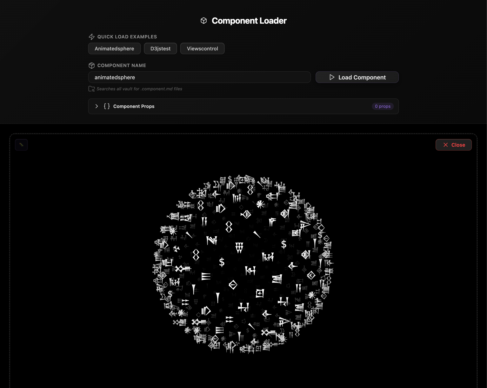

### Tab : Views Inception

- **Description**: An advanced developer utility designed to dynamically load, render, and interact with any other Datacore component within a secure, isolated "sandbox." This upgraded version introduces a powerful props editor, allowing developers to pass custom properties to the loaded component and see the changes reflected instantly. It provides a robust testing and rapid prototyping environment that prevents the loaded component from interfering with the Obsidian interface.

- **Does**:
   
    - **Dynamic Component Loading**:  
        - Loads any Datacore component by its name, automatically searching the vault for a matching *.component.md file.
        - Features a "Quick Load" section that discovers and lists all available components for one-click testing.
    - **Live Props Injection & Editing**:
        - Includes a full-featured **Props Editor** that allows developers to dynamically add, edit, and remove properties passed to the loaded component.
        - Intelligently parses prop values, supporting strings, numbers, booleans, arrays, and objects using JavaScript-like syntax (e.g., fileName="data.json", count={10}, isEnabled={true}).
        - **Instantly re-renders** the target component with the new props whenever they are changed, enabling rapid prototyping and state testing.
    - **Secure Sandbox with Escape Prevention**:
        - Renders the target component inside a strictly controlled div that mimics the structure of an Obsidian pane, crucial for testing components that use full-tab or windowed modes.
        - Actively monitors the DOM with a MutationObserver and automatically forces any component attempting to "escape" its container back into the sandbox, ensuring UI stability.
    - **Robust Error & Debugging Tools**:
        - Wraps the loaded component in an ErrorBoundary, which catches any rendering errors and displays a clear error message instead of crashing the view.
        - Includes a toggleable **Debug Panel** that provides a live view of the props being passed to the component, showing their raw values and data types.
    - **Immersive UI**: Designed to run in a full-pane mode for a dedicated development environment, with a compact fallback option.

- **Can’t**:
   
    - **Provide Any Content on its Own**: It is a shell and testing utility; its only function is to load and display other components.   
    - **Guarantee Perfect Security**: The props editor uses eval to parse input, which could be a security risk if used with untrusted code. The sandbox is a containment strategy, not an impenetrable security measure.
    - **Persist Loaded State**: The currently loaded component and its props are not saved. The sandbox will be empty each time the note is reloaded.
    - **Automatically Detect Required Props**: The user must know which props a component accepts and their expected data types. The sandbox does not automatically inspect the component's code.

----

### Components

###### [Views Inceptions Viewer](D.q.viewsinceptions.viewer.md)

###### [Views Inceptions Component](D.q.viewsinceptions.component.md)