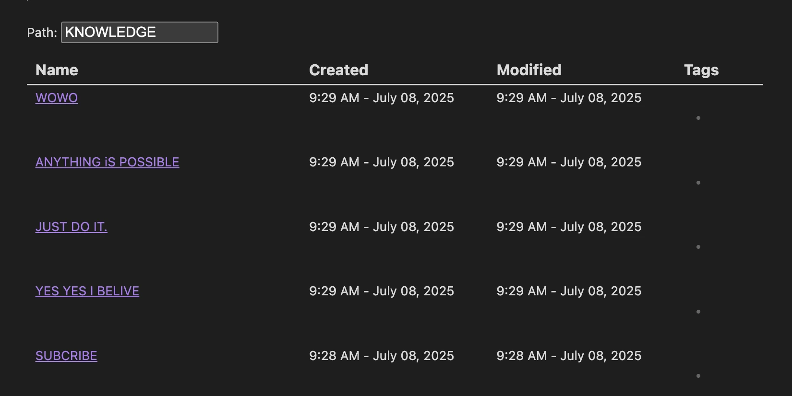

### Tab: Basic Query

- **Description**: Queries Obsidian notes in a specified folder path, displaying results in a sortable table with name, creation time, modification time, and tags.

- **Does**:

    - Filters notes by folder path via text input.
    - Shows results in a paginated table.
    - Sorts notes by creation time (newest first).

- **Can’t**:

    - No fuzzy search or advanced query filters.
    - Limited to predefined columns (name, created, modified, tags).

### Components

###### [Basic Query Viewer](D.q.basicquery.viewer.md)

###### [Basic Query Component](D.q.basicquery.component.md)
