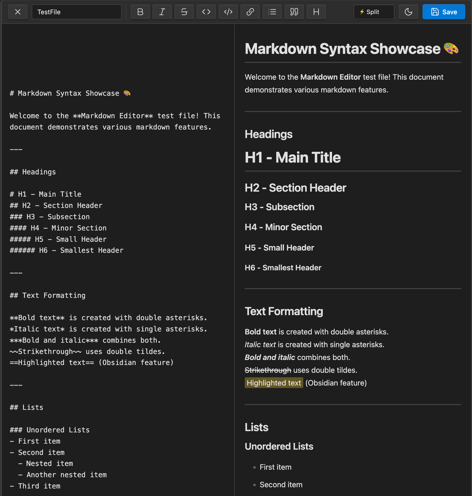
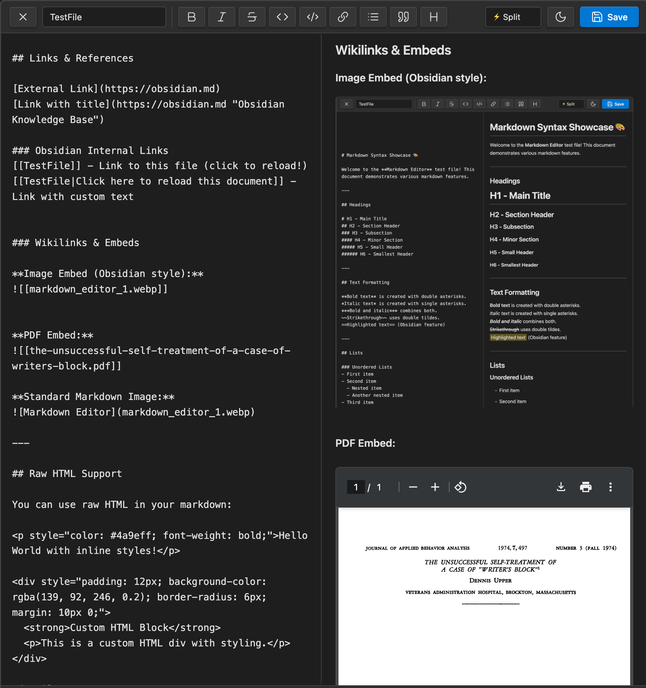
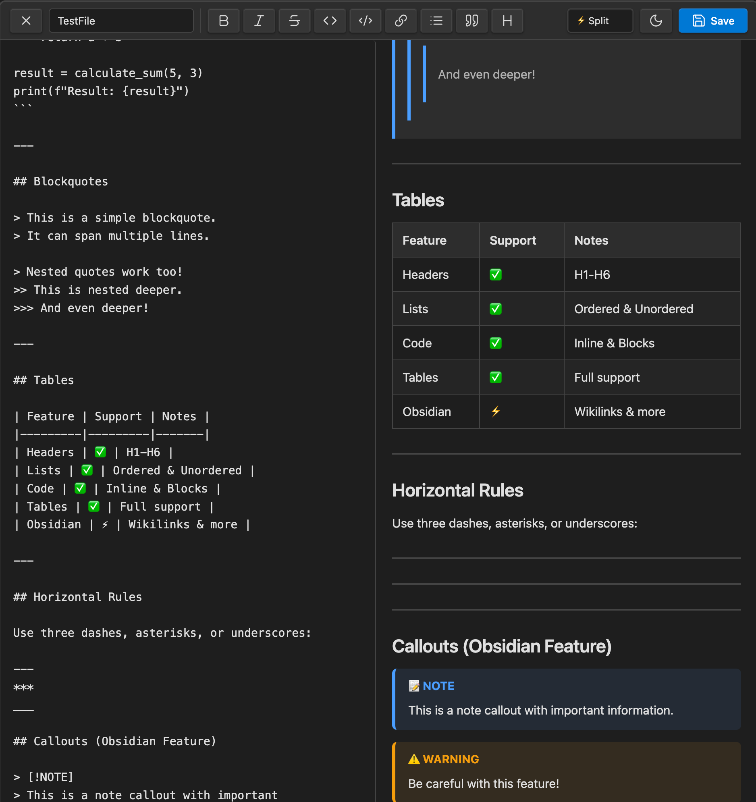

### Tab: Markdown Editor {wip}

- **Description**: A powerful, IDE-like component that provides a full-featured, side-by-side markdown editor and a live, enhanced preview pane. It is designed to replicate and extend Obsidian's native editing experience, supporting a wide range of markdown and Obsidian-specific syntax. All changes are saved directly back to the source markdown file, turning any code block into a rich, self-contained editing environment.

- **Does**:

    - **Live, Two-Way Markdown Editing**:
        - Provides a raw markdown editor that loads content directly from a specified file.
        - Includes a "Save" button that writes any changes made in the editor directly back to the source .md file.
    - **Advanced Live Preview with Obsidian Syntax Support**:
        - Renders a live preview of the markdown content using the marked.js library.
        - **Wikilinks**: Correctly parses and renders `[[wikilinks]]`. These links are fully functional, opening the target note in Obsidian when clicked, and display a hover-preview of the note's content.
            
        - **Embedded Media**: Intelligently finds and displays embedded images and PDFs  using a fuzzy search, so they work even if the file path is not exact.
        - **Interactive Task Lists**: Renders task list items (`- [ ]`) as clickable checkboxes. Toggling a checkbox in the preview pane writes the change back to the source file.
        - **Callouts & Highlights**: Supports rendering of Obsidian's callout blocks (`[!NOTE]`) and highlighted text (`==text==).
        - **Code Blocks**: Displays code blocks with a header showing the language and includes a one-click "Copy" button.
    - **Full-Featured UI & UX**:
        - **Multiple View Modes**: Offers a tabbed interface to switch between an editor-only view, a preview-only view, and a split-screen view.
        - **Formatting Toolbar**: Includes a toolbar with buttons for common markdown actions like bold, italic, lists, and code blocks.
        - **Dynamic File Loading**: Allows the user to specify a file to edit by name, with a "Quick Load" menu that automatically lists available component files in the vault.
    - **Immersive Full-Pane Mode**: Designed to run in a full-pane view that takes over the entire Obsidian window, complete with its own theme toggle (light/dark) for a customized editing environment.

- **Can’t**:
 
    - **Provide a Perfect 1:1 Obsidian Preview**: While it supports many features, the preview is rendered using marked.js and may not perfectly match Obsidian's native renderer, especially for syntax from third-party plugins.        
    - **Guarantee Performance on Very Large Files**: Live parsing and rendering of extremely large or complex markdown files on every keystroke may lead to performance degradation.
    - **Merge External Changes**: If the source markdown file is edited in another pane while this component is open, the component may overwrite those external changes on its next save. It does not have a built-in conflict resolution system.
    - **Function Offline on First Run**: It requires an internet connection for its initial run to download and cache the marked.js and Fuse.js libraries. Subsequent uses are fully offline-capable.

- **Disclaimer**:
   
    - This component is a highly experimental proof-of-concept. Its primary purpose is to **showcase the advanced capabilities** of the Datacore engine, such as integrating external libraries, live file I/O, and creating rich, interactive user interfaces. It is not intended to be a perfectly polished or bug-free application. Some features, particularly the parsing of complex nested markdown or performance with very large files, may be inconsistent. It serves as a powerful example of what is possible rather than a finished tool.

---

### Components

###### [Markdown Editor Viewer](D.q.markdowneditor.viewer.md)

###### [Markdown Editor Component](D.q.markdowneditor.component.md)

