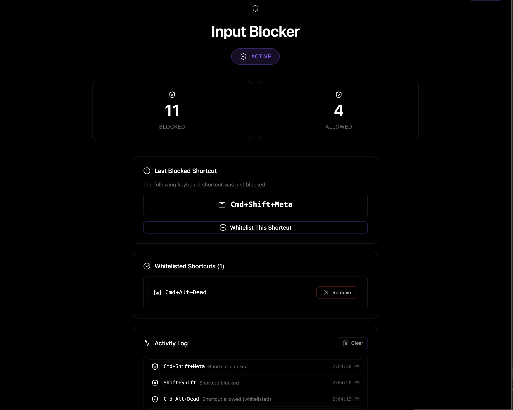

### Tab: External Input Blocker

- **Description**: A powerful, system-level utility designed to intercept and block nearly all keyboard shortcuts and commands across the entire Obsidian application. When activated, it provides a "focus mode" by preventing accidental command triggers, allowing only whitelisted shortcuts to pass through. This upgraded version now includes a persistent caching system, allowing all user settings and whitelisted shortcuts to be saved and automatically restored across sessions.

- **Does**:
   
    - **Global Command Interception**: When active, it directly patches Obsidian's command execution functions (executeCommandById and execute), preventing any command from running, including those triggered by hotkeys or the command palette.   
    - **Aggressive Keyboard Blocking**: Implements a global, capturing event listener for all keyboard events (keydown, keypress, keyup), allowing it to intercept and block shortcuts before they can be processed by Obsidian.
    - **Persistent Whitelist Control**:
        - By default, it blocks all shortcuts. Users can then selectively "whitelist" specific key combinations.
        - Features a UI that displays the last blocked shortcut and provides a one-click button to add it to the whitelist.
        - **Automatically saves** all whitelisted shortcuts, stats, and the activity log to a cache file (.datacore/input_blocker_cache/settings.json) in the vault.
        - **Automatically restores** all saved settings upon reload, ensuring a persistent and customized focus environment.
    - **Intelligent Focus Management**:
        - Activates when its pane is clicked and deactivates when the user clicks outside of it.
        - It smartly re-activates if the user navigates away from and back to the Obsidian window, and deactivates if the tab becomes hidden.
        - Allows normal typing within the component's own input fields, so users can still interact with the whitelist UI.
    - **Live Activity Monitoring**: Provides a real-time activity log that shows a history of all blocked, allowed, and whitelisted shortcuts, complete with timestamps.
    - **Immersive Full-Tab UI**: Designed to run in a full-pane mode for a focused "lockdown" experience, with a compact fallback mode.

- **Can’t**:
   
    - **Block OS-Level Shortcuts**: It operates within the Obsidian application and cannot intercept system-level shortcuts handled by the operating system (e.g., Cmd+Tab on macOS, Alt+F4 on Windows).    
    - **Guarantee Perfect Blocking**: While extremely aggressive, it is a proof-of-concept. A conflicting plugin or a future change in the Obsidian API could potentially bypass its blocking mechanisms.

- **Disclaimer**:
   
    - This component is a highly experimental and advanced proof-of-concept. Its primary purpose is to **showcase the deep integration capabilities** of the Datacore engine by directly manipulating core application functions. It is **not intended for regular use** and should be handled with extreme care.
    - **CRITICAL BUG WARNING**: There is a known, intermittent bug where the component can fail to properly restore Obsidian's command registry upon deactivation. This can cause **all commands to disappear from your command palette** (Cmd/Ctrl + P), making it appear empty. This state may persist even upon **restarting Obsidian completely**. The exact cause of this bug is not yet known.

----

### Components

###### [External Input Blocker Viewer](D.q.externalinputblocker.viewer.md)

###### [External Input Blocker Component](D.q.externalinputblocker.component.md)

