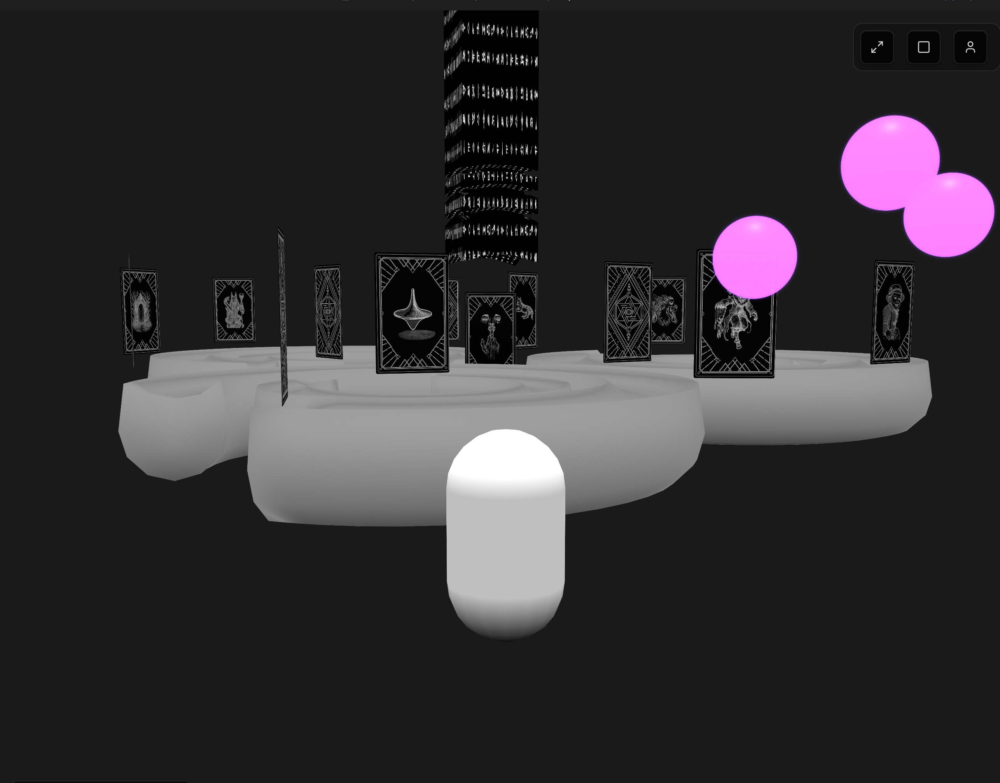
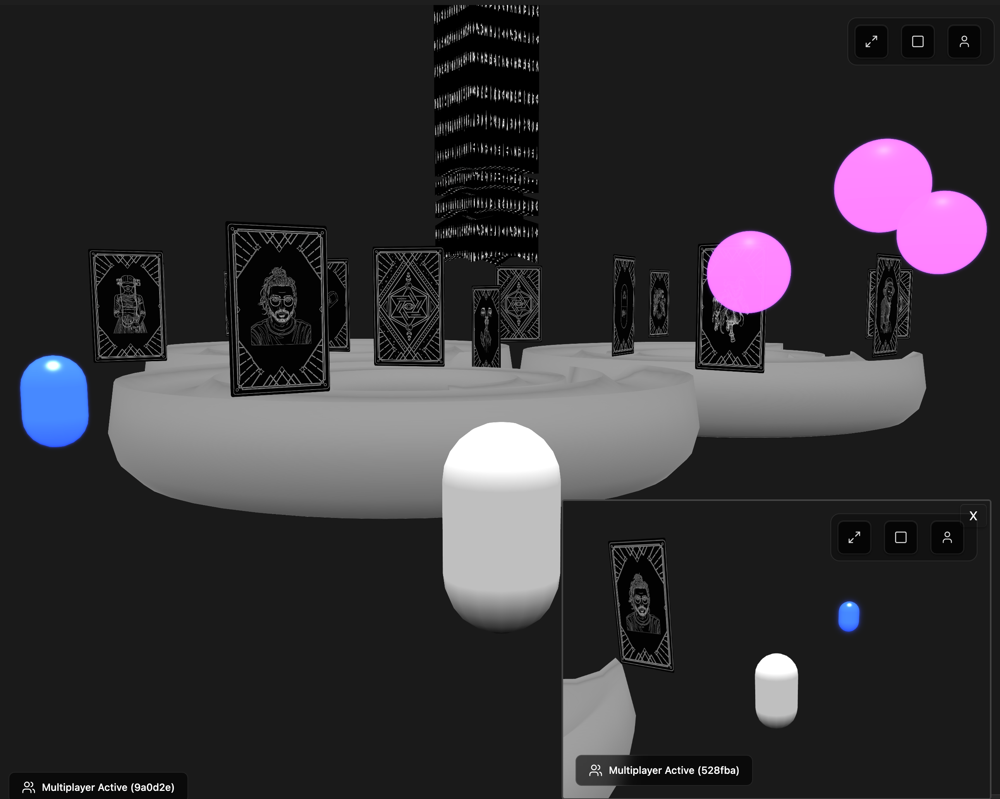

### Tab: World 888

- **Description**: A comprehensive, first-person 3D world built with Babylon.js and the Havok physics engine. It is a highly experimental component that pushes the boundaries of what is possible within Datacore, featuring a sophisticated character controller with advanced movement, real-time local multiplayer, interactive in-world objects, and an aggressive input blocking system that turns Obsidian into a game-like environment.

- **Does**:
   
    - **Full 3D World with Physics**: 
        - Renders a persistent 3D environment powered by the **Havok physics engine**, enabling realistic gravity, collisions, and character interactions with the scenery.
        - Loads complex 3D models (.glb files) from a local folder and applies physics properties to them, distinguishing between static and dynamic objects.
    - **Advanced Character Controller**:
        - Features a sophisticated first-person character controller with a full range of advanced movement mechanics, including sprinting, crouching, and physics-based **sliding**.
        - Sliding speed is dynamically affected by factors like landing from a fall or moving down a slope.
    - **Local Multiplayer System**:
        - Implements a real-time local multiplayer system using the browser's BroadcastChannel API.
        - Allows multiple open instances of the component on the same machine to see and interact with each other in the same world. Player positions and rotations are synchronized between instances.
    - **Total Input & Command Blocking**:
        - Integrates an aggressive input blocking system that, when the 3D view is focused, captures **all** keyboard shortcuts and commands across the entire Obsidian application.
        - This creates a true "game mode," preventing accidental command palette triggers or hotkey actions and dedicating all input to character movement and in-world interaction.
    - **Interactive World & Meta-Functionality**:
        - Spawns interactive objects (e.g., floating spheres) within the world.
        - Clicking these objects can trigger actions, such as spawning another instance of the WorldView component itself inside a separate, floating "Picture-in-Picture" window.
    - **Advanced Screen Controls**: Retains the full suite of advanced screen controls, including Browser Fullscreen, a Windowed Overlay, and an interactive Float Mode.

- **Can’t**:
   
    - **Persist the World State**: Any spawned objects, player positions, or other changes within the 3D world are held in memory and are **completely lost** when the note is closed or reloaded. It is a temporary sandbox, not a persistent world-building tool.   
    - **Provide True Online Multiplayer**: The synchronization only works for component instances open on the **same machine** and in the **same browser profile**. It does not support networking over the internet.
    - **Block OS-Level Shortcuts**: It cannot intercept shortcuts handled by the operating system itself (e.g., Cmd+Tab on macOS, Alt+F4 on Windows).
    - **Create or Save New World Layouts**: All objects and characters are defined in the component's code or loaded from static assets. It is not a world editor.
    - **Function Offline on First Run**: It requires an internet connection for its initial run to download and cache its dependencies (Babylon.js, Havok Physics, etc.).

----

### Components

###### [World 888 Viewer](D.q.world888.viewer.md)

###### [World 888 Component](D.q.world888.component.md)

