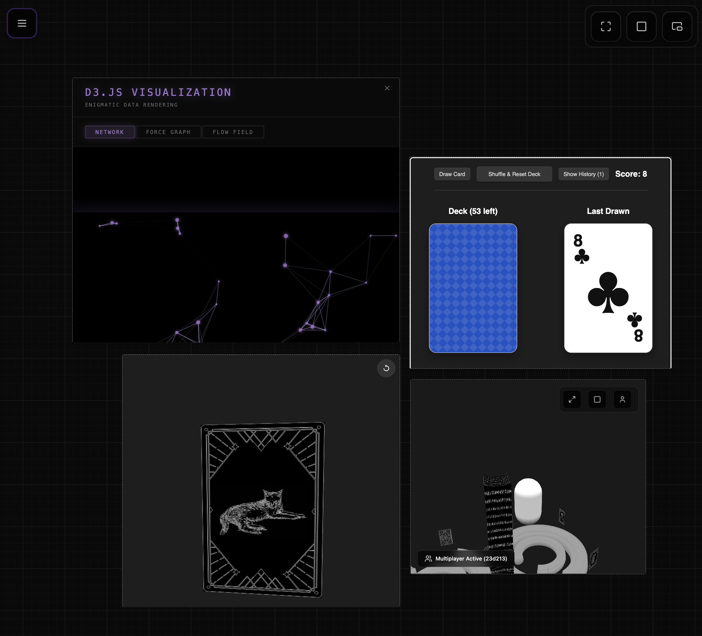

### Tab: Canvas v1

- **Description**: An advanced, multi-purpose component that provides an infinite, zoomable, and pannable canvas for creating complex visual layouts. Its most powerful feature is the ability to act as a "sandbox," allowing users to dynamically load, configure, and interact with any other Datacore component as a movable, resizable object on the canvas. It is a versatile tool for building dashboards, mind maps, and a powerful utility for developing and testing other components.
   
- **Does**:

    - **Infinite Canvas Workspace**:   
        - Provides a limitless 2D space with smooth panning (Space + Drag) and zooming (Ctrl/Cmd + Scroll).
        - Features an adaptive grid that changes density based on the zoom level for precise alignment.
    - **Object Creation & Manipulation**:
        - Allows users to create various types of objects ("boxes"), including text boxes, shapes (circles, triangles), and, most importantly, datacore-component containers.
        - Supports standard canvas interactions: multi-select (Shift/Ctrl + Click), marquee selection (drag on canvas), and moving/resizing multiple objects at once.
        - Includes full keyboard support for copy (Cmd+C), paste (Cmd+V), cut (Cmd+X), and delete (Backspace).
    - **Live Component Sandboxing**:
        - **Dynamic Loading**: Can load any Datacore component from the vault by its filename, using a fuzzy search to find it. A "Quick Load" menu automatically lists available components.
        - **Live Props Editor**: Features a draggable properties panel that allows users to pass custom props to a loaded component. It intelligently parses values (strings, numbers, booleans, objects) and instantly re-renders the component with the new props.
        - **Hot-Reloading**: Includes an "Enable Quick Reload" option for component boxes. When active, a reload button appears, which creates a temporary copy of the component's source file and re-renders from it, enabling a live code-editing workflow.
        - **Escape Prevention**: Implements a MutationObserver to monitor the DOM and prevent loaded components from "escaping" their sandbox and taking over the main UI, which is crucial for testing full-screen components.
    - **Persistence & State Management**:
        - The entire state of the canvas—including all boxes, their properties, position, and zoom level—can be saved to a JSON file within the vault's .datacore/dc.canvas directory.
        - Provides a menu to load, manage, and delete previously saved canvas layouts.
    - **Advanced Interaction & UI**:
        - Features an intelligent focus management system that blocks most Obsidian shortcuts when the canvas is active, creating an uninterrupted, app-like experience.
        - Includes multiple display modes via ScreenModeHelper, allowing the entire canvas to be expanded to fill the pane, the full window, or a floating Picture-in-Picture view.

- **Can’t**:
   
    - **Connect Boxes with Lines**: It is a freeform canvas and does not include functionality for creating connectors or arrows between boxes, limiting its use for complex diagramming.   
    - **Guarantee Perfect Sandboxing**: The escape-prevention mechanism is a best-effort solution. A highly complex or misbehaving component could still potentially interfere with the main application UI.
    - **Automatically Save State**: All saves are manual user actions. There is no auto-save feature, so work could be lost if not explicitly saved.
    - **Function Offline on First Run**: It requires an internet connection for its initial run to download and cache external libraries like marked.js and Fuse.js.

-----

### Components

###### [Canvas v1 Viewer](D.q.canvas.viewer.v1.md)

###### [Canvas v1 Component](D.q.canvas.component.v1.md)

