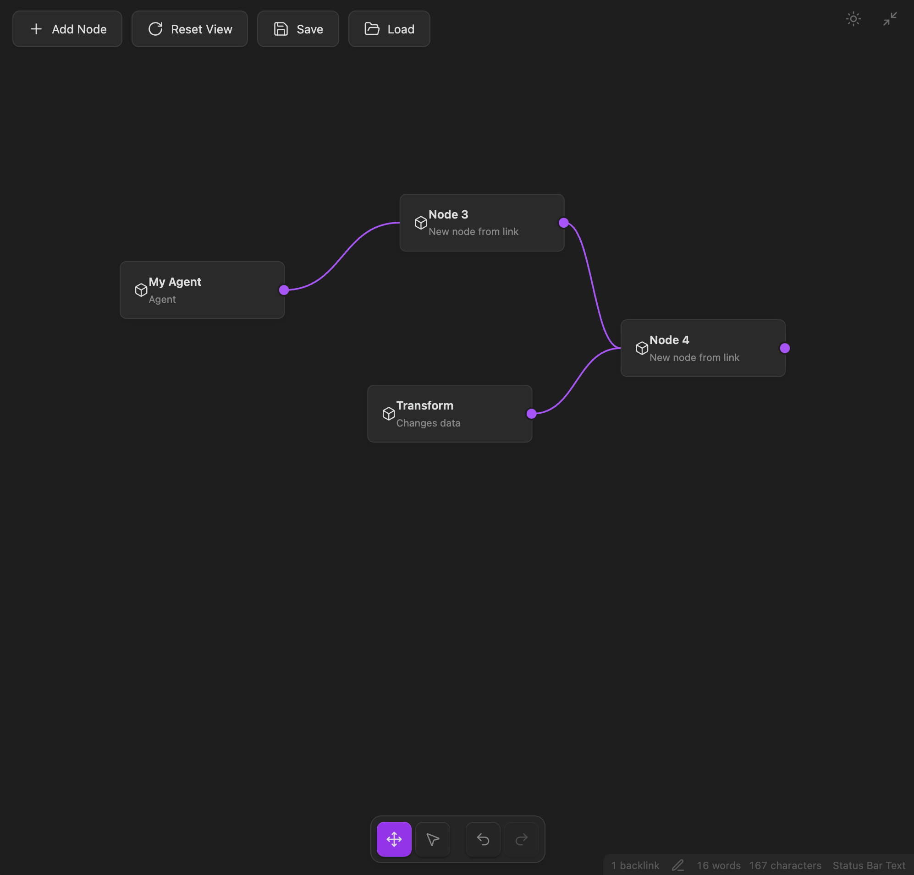

### Tab: Canvas v2

- **Description**: An advanced, interactive component that provides an infinite, zoomable canvas for creating and connecting nodes. This upgraded version integrates seamlessly with the Obsidian vault for saving and loading canvas states, includes a full undo/redo history, and adapts its visual theme to match Obsidian's light or dark mode. It functions as a complete and persistent visual programming or mind-mapping environment.

- **Does**:

    - **Full Canvas Persistence**:
        - **Save & Load**: Allows users to save the entire state of their canvas—including all nodes, links, and the current view position/zoom—to a JSON file within the vault (.datacore/canvas-saves).
        - **File Management**: A "Load" menu provides an interface to browse, load, and delete previously saved canvas files.
    - **Infinite Canvas & Navigation**:
        - Provides a limitless 2D workspace with smooth panning (Space + Drag) and zooming (Ctrl/Cmd + Scroll).
        - Includes "Reset View" and "Add Node" buttons for easy navigation and content creation.
    - **Full Node & Link Editing**:
        - **Node Management**: Users can create new nodes, which appear in the center of the viewport. Nodes can be selected, multi-selected (with Shift or marquee selection), and moved around the canvas.
        - **Link Creation**: Users can create connections between nodes by dragging from an output connector on one node to another.
        - **Dynamic Linking**: If a link is dragged to an empty area of the canvas, a new node is automatically created and linked.
    - **Advanced Interaction & State Management**:
        - **Undo/Redo History**: Features a complete history system, allowing users to undo and redo all actions, including node creation, movement, and linking.
        - **Multiple Interaction Modes**: A floating toolbar allows the user to switch between a "Pan" tool for navigating the canvas and a "Select" tool for interacting with nodes.
        - **Keyboard Shortcuts**: Supports deleting selected nodes with the Delete or Backspace key.
    - **Thematic & Immersive UI**:
        - **Theme-Aware**: Automatically detects whether Obsidian is in light or dark mode and adapts its entire color scheme to match, ensuring a native look and feel.
        - **Full-Tab Mode**: Designed to run by default in a full-pane mode that takes over the entire Obsidian view, creating a dedicated, app-like environment.

- **Can’t**:

    - **Real-Time Synchronization**: The save and load operations are manual actions. The canvas does not automatically sync with a file in real-time.
    - **Node Customization**: The content and appearance of nodes (title, description, icon) are hard-coded. There is no interface to edit the text or style of individual nodes.
    - **Vault Data Integration**: This component is a self-contained diagramming tool and does not read, parse, or visualize any data from the Obsidian vault.

----

### Components

###### [Canvas v2 Viewer](D.q.canvas.viewer.v2.md)

###### [Canvas v2 Component](D.q.canvas.component.v2.md)

