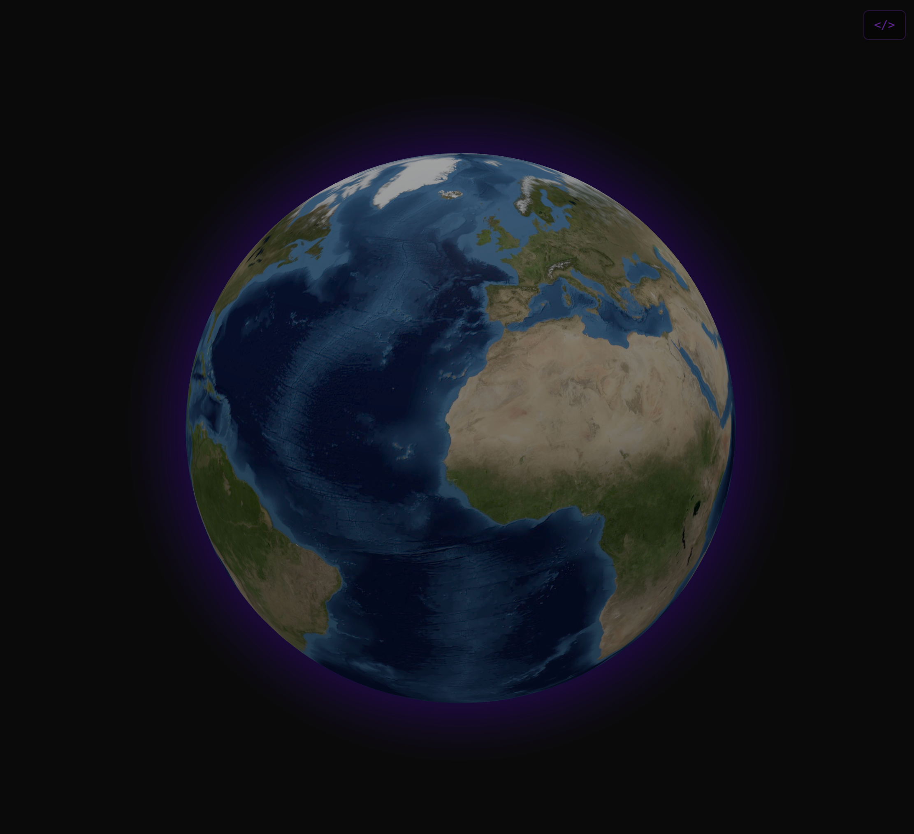

### Tab: Map Globe v1

- **Description**: A visually stunning and performant component that renders a fully interactive, auto-rotating 3D globe directly within an Obsidian note. Built with Three.js and Globe.gl, it is designed for both immersive viewing and offline use by intelligently loading and caching its own dependencies and assets.

- **Does**:

    - **Renders an Interactive 3D Globe**: Displays a high-quality 3D model of the Earth, complete with a "blue marble" texture, a bump map for realistic topology, and a glowing purple atmosphere.
    - **Dynamic Dependency & Asset Management**:
        - **On-Demand Script Loading**: Automatically checks if Three.js and Globe.gl are available and dynamically loads them from a CDN if needed.
        - **Local Asset Caching**: On its first run, it fetches the required texture images (for the globe's surface and topology) and saves them to a local cache folder (.datacore/image_cache) within the vault.
        - **Full Offline Capability**: After the initial setup, all subsequent loads use the cached scripts and images, allowing the component to work perfectly without an internet connection and load significantly faster.
    - **Immersive User Experience**:
        - The globe features continuous, gentle auto-rotation.
        - Users can freely interact with the globe by panning and zooming the camera with their mouse.
        - Designed to run primarily in a "Full-Tab Mode" that takes over the entire Obsidian pane for an immersive, focused experience.
    - **Flexible Display**: Includes a "Compact Mode" that acts as a placeholder within a note, allowing the user to enter the full-tab view on demand.

- **Can’t**:

    - **Vault Data Visualization**: This component is a visual centerpiece and does not plot any notes, tags, links, or other data from the vault onto the globe's surface.
    - **Deep Prop Customization**: The appearance and behavior of the globe, such as the textures, rotation speed, and initial camera position, are hard-coded.
    - **Offline Setup**: It requires an active internet connection the very first time it runs to download and cache both its script dependencies and texture images.
    - **Advanced Data Overlays**: It renders a base globe and does not include plotting arcs, points, or country polygons.

----

### Components

###### [Map Globe Viewer v1](D.q.mapglobe.viewer.v1.md)

###### [Map Globe Component v1](D.q.mapglobe.component.v1.md)
