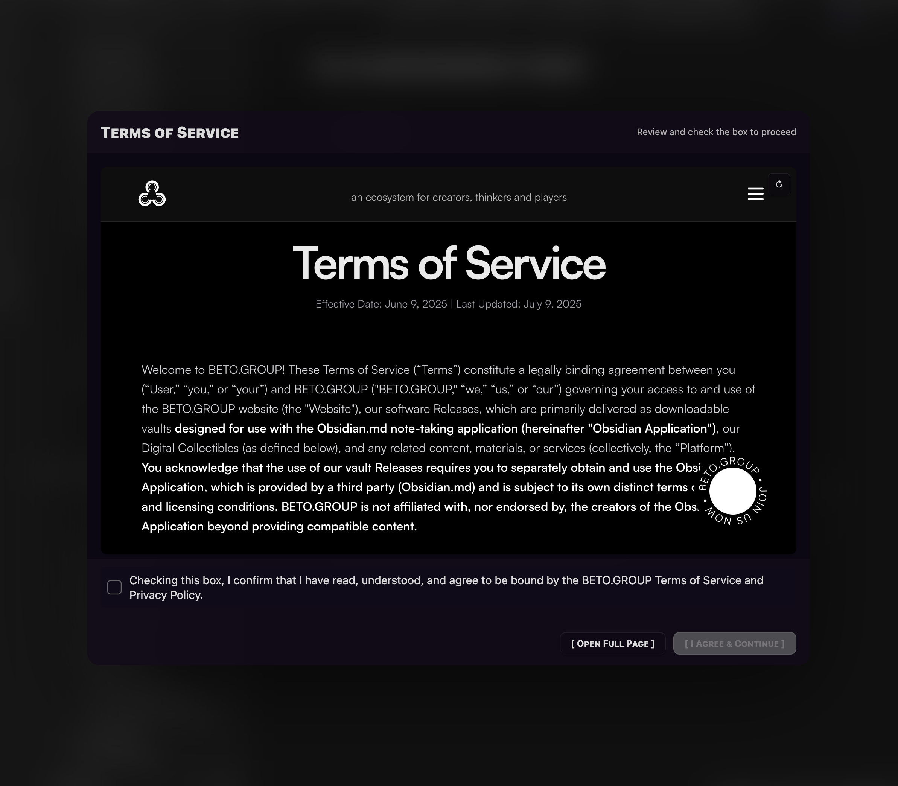

### Tab: LicenseAgreement

- **Description**: A robust and secure component that acts as a modal gatekeeper, requiring users to explicitly agree to a set of terms before they can proceed. It dynamically loads a specified markdown file containing a task list of terms, displays an embedded version of a "Terms of Service" webpage, and aggressively blocks all application-wide shortcuts and commands to ensure the user's focus remains on the agreement.

- **Does**:
   
    - **Initial State Check**: On load, it silently checks a designated markdown file in the vault (e.g., TERMS OF SERVICE.approval.md). If all tasks in this file are already checked, the component remains hidden and allows normal app usage.    
    - **Modal Focus Mode**: If any task is unchecked, the component renders a full-screen, blurred overlay that covers the entire Obsidian interface. This modal cannot be dismissed until all tasks are completed.
    - **Global Input & Command Blocking**: While the agreement is active, it implements an aggressive blocking system that:
        - Intercepts and disables **all** keyboard shortcuts across the entire application to prevent accidental navigation or command execution.
        - Patches Obsidian's core command functions to block the command palette and any registered hotkeys.
        - The only commands that are allowed to pass through are essential window management actions like workspace:close.
    - **Content Display & Task Management**:
        - Displays an interactive checklist of tasks parsed directly from the specified markdown file.
        - Embeds a live webpage (e.g., a "Terms of Service" page) within an iframe for review.
        - Users must check every task in the list to enable the "I Agree & Continue" button.
    - **Live File Updates**: Toggling a checkbox in the UI writes the change directly back to the source markdown file in real-time, persisting the user's consent.
    - **Re-Verification**: If a user agrees to the terms but later unchecks a task in the source file, the component will automatically re-activate and force them to re-confirm their agreement.
    - **Debug Mode & Reset**: Includes an optional debug mode that renders a floating "Reset TOS Tasks" button. This developer tool allows for easily unchecking all tasks in the file to test the agreement flow repeatedly.

- **Can’t**:
   
    - **Create the Agreement File**: The component requires that the target markdown file (e.g., TERMS OF SERVICE.approval.md) already exists in the vault. It cannot create this file on its own.    
    - **Block OS-Level Shortcuts**: It operates within the Obsidian application and cannot intercept system-level shortcuts handled by the operating system (e.g., Cmd+Tab on macOS, Alt+F4 on Windows).
    - **Guarantee Playback of All Embedded Content**: The embedded iframe is subject to the security policies of the external website, which may prevent it from rendering correctly within Obsidian's app:// protocol.

-----

### Components

###### [License Agreement Viewer](D.q.licenseagreement.viewer.md)

###### [License Agreement Component](D.q.licenseagreement.component.md)
