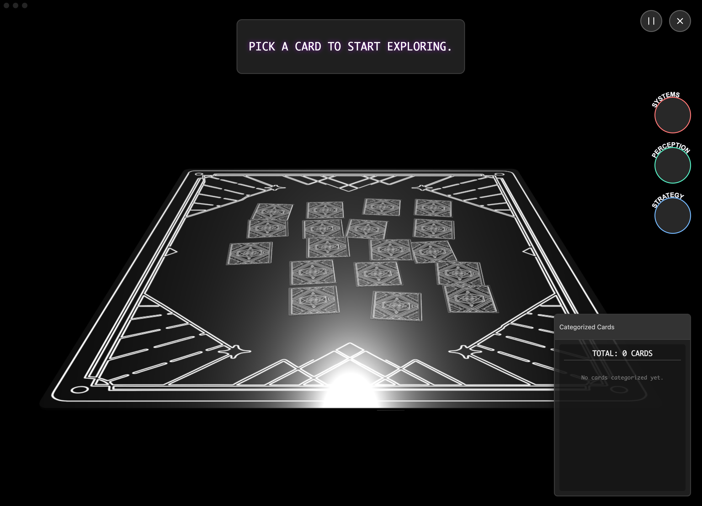
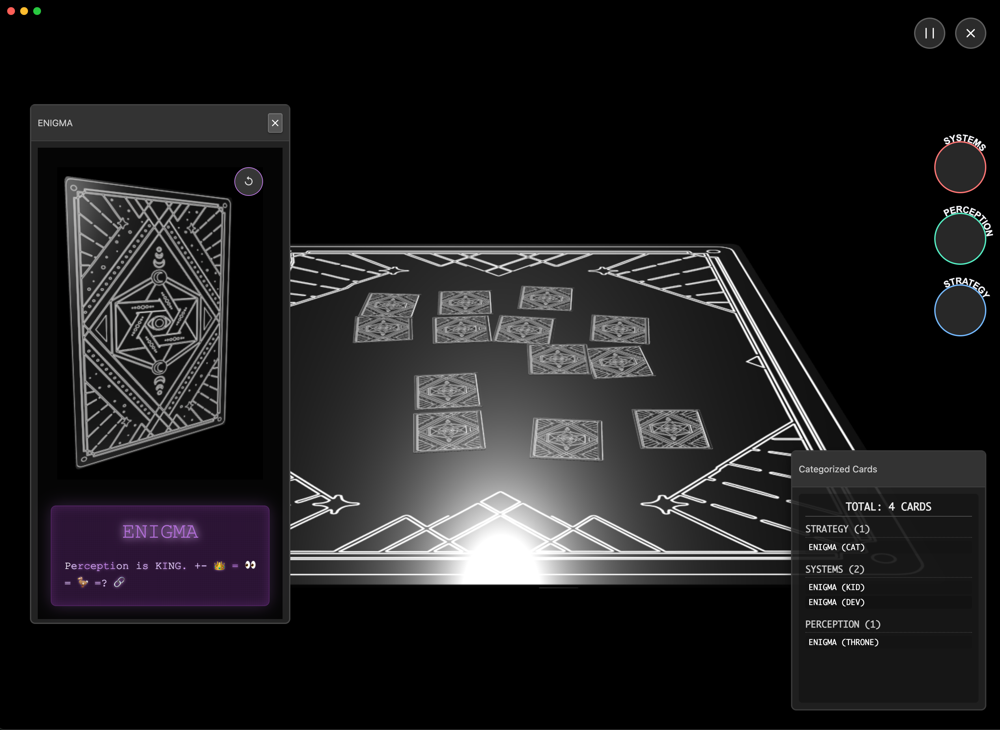

### Tab: MiniGame 888

- **Description**: An elegant and immersive component designed to showcase a single "Enigma"—a combination of a 3D model and descriptive text—in a stylized, animated view. It seamlessly integrates a live-rendered Babylon.js scene with dynamically animated text to create a focused, high-impact presentation. The component is entirely self-contained and manages its own dependencies and assets.

- **Does**:
   
    - **Live 3D Model Rendering**:    
        - Renders a 3D model (passed in as a sourceMesh prop) within a dedicated Babylon.js scene.
        - The scene features a default environment, studio lighting, and an ArcRotateCamera that allows the user to inspect the model from all angles.
    - **Cinematic Introduction Animation**:
        - On load, the component plays a cinematic intro sequence: the 3D model rises from below the screen while rapidly spinning, and the camera simultaneously zooms and pans into its final viewing position.
        - After the intro, the model continues to rotate gently on its Y-axis and hover subtly, creating a constant sense of motion.
    - **Animated "Hacker-Style" Text**:
        - Displays a title and a multi-line description, both of which are fully animatable.
        - The description text uses a "character-by-character" reveal with a color-shifting animation, creating a futuristic, "hacker terminal" effect.
    - **Dynamic Content & Reusability**: The title and description are passed in as props (titleText, descriptionText), making the component fully reusable for displaying different "Enigmas."
    - **Self-Contained & Optimized**:
        - Dynamically loads its own dependencies (Babylon.js) on demand, ensuring it doesn't slow down the initial page load.
        - Includes a "Refresh" button to re-trigger the entire intro animation sequence.
    - **Component-in-Component Capability**: Designed to be loaded and rendered inside other components (like the InfiniteCanvas), demonstrating a powerful "component-in-component" architecture.

- **Can’t**:
   
    - **Load its Own 3D Models**: The component requires a pre-loaded Babylon.js mesh to be passed in via the sourceMesh prop. It does not contain logic to load .glb or other model files itself.    
    - **Provide Advanced Playback Controls**: The animations for the 3D model and the text are hard-coded to autoplay and loop. There are no UI controls to pause, rewind, or modify the animations.
    - **Be Used for General-Purpose Markdown**: The text rendering is highly stylized and specifically designed for the "Enigma" theme. It is not a general-purpose markdown previewer.
    - **Function Offline on First Run**: It requires an internet connection for its initial run to download the Babylon.js library. Subsequent uses will be faster, though the component does not implement caching for the script itself.

-----

### Components 

###### [Minigame 888 Viewer](D.q.minigame888.viewer.md)

###### [Minigame 888 Component](D.q.minigame888.component.md)

