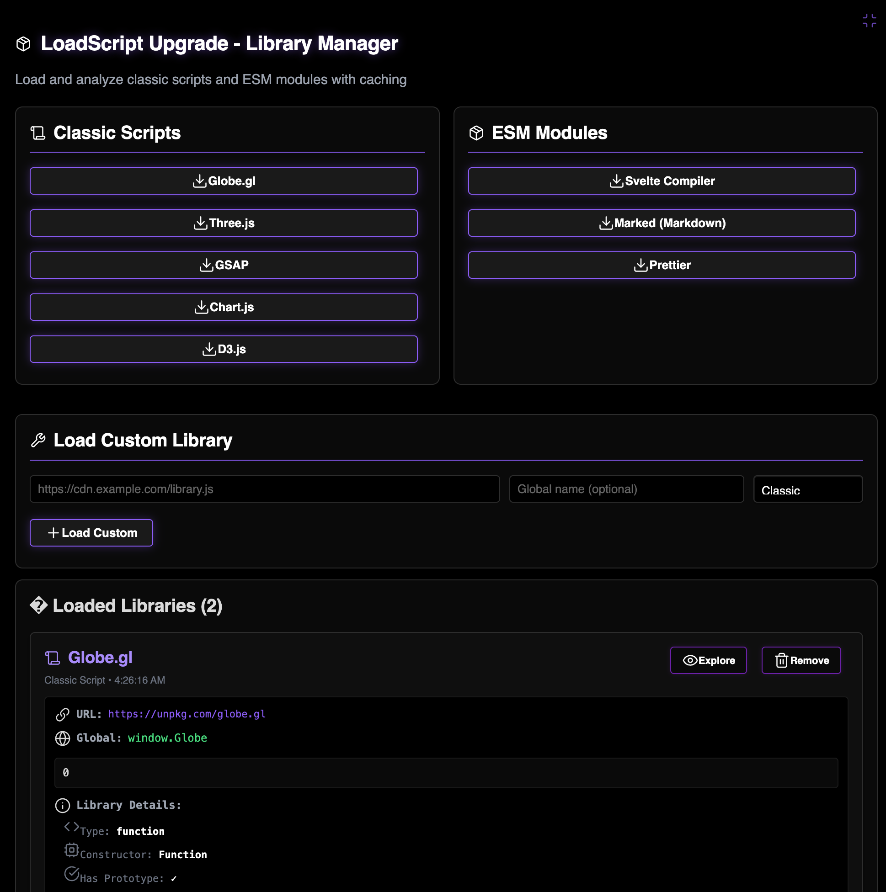
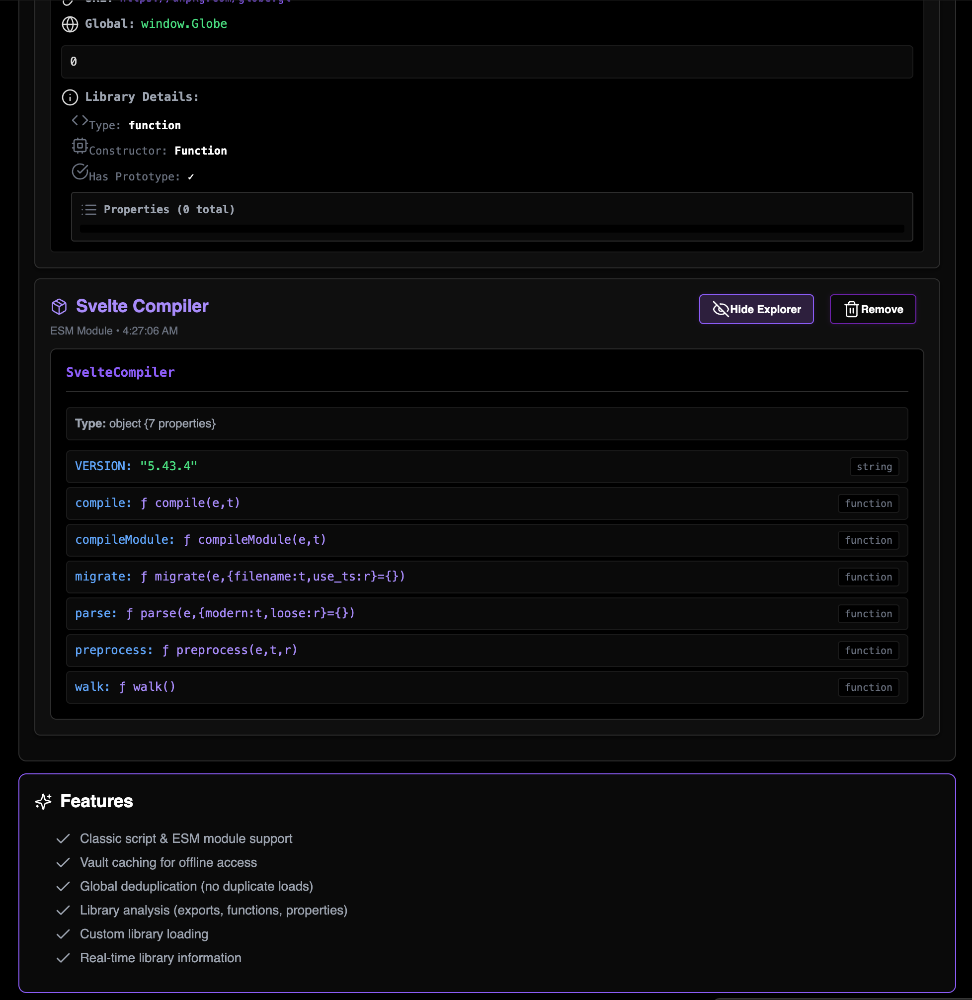

### Tab: Load Script

- **Description**: A comprehensive developer utility and live demonstration tool for dynamically loading external JavaScript libraries. It provides a robust, cached loading mechanism for both classic scripts and modern ESM modules, complete with a user interface to test presets, load custom URLs, and inspect the properties of successfully loaded libraries in real time.

- **Does**:
   
    - **Universal Script Loading**:    
        - **Classic & ESM Support**: Can load both traditional scripts (that create global variables) and modern ECMAScript Modules, automatically handling the different import mechanisms.
        - **URL & Local Paths**: Supports loading from both external web URLs and local file paths within the Obsidian vault.
    - **Intelligent Caching & Deduplication**:
        - **Vault Caching**: When loading a script from a URL for the first time, it saves a copy to a local cache folder (.datacore/script_cache). All subsequent loads use the fast, local cache, enabling full offline functionality.
        - **Global Deduplication**: Checks if a library has already been loaded (by its global variable name) and skips redundant downloads. It also tracks in-progress downloads to prevent race conditions.
    - **Interactive UI & Library Explorer**:
        - **Live Demo Interface**: The component's UI acts as a live testing ground for the script loader itself.
        - **Presets & Custom Loading**: Includes preset buttons to instantly load common libraries (like D3.js, Three.js, GSAP) and a form to load any custom URL as either a classic script or an ESM module.
        - **Real-Time Analysis**: Upon successful loading, it displays a card for the library, showing its type, URL, and a summary of its contents (e.g., number of exports, functions, and properties).
        - **Object Explorer**: Features an "Explore" button for each loaded library that opens a navigable tree view, allowing the user to drill down into the library's nested objects and properties to understand its structure.
    - **Immersive Full-Tab Mode**: Designed to run in a full-pane view that takes over the entire Obsidian window, providing a dedicated interface for library management and exploration.

- **Can’t**:
   
    - **Manage CSS or Other Asset Types**: It is specifically designed for loading and executing JavaScript files (.js) and does not handle CSS stylesheets, images, or other types of assets.    
    - **Resolve Complex Module Dependencies Locally**: While it can load local ESM modules, it does not include a full module bundler or resolver. It cannot handle complex local import statements that point to other local files.
    - **Guarantee Compatibility**: The loader executes scripts directly in the global scope. It cannot prevent conflicts if two different libraries attempt to define the same global variable.
    - **Function Offline on First Run**: It requires an internet connection to download and cache any library that is not already present in the local cache.

----

### Components

###### [Load Script Viewer](D.q.loadscript.viewer.md)

###### [Load Script Component](D.q.loadscript.component.md)

