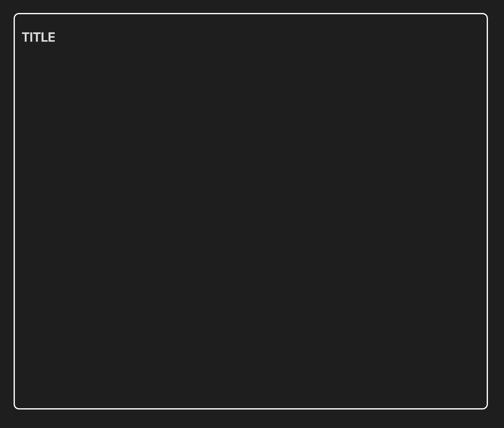

### Tab: Basic View v1

- **Description**: Renders a simple, customizable container in Obsidian notes with a title and styled border, serving as a blank canvas for content.

- **Does**:

    - Displays a titled container with adjustable height and width.
    - Applies a white border and rounded corners for visual clarity.

- **Can’t**:

    - No dynamic content or data querying by default.
    - Limited to static styling without additional customization.

### Components

###### [Basic View Viewer v1](D.q.basicview.viewer.v1.md)

###### [Basic View Component v1](D.q.basicview.component.v1.md)

