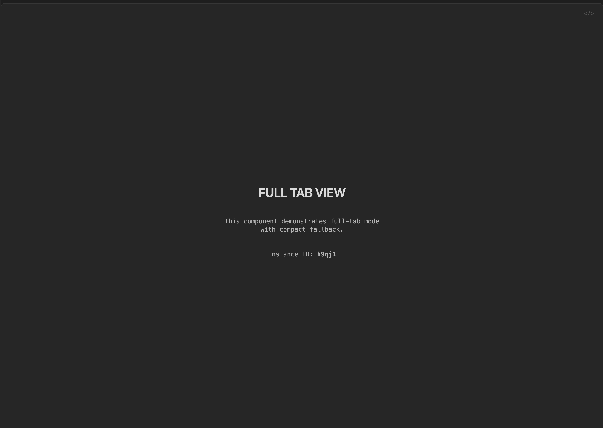

### Tab: Basic View v2

- **Description**: A reusable UI shell designed to wrap other Datacore components, providing a dual-mode system that allows a component to switch between being a compact, inline element and an immersive, full-pane application. It handles the complex DOM manipulation required to create a seamless "app-like" experience within an Obsidian note.

- **Does**:

    - **Dual-Mode Functionality**:
        - **Compact Mode**: Renders as a simple container with a button to expand into the full-tab view, allowing it to be neatly integrated within a standard Markdown note.
        - **Full-Tab Mode**: Dynamically reparents itself in the DOM to fill the entire active Obsidian view pane, providing maximum screen real estate for the wrapped component. It includes an intuitive exit icon to return to compact mode.
    - **Clean DOM Management**: When entering full-tab mode, it leaves a placeholder element behind in its original location. This ensures the document's layout remains stable and is restored perfectly upon exiting full-tab mode, preventing any disruption to the note's content.
        
- **Can’t**:

    - Provide any content or functionality on its own; it is a shell designed to wrap another component.
    - Style the child component placed within it; all content styling is inherited from the nested component.
    - Fetch, process, or manage any data. Its purpose is strictly presentational and structural.
    - Persist its view mode (compact/full-tab) across Obsidian sessions or note reloads; it will always initialize in its default full-tab state.

----

### COMPONENTS

###### [Basic View Viewer v2](D.q.basicview.viewer.v2.md)

###### [Basic View Component v2](D.q.basicview.component.v2.md)

