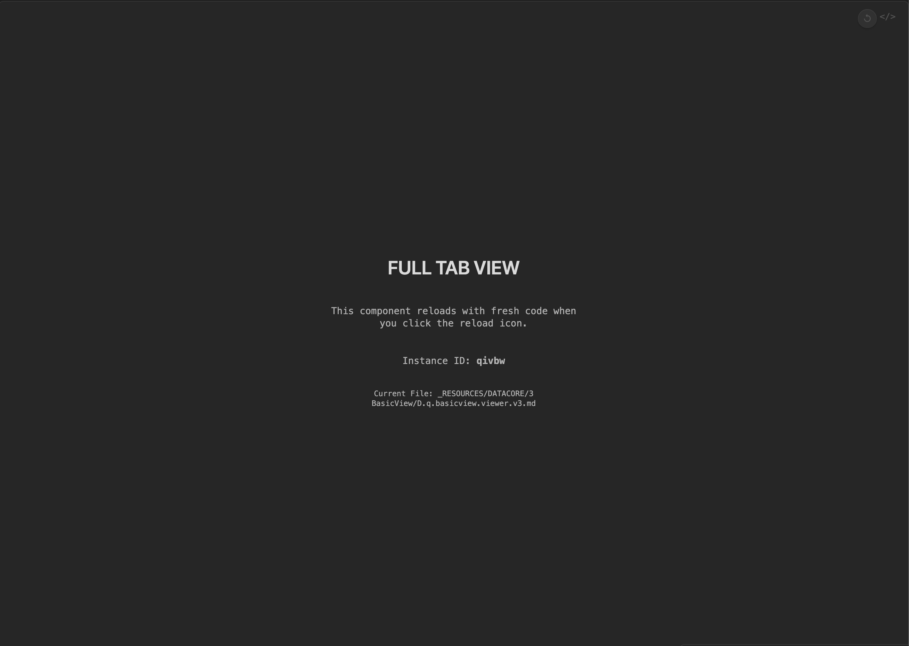

### Tab: Basic View v3

- **Description**: An advanced developer-focused UI shell that wraps other Datacore components to provide both an immersive, full-pane app experience and a robust, file-based hot-reloading system. It allows developers to iterate on component code with instant feedback by creating temporary, live previews of their changes without modifying the original note.

- **Does**:

    - **Developer Hot-Reload**:
        - Features a dedicated reload icon that, when clicked, reads the entire content of the current note.
        - It then creates a new, timestamped temporary markdown file in a _RESOURCES/temp directory and writes the note's content into it.
        - Finally, it opens this temporary file in a new pane, forcing Datacore to re-render the component with the very latest code changes. This creates a safe and powerful development loop.
    - **Dual-Mode Functionality**:
        - **Compact Mode**: Renders as a simple inline container with a button to enter the full-tab view. Includes a "Find Codeblock" utility button that copies the current note's path to the clipboard for easy navigation.
        - **Full-Tab Mode**: Dynamically reparents itself in the DOM to fill the entire active Obsidian view pane, providing maximum screen real estate for the wrapped component.
    - **Clean DOM & File Management**:
        - Leaves a placeholder in the DOM when entering full-tab mode to ensure the document layout is perfectly restored.
        - Automatically cleans up previously generated temporary files to reduce clutter in the vault.

- **Can’t**:    

    - Provide any content or functionality on its own; it is a shell designed to wrap and enhance other components.
    - Persist its view mode (compact/full-tab) across sessions; it will always initialize in full-tab mode.
    - Reload code without navigating the user away from the original note; the hot-reload works by opening the temporary preview file.
    - Clean up the most recent temporary file immediately; the temp file used for the current view is only deleted when the component is unmounted or Obsidian is restarted.

----

### COMPONENTS

###### [Basic View Viewer v3](D.q.basicview.viewer.v3.md)

###### [Basic View Component v3](D.q.basicview.component.v3.md)
