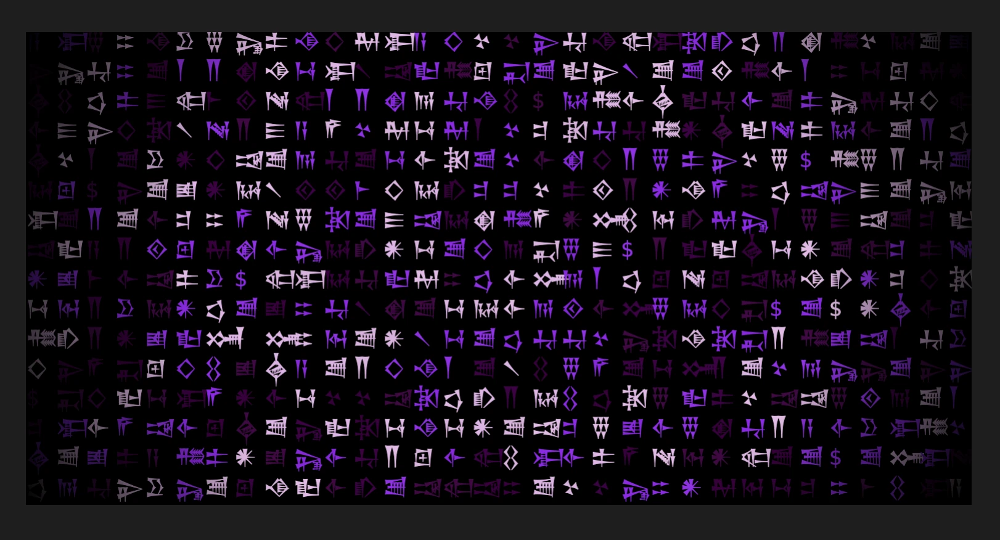

### Tab: Matrix Glitch Wall

- **Description**: A dynamic and highly configurable component that generates a full-screen, generative art piece based on typography. It renders a grid of constantly shifting cuneiform-like symbols, creating a mesmerizing "digital rain" or "matrix" style glitch effect. The component includes a slide-out editor that allows for real-time customization of the animation's colors, speed, and other visual properties. Redesign from [ReactBits](https://www.reactbits.dev/)

- **Does**:
   
    - **Generative Typographic Animation**:    
        - Fills the entire container with a grid of characters, which are continuously and randomly replaced with different symbols from a predefined set.
        - The animation runs efficiently in a requestAnimationFrame loop, drawing directly onto an HTML5 Canvas.
    - **Real-Time Customization Panel**:
        - A slide-out "Edit" panel, which appears on hover, provides a suite of controls to modify the animation's behavior live.
        - **Glitch Speed**: A slider controls the refresh rate of the character grid, allowing for effects ranging from a slow, deliberate flicker to a rapid, chaotic glitch.
        - **Font Size**: A slider adjusts the size of the characters, which in turn changes the density of the grid.
        - **Color Palette Management**: Users can dynamically add, remove, and change the colors used in the animation via a list of color pickers.
        - **Visual Effects**: Toggles are available for enabling smooth color transitions between glitches and adding inner or outer vignette effects to the canvas.
    - **Immersive Full-Screen Experience**:
        - Designed to run in a full-pane mode by default, creating an immersive, ambient background.
        - Includes a button to enter the browser's native fullscreen mode for a completely distraction-free view.
    - **Responsive Grid**: The grid of characters automatically resizes and recalculates its dimensions to fit the container, ensuring the effect works correctly at any screen size.

- **Can’t**:
   
    - **Display User-Defined Text**: The component generates its visual from a hard-coded set of symbols. It cannot be used to display custom messages or text from a note.    
    - **Persist Customizations**: Any changes made in the edit panel (colors, speed, etc.) are for the current session only and will be lost when the component is reloaded. It does not save user-configured themes.
    - **Provide Advanced Animation Controls**: The animation is based on a randomized replacement algorithm. It does not offer controls for animation direction, patterns, or other complex behaviors.

-----

### Components

###### [Matrix Glitch Wall Viewer](D.q.matrixglitchwall.viewer.md)

###### [Matrix Glitch Wall Component](D.q.matrixglitchwall.component.md)
