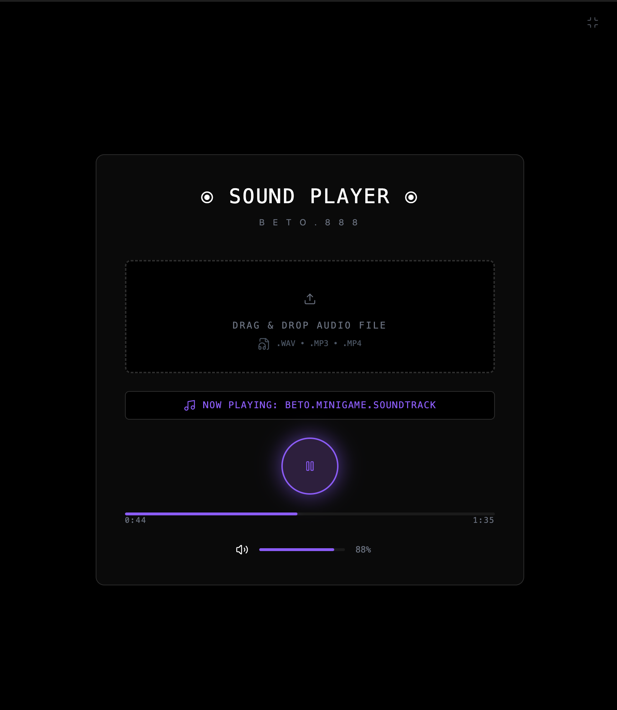

### Tab: Sound Player

- **Description**: A modern, minimalist audio player designed for a focused listening experience within Obsidian. It features a full suite of playback controls and supports dynamic track loading via a drag-and-drop interface. The component is built to run in an immersive, full-pane view, providing a clean and distraction-free environment for audio playback.

- **Does**:
   
    - **Full Audio Playback Controls**:    
        - Provides a complete set of standard audio controls, including a large Play/Pause button, a clickable progress bar to seek through the track, and a volume slider.
        - Displays the current playback time and the total duration of the track.
    - **Drag-and-Drop Track Loading**:
        - Features an intuitive drag-and-drop zone that allows users to load a new audio file directly into the player.
        - Supports common audio formats like .wav, .mp3, and .mp4 (audio only).
        - Can load files dragged directly from the user's operating system or from within the Obsidian file explorer.
    - **Informative Display**: Clearly shows the name of the currently playing track.
    - **Immersive Full-Tab UI**:
        - Designed to run by default in a "Full-Tab Mode" that takes over the entire Obsidian view pane, creating a dedicated, app-like experience.
        - Includes an elegant, dark-themed interface with purple accents and subtle hover effects.
    - **Flexible Display**: Includes a compact mode that acts as a placeholder within a note, allowing the user to enter the full-tab view on demand.

- **Can’t**:
   
    - **Manage Playlists**: It is a single-track player. It does not have functionality for creating, managing, or queuing multiple audio files in a playlist.    
    - **Load Files via a File Picker**: The primary method for loading new tracks is drag-and-drop. It does not include a traditional "Open File" button or dialog.
    - **Remember the Last Played Track**: The player will always load with its default track when the note is reloaded. It does not save or persist the user's last played song across sessions.
    - **Be Customized via Props**: The initial audio file and the player's appearance are hard-coded. It does not accept properties to change its initial state or theme.

----

### Components

###### [Sound Player Viewer](D.q.soundplayer.viewer.md)

###### [Sound Player Component](D.q.soundplayer.component.md)

