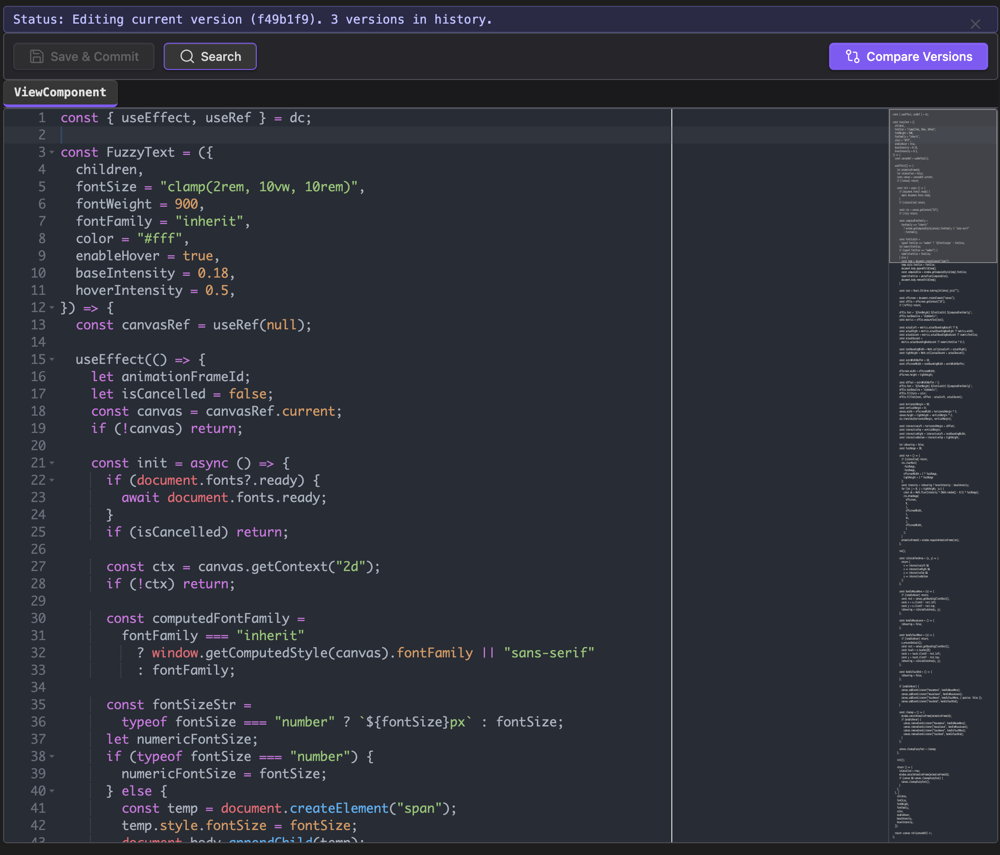
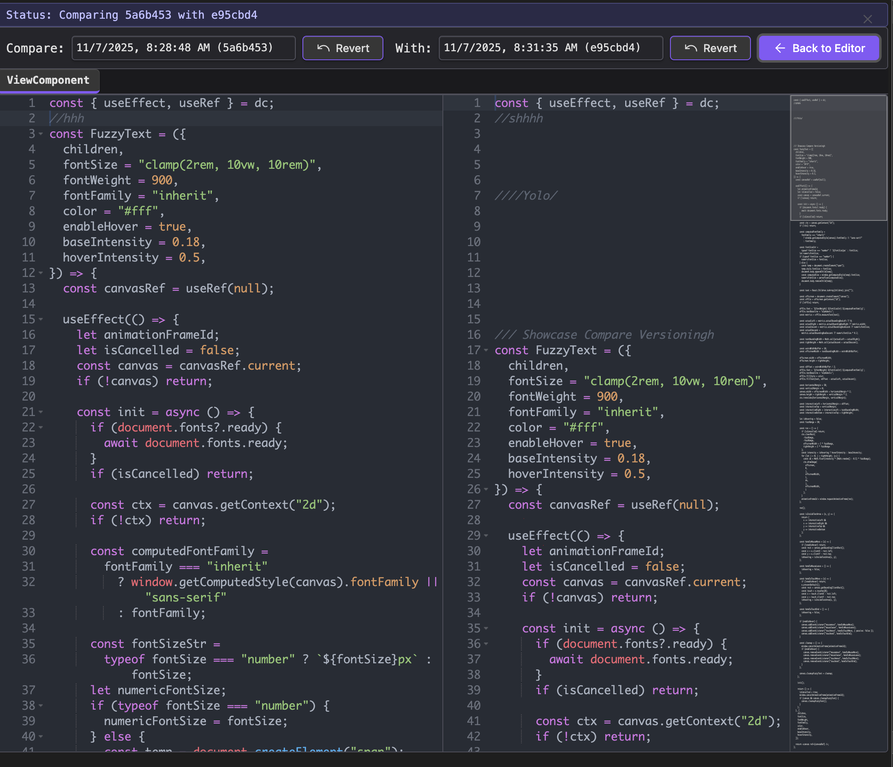

### Tab: Code Editor v2

- **Description**: An advanced, self-contained version control system for individual markdown files, inspired by Git. It automatically tracks changes to a specified file, creating a new "commit" whenever the file is modified. It provides a full-featured UI to browse the version history, compare any two versions with a visual diff, and revert the file to a previous state. The entire system is built on top of the Ace Code Editor for a professional editing experience.
   
- **Does**:

    - **Automatic Version Tracking**:    
        - When loaded, it checks if the target markdown file (specified via a filename prop) has changed since the last time it was viewed.
        - If changes are detected, it automatically creates a new version "commit" by calculating a patch (using Google's Diff-Match-Patch library) and storing it as a JSON object in the vault's .datacore/.git/ directory.
    - **Live Code Editing & Block Parsing**:
        - Renders the file's content in the powerful **Ace Code Editor**, providing a professional editing experience with syntax highlighting and other features.
        - Intelligently parses the markdown file into distinct code blocks based on headers (# Header), allowing users to navigate the file's structure via a clean tabbed interface.
    - **Visual Diff Comparison**:
        - Features a "Compare Versions" mode that displays a list of all historical commits for the file.
        - Users can select any two versions from the history to see a side-by-side, color-coded visual diff, highlighting all insertions and deletions between the two points in time.
    - **File Reversion**: From the comparison view, users can choose to revert the live markdown file to the state of either of the selected historical versions, with a confirmation prompt to prevent accidental data loss.
    - **In-Editor Editing & Saving**: In the main editor view, users can modify the content of any code block. A "Save & Commit" button writes these changes back to the source file, which in turn triggers the creation of a new version on the next load.
    - **Immersive Full-Tab UI**: Designed to run in a full-pane mode that takes over the entire Obsidian view, creating a dedicated, IDE-like environment for version management.

- **Can’t**:
   
    - **Manage Git Repositories**: This is a Git-like system for single files, not a full Git client. It does not interact with .git repositories, branches, or remotes. All version data is stored as JSON objects within the .datacore folder.    
    - **Merge Changes**: It can only revert a file to a previous state. It does not have functionality to merge or resolve conflicts between different versions.
    - **Provide a Graphical History Timeline**: The version history is presented as a simple chronological list in a dropdown menu, not a graphical branch timeline.
    - **Function Without Dependencies**: The component is complex and relies on several dynamically loaded external libraries, including the Ace Code Editor and the Diff-Match-Patch library.

-----

### Components

###### [Code Editor v2 Viewer](D.q.codeeditor.viewer.v2.md)

###### [Code Editor v2 Component](D.q.codeeditor.component.v2.md)

