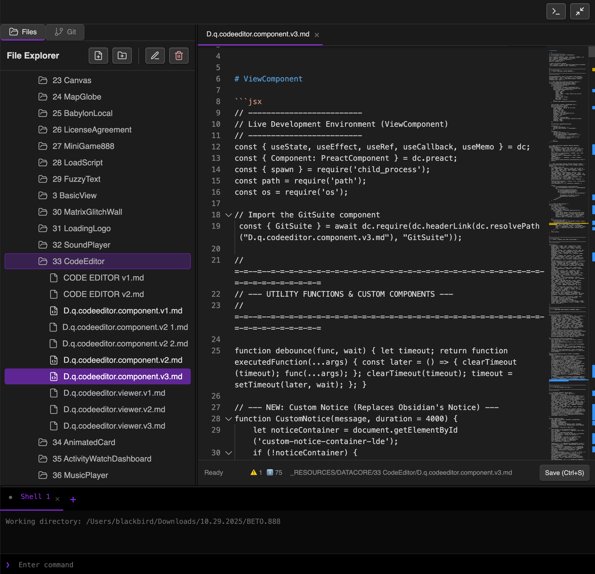

### Tab: Code Editor v3

- **Description**: A full-featured, multi-pane Integrated Development Environment (IDE) that provides a complete Git version control client and a live code editor, all running directly inside Obsidian. It allows developers to manage a local Git repository, stage and commit changes, interact with remote repositories (like GitHub), and edit code in a sophisticated editor, creating a seamless, end-to-end development workflow within a single component.

- **Does**:
   
    - **Full Git Functionality**:    
        - **Repository Management**: Can initialize a new Git repository within a specified folder, or connect to and manage an existing one.
        - **Staging & Committing**: Provides a UI to view unstaged and staged changes, stage individual files or all changes, and write commit messages.
        - **Branching & Merging**: Allows users to view all local and remote branches, switch between them, create new branches, and merge branches into their current HEAD.
        - **Remote Interaction**: Supports adding or updating a remote repository URL (e.g., from GitHub), and can **push** local commits to and **pull** updates from the remote.
    - **Live Code Editing & Prototyping**:
        - **Multi-File Explorer**: Includes a built-in file explorer to navigate the directory structure of the connected repository, with full support for creating, renaming, moving (drag-and-drop), and deleting files and folders.
        - **Tabbed Code Editor**: Features a multi-tabbed interface powered by the **Monaco Editor** (the same editor used in VS Code), allowing multiple files to be open at once.
        - **Live Preview Sandbox**: Includes a dedicated preview pane that can dynamically load and render Datacore components. The preview is sandboxed to prevent it from "escaping" its container and interfering with the IDE's layout.
        - **Best-Practice Linter**: A built-in linter analyzes component code and provides real-time feedback on best practices, such as flagging the use of console.log or inline styles.
    - **Integrated Terminal**: Includes a fully functional, tabbed terminal that runs shell commands directly within the specified repository's directory, enabling access to advanced command-line operations.
    - **Customizable Multi-Pane UI**:
        - The IDE features a responsive, multi-pane layout with resizable sections for the file explorer, editor, and terminal.
        - It is designed to run in an immersive, full-pane "Full Tab" mode for a complete, distraction-free development experience.
    - **Self-Contained & System-Aware**:
        - Automatically checks if Git is installed on the user's system and provides instructions if it is not.
        - Guides users through the initial Git configuration (user.name and user.email) if not already set.

- **Can’t**:
   
    - **Function Without Git**: The component is entirely dependent on having the Git command-line tool installed and accessible in the system's PATH.    
    - **Resolve Complex Merge Conflicts**: While it can perform merges, it does not include a graphical merge conflict resolution tool. Conflicts must be resolved manually through the editor or terminal.
    - **Provide a Graphical Git History**: The commit history is displayed as a simple, linear list. It does not provide a visual graph of branches and merges.
    - **Function Offline (For Remote Actions)**: All interactions with a remote repository (push, pull, fetch) require an active internet connection.

----

### Components

###### [Code Editor v3 Viewer](D.q.codeeditor.viewer.v3.md)

###### [Code Editor v3 Component](D.q.codeeditor.component.v3.md)

