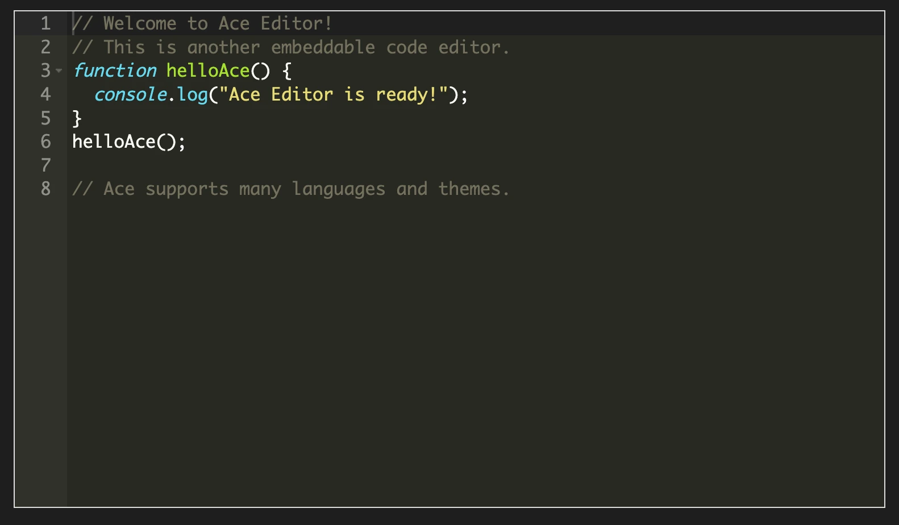

### Tab: Code Editor v1

- **Description**: A powerful, embeddable code editor component powered by the industry-standard **Ace Editor** library. It provides a rich coding interface with syntax highlighting, theming, and autocompletion. Crucially, it utilizes a smart LoadScript utility that fetches the required libraries from a CDN once and **caches them locally** in the vault, ensuring the editor remains fully functional even without an internet connection on subsequent uses.

- **Does**:
   
    - **Professional Code Editing**:        
        - Embeds a fully functional Ace Editor instance directly in the note.
        - Features **Syntax Highlighting** (configured for JavaScript in this view) and **Theming** (Monokai).
        - Supports essential coding features like line numbers, active line highlighting, and gutter indicators.
    - **Smart Dependency Management**:
        - **Offline Caching**: Uses a custom LoadScript module to fetch the Ace library (ace.js) from a CDN. It saves a copy to .datacore/script_cache, so future loads are instant and work offline.
        - **Dynamic Configuration**: Automatically configures Ace's internal paths (basePath, modePath, workerPath) to point to the correct source, allowing Ace to lazy-load extra languages and themes as needed.
    - **Collision Prevention**: Checks the global window object to see if Ace is already loaded before attempting a download, preventing duplicate scripts and conflicts.
    - **Responsive Layout**: The editor container is styled to fit the width of its parent while maintaining a fixed, usable height.

- **Can’t**:
   
    - **Execute Code**: This component is strictly an editor interface. It does not include a runtime engine to execute the code written inside it (unlike the "Actions Flow" runtime).        
    - **Persist Changes (in this view)**: In this specific implementation, the initial code content is hardcoded for demonstration. It does not currently automatically save changes back to a file in the vault (though the component can be extended to do so).
    - **Switch Languages via UI**: The language mode (javascript) and theme (monokai) are defined in the code. It does not currently have a dropdown menu for the user to change these settings on the fly.

- **Disclaimer**:
   
    - **Network Requirement**: An internet connection is required **only for the very first load** to download the Ace Editor library. All subsequent loads will use the local cache.

----

### Components

###### [Code Editor v1 Viewer](D.q.codeeditor.viewer.v1.md)

###### [Code Editor v1 Component](D.q.codeeditor.component.v1.md)