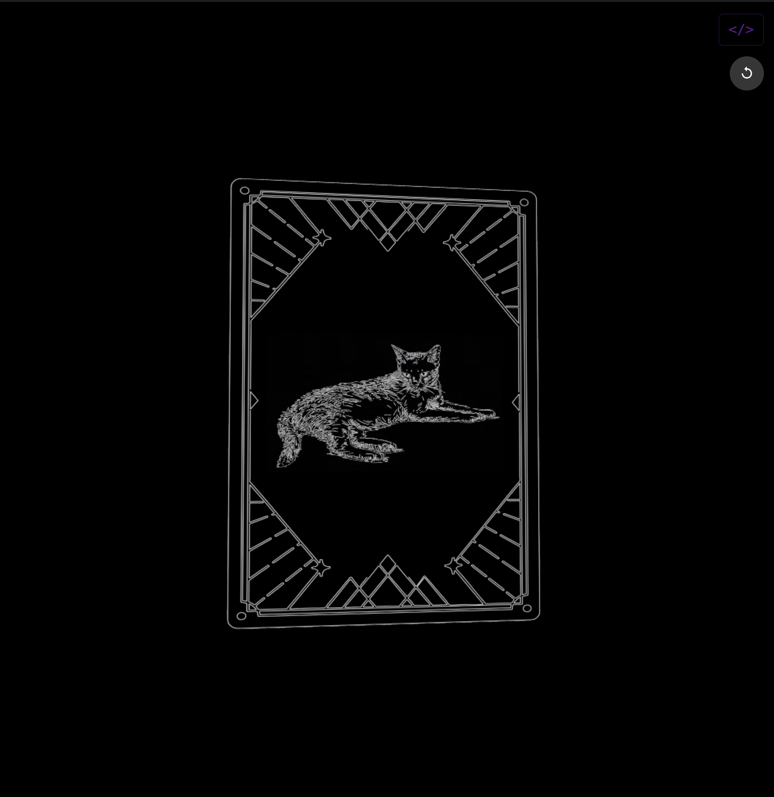

### Tab: AnimatedCard

- **Description**: A visually stunning component that renders a 3D model of a card with interactive, animated video textures. Built with Babylon.js, it provides an immersive, full-pane viewing experience where users can rotate the 3D card and trigger different video playback sequences by clicking on its surface. It intelligently preloads and swaps video textures for seamless, on-demand playback.

- **Does**:
   
    - **Live 3D Card Rendering**:    
        - Renders a 3D model of a card with distinct front, back, and edge materials.
        - The back and edges of the card use static image textures.
        - The front of the card is a dynamic video texture that can play animated content.
    - **Interactive Video Playback & Playlist**:
        - The component manages a weighted playlist of video files, allowing for both common and rare videos to be played.
        - Clicking on the front face of the 3D card triggers the next video in the sequence.
        - Includes a "cheat code" to force a rare video to play by holding Shift while clicking.
    - **Seamless Video Buffering**: To ensure smooth transitions, the component employs a double-buffering system. While one video is playing, the next video in the sequence is preloaded in the background on a second, hidden video texture.
    - **Idle Auto-Rotation**: The 3D card gently auto-rotates to showcase its design. This rotation automatically pauses when the user interacts with the camera (panning or zooming) and resumes after a period of inactivity.
    - **Dynamic Dependency Loading**: Automatically checks for and loads the Babylon.js library from a CDN if it's not already available in the current session.
    - **Configurable & Reusable**: The component is designed to be highly reusable, accepting props to change the front and back images, the depth of the card, the edge color, and camera constraints.
    - **Immersive Full-Tab UI**: Designed to run in a full-pane mode that takes over the entire Obsidian view, with a compact fallback option.

- **Can’t**:
  
    - **Visualize Vault Data**: This component is a visual media player. It does not read, parse, or display any data from the vault beyond the specified image and video files.    
    - **Provide Custom Video Controls**: All video playback is controlled by clicking the 3D object. There are no on-screen UI controls to pause, rewind, scrub, or change the volume of the videos.
    - **Function Offline on First Run**: It requires an internet connection for its initial run to download the Babylon.js library.
    - **Persist Playback State**: The video playlist and current playback position are not saved. The component will always restart from the beginning when the note is reloaded.

----

### Components

###### [Animated Card Viewer](D.q.animatedcard.viewer.md)

###### [Animated Card Component](D.q.animatedcard.component.md)

