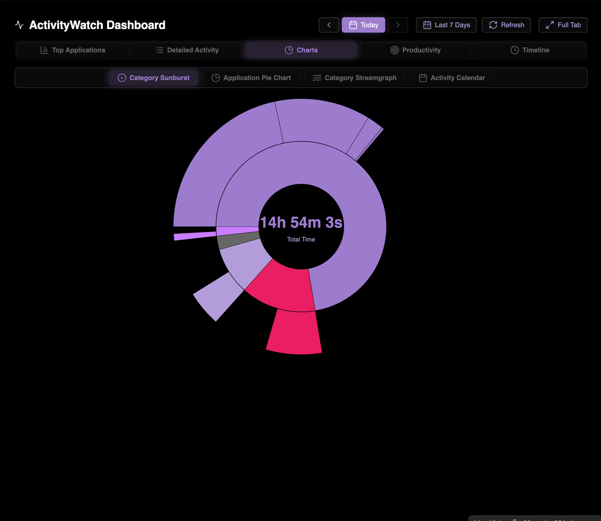
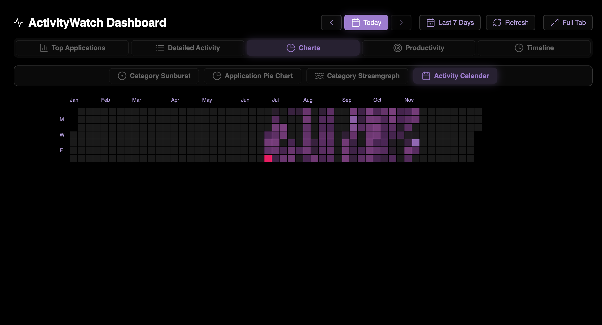
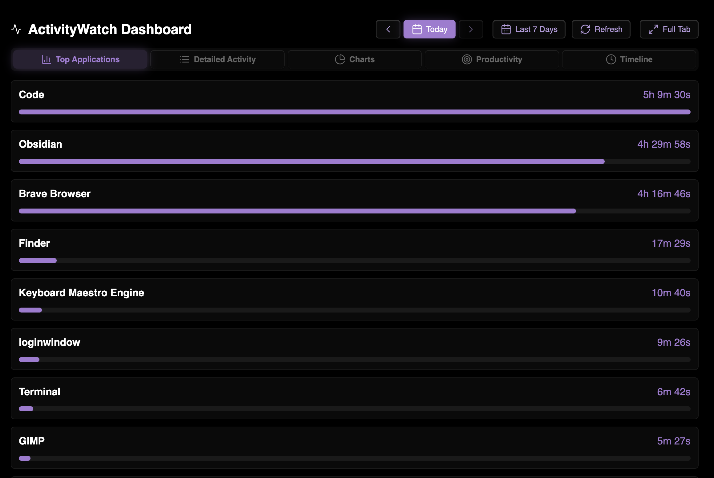
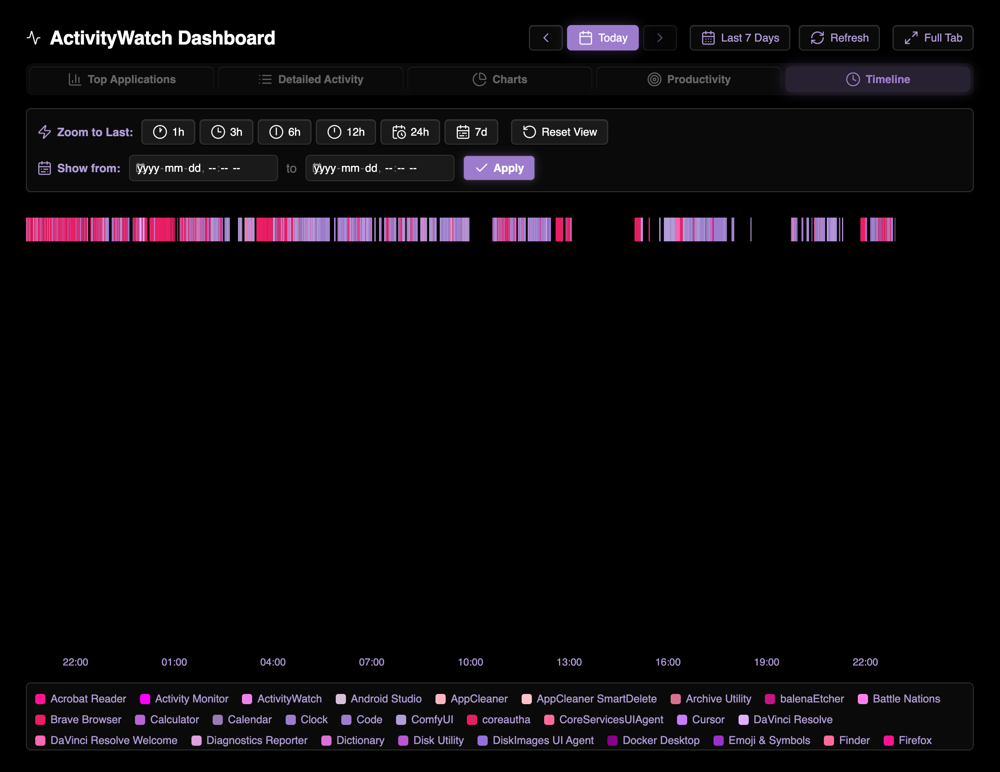

### Tab: ActivityWatch Dashboard

- **Description**: A comprehensive, feature-rich dashboard that connects to a local [ActivityWatch](https://www.google.com/url?sa=E&q=https%3A%2F%2Factivitywatch.net%2F) server to fetch, process, and visualize your personal computing activity. This redesigned version features a polished, modern UI with improved navigation, better visual feedback, and enhanced interactive elements for a more intuitive and aesthetically pleasing user experience.

- **Does**:
   
    - Connects directly to a local ActivityWatch server running on localhost:5600.    
    - Fetches raw event data for application usage and AFK (Away-From-Keyboard) status.
    - Processes and categorizes your activity using a predefined set of rules (e.g., classifying 'Visual Studio Code' as 'Work' and 'Programming').
    - Provides multiple data views through a redesigned tabbed interface:
        - **Charts**: Includes an interactive **Sunburst chart** for hierarchical categories, a **Pie chart** for top applications, a **Calendar Heatmap** for daily totals, and a **Streamgraph** for visualizing activity flow over time.
        - **Detailed View**: A filterable and paginated list of all recorded application/window title events.
        - **Productivity**: A summary view grouping time spent by high-level categories like 'Work', 'Media', and 'Comms', now with expandable sub-categories.
        - **Timeline**: A pannable and zoomable timeline visualizing the precise sequence of events throughout the day, complete with an interactive legend.
    - Features a redesigned header with enhanced date controls to view data for a specific day or the last 7 days.
    - Integrates a ScreenModeHelper to allow the entire dashboard to be expanded to fill the current tab or a separate window

- **Can’t**:
   
    - Connect to a remote or differently configured ActivityWatch server; the localhost:5600 address is hardcoded.    
    - Add or modify the categorization rules from the UI; they are defined within the component's code.
    - Edit or delete any of the underlying ActivityWatch data; it is a read-only dashboard.
    - Function if the ActivityWatch server is not running on the local machine.

---

### Components

###### [ActivityWatch Dashboard Viewer](D.q.activitywatchdashboard.viewer.md)

###### [ActivityWatch Dashboard Component](D.q.activitywatchdashboard.component.md)

