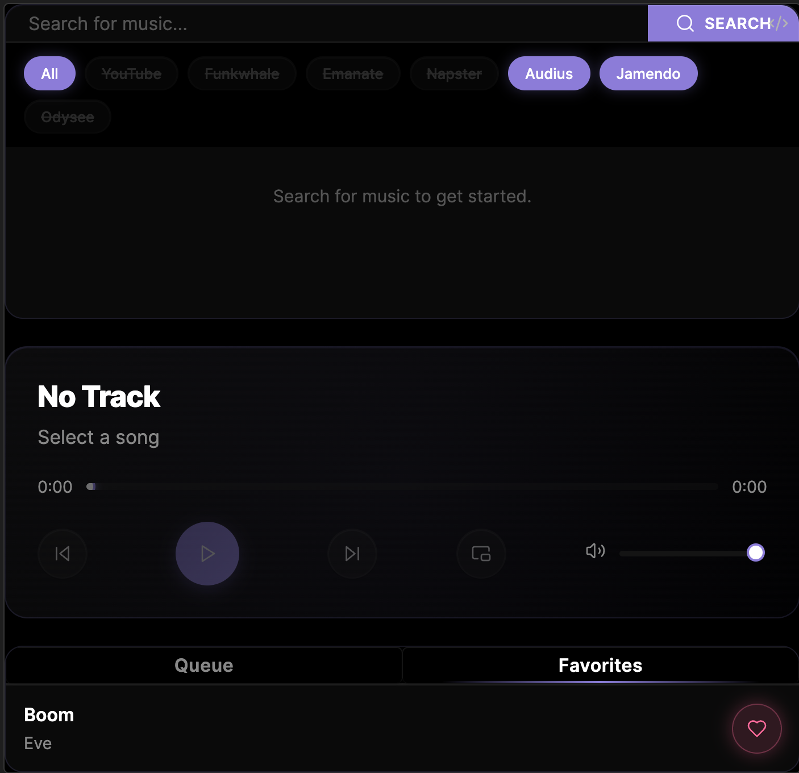
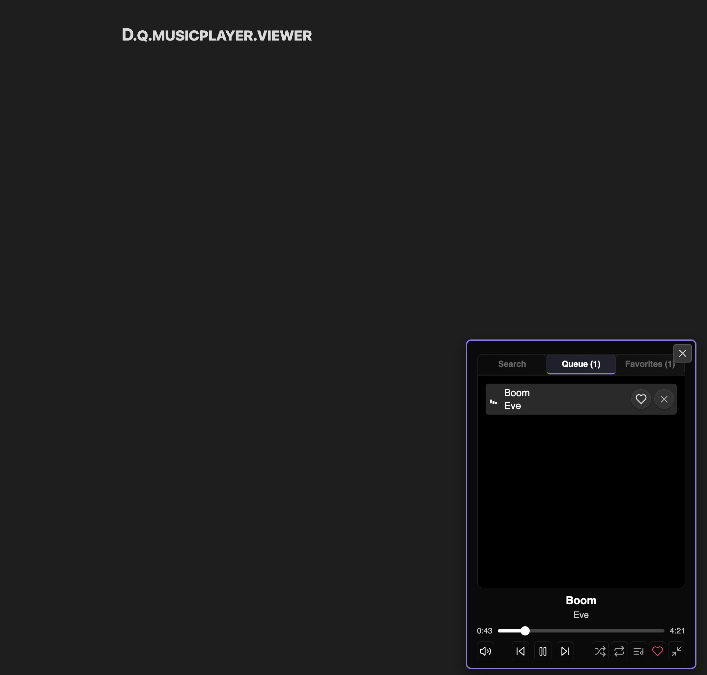

### Tab: MusicPlayer

- **Description**: A complete, self-contained music streaming application that runs directly inside Obsidian. It connects to multiple free music APIs to search for and stream audio, providing a rich user experience with a full suite of playback controls, playlist and library management, and a detachable, fully functional mini-player.

- **Does**:
  
    - **Multi-Source Music Streaming**:    
        - Integrates with multiple royalty-free music APIs, including **Audius** and **Jamendo**, to search for and stream a vast catalog of music.
        - Provides a provider selection UI to enable or disable different music sources.
    - **Comprehensive Music Library & Playlist Management**:
        - **Search**: A powerful search bar to find tracks across all enabled providers.
        - **Favorites**: Allows users to "like" tracks, which saves them to a persistent liked-songs.json file in the vault for long-term storage.
        - **Queue**: A fully functional playback queue where users can add tracks from search results or their favorites. Tracks can be reordered (in a future version) and removed from the queue.
    - **Advanced Player UI & Controls**:
        - A polished main player interface with controls for play/pause, next/previous track, volume, and a custom, seekable progress bar.
        - Includes advanced playback features like **shuffle**, and multiple **loop modes** (none, loop all, loop one).
    - **Detachable, Fully-Featured Mini-Player (PiP)**:
        - Features a "Picture-in-Picture" mode that launches the player in a separate, floating, and draggable window.
        - The mini-player is **fully interactive** and includes two states:
            - **Compact**: A minimal view showing track info, progress, and essential playback controls.
            - **Expanded**: Can be expanded to reveal the full search, queue, and favorites tabs directly within the floating window.
    - **Mobile-Friendly Launcher**: Includes a special mobile mode that renders as a floating action button (FAB) in the corner of the screen. Tapping the button launches the music player, providing an accessible, mobile-app-like experience.

- **Can’t**:
   
    - **Play Local Files**: The player is designed to stream audio from the integrated APIs. It does not have functionality to browse or play local audio files (e.g., .mp3, .wav) stored in the vault.    
    - **Function Offline**: It requires an active internet connection to search for and stream music from the online APIs. While liked songs are saved locally, their audio still needs to be streamed.
    - **Integrate with Mainstream Services**: By design, it only connects to royalty-free or open music APIs. It cannot connect to services like Spotify, Apple Music, or YouTube Music due to API and DRM restrictions.
    - **Download or Save Audio**: It is a streaming-only player and does not include any functionality to download or permanently save audio files to the user's device.

-----

### Components

###### [Music Player Viewer](D.q.musicplayer.viewer.md)

###### [Music Player Component](D.q.musicplayer.component.md)

