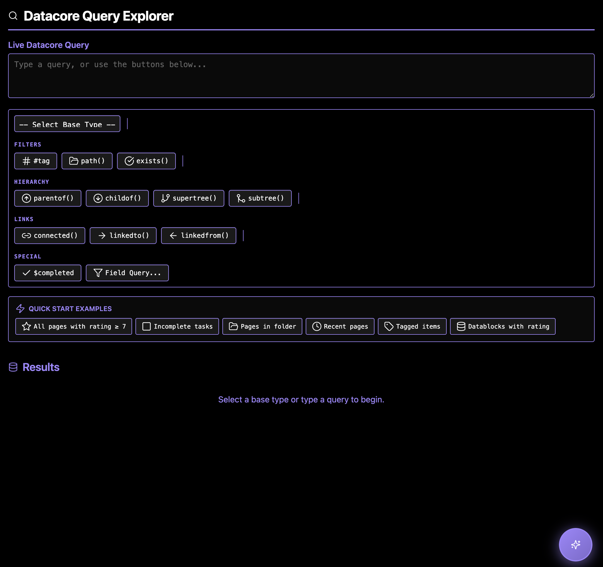
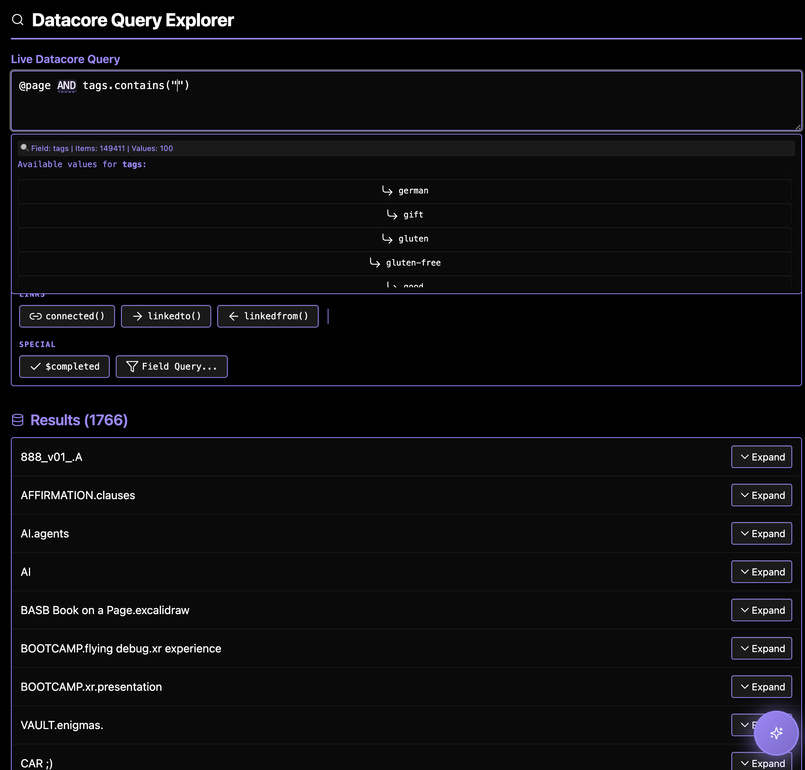

### Tab: Datacore Query Builder

- **Description**: A comprehensive, all-in-one Integrated Development Environment (IDE) for crafting, testing, and understanding Datacore queries. It combines a live query editor with an interactive results viewer, a suite of helper wizards for syntax assistance, and a powerful, conversational AI assistant that can generate and explain queries in natural language.
   
- **Does**:

    - **Live Query Editor & Results**:
        - Provides a text area for writing Datacore queries, which executes the query in real-time as you type.
        - Displays the query results in a paginated list below the editor, with each result being expandable to show its raw data structure.
    - **Intelligent Query-Building Wizards**:
        - **Context-Aware Helpers**: As you type, the editor intelligently detects what you're trying to do and summons a relevant helper. For example, typing # brings up a list of all tags in your vault, path(" shows a list of folders, and typing $ after an operator suggests relevant fields.
        - **Operator Toggling**: Logic operators like AND and OR become clickable hotspots, allowing you to easily toggle between them or add a !not condition.
        - **Filter Wizard**: A dedicated "Field Query" button guides you step-by-step through creating a filter, helping you select a property, an operator (like > or .contains), and a value.
    - **Conversational AI Assistant** {WIP }:
		- NOT FULLY OPERATIONS, tho UI/UX flows has been created
        - **Floating AI Chat**: Includes a floating, draggable "AI Query Assistant" window that can be launched from a button in the corner of the screen.
        - **Natural Language to Query**: Users can describe the data they want to find in plain English (e.g., "show me all incomplete tasks from my projects folder"), and the AI will generate the corresponding Datacore query.        
        - **Continuous Learning**: The AI assistant learns from user interactions. It saves successful queries and user-provided feedback to a local file, improving its suggestions over time. It can also be taught new rules and limitations about the query language.
        - **Multi-Provider Support**: Can be configured to work with multiple AI providers, including Google Gemini, OpenAI, Anthropic, and Groq.
    - **Immersive Full-Tab UI**:
        - Designed to run in a full-pane mode that takes over the entire Obsidian view, creating a dedicated, app-like environment for query development.
        - Includes a compact mode for simple embedding and a "AI Launcher" mode that only displays the floating AI assistant button.

- **Can’t**:
   
    - **Write Data**: The explorer is a read-only tool for querying and viewing your vault's data. It cannot be used to modify or create notes.    
    - **Function Without an API Key**: The AI Assistant requires the user to provide their own API key for one of the supported AI providers. It will not work without a valid key.
    - **Guarantee AI Accuracy**: The queries generated by the AI are suggestions and may not always be perfectly correct or optimal, especially for complex or ambiguous requests.
    - **Execute Non-Datacore Code**: The query input is specifically for the Datacore query language and cannot be used to run JavaScript or other scripts.

----

###### [Datacore Query Builder Viewer](D.q.datacorequerybuilder.viewer.md)

###### [Datacore Query Builder Component](D.q.datacorequerybuilder.component)