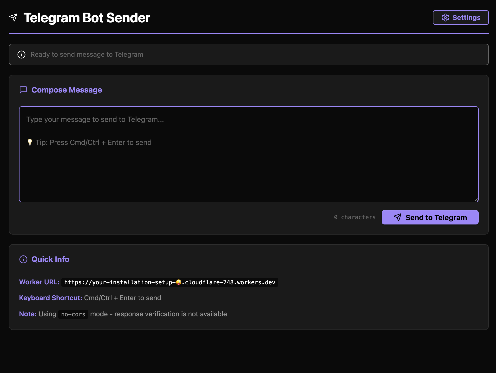

### Tab: Chatbot

- **Description**: A streamlined and secure component that provides a user interface for sending messages to a Telegram bot via a Cloudflare Worker. It acts as a bridge, allowing a user within Obsidian to send text to a Telegram chat without exposing any sensitive bot tokens directly in the component's code.

- **Does**:
   
    - **Secure Message Sending**:    
        - Provides a simple text area for composing messages.
        - Sends the message content to a user-configured Cloudflare Worker URL, which then securely forwards it to a Telegram bot. This architecture ensures that the Telegram Bot Token remains secret and is never exposed in the Datacore component.
    - **Persistent Configuration**:
        - Includes a settings modal where the user can input and save their unique Cloudflare Worker URL.
        - This URL is saved securely and persistently within the Obsidian vault in the .datacore directory, so it only needs to be configured once.
    - **Polished User Experience**:
        - Features a clean, dark-themed UI with a prominent "Send" button and a clear status bar that provides real-time feedback (e.g., "Ready," "Sending...," "Success," "Error").
        - Supports a Cmd/Ctrl + Enter keyboard shortcut to quickly send messages.
        - The entire UI is designed to run in an immersive, full-pane "Full Tab" mode for a focused, app-like experience.
    - **CORS-Compliant**: Sends requests in no-cors mode, which is often necessary when interacting with web services from within a local application environment like Obsidian to avoid cross-origin issues.

- **Can’t**:
   
    - **Receive Messages from Telegram**: It is a one-way communication tool. It can only send messages to a bot; it cannot receive or display incoming messages.    
    - **Manage Telegram Bot Settings**: All bot configuration (like which chat it sends to) must be handled within the Cloudflare Worker's code. This component only provides the message content.
    - **Function Without a Cloudflare Worker**: The component is entirely dependent on a correctly configured Cloudflare Worker to act as a middleman. It cannot send messages directly to the Telegram API.
    - **Verify Message Delivery**: Due to using no-cors mode for sending, the component can only confirm that the request was sent. It cannot verify whether the message was successfully delivered by the Cloudflare Worker to Telegram.

- **Disclaimer**:
   
    - This component requires a separate, user-provided Cloudflare Worker to be set up and deployed. It is a powerful utility but serves as a proof-of-concept for integrating Datacore with external serverless functions. The security and functionality of the message delivery depend entirely on the user's Cloudflare Worker implementation.

----

### Components

###### [Chatbot Viewer](D.q.chatbot.viewer.md)

###### [Chatbot Component](D.q.chatbot.component.md)

