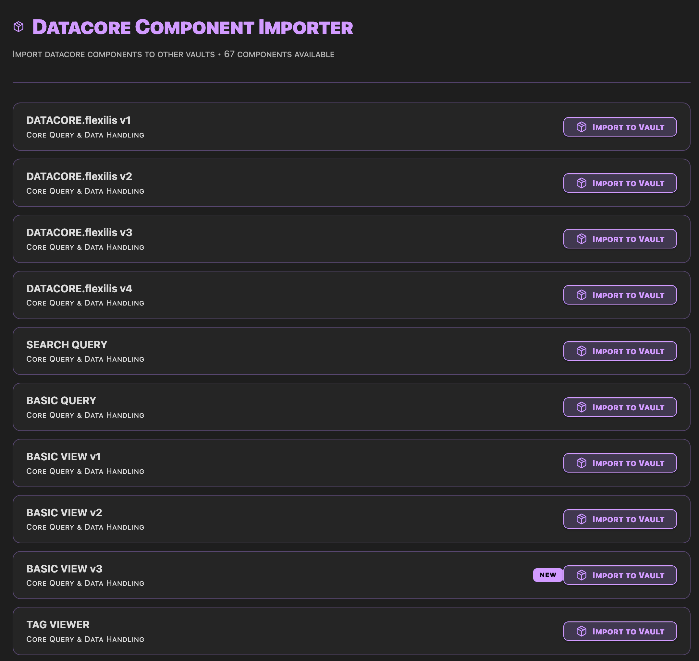
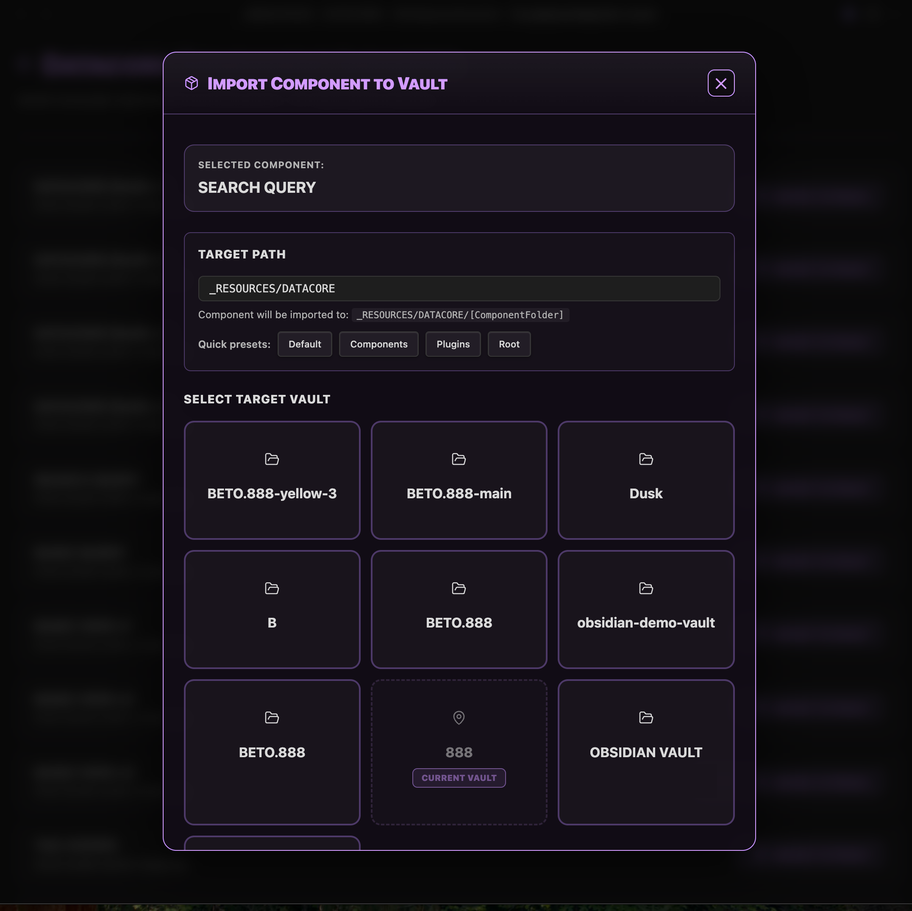

### Tab: Datacore Importer

- **Description**: An advanced developer and power-user utility that allows you to browse and import Datacore components from a central "showcase" vault into any other Obsidian vault on your system. It automates the entire process of discovering, copying, and providing a ready-to-use code snippet for the imported component, creating a seamless cross-vault workflow.

- **Does**:
   
    - **Dynamic Component Discovery**:    
        - Automatically reads and parses a central DATACORE.showcase.md file to build a rich, categorized list of available components.
        - Displays components with special tags like { NEW }, { PROTOTYPE }, and { FEATURED } to highlight their status.
    - **Cross-Vault Import Functionality**:
        - **Automatic Vault Detection**: Uses Node.js and Electron APIs to automatically discover all other Obsidian vaults configured on the user's machine by reading the global obsidian.json file.
        - **Targeted Import UI**: When a user clicks "Import," it presents a modal showing all available vaults, allowing the user to select a destination.
        - **Customizable Path**: Lets the user specify the exact folder path (e.g., _RESOURCES/DATACORE) where the component should be installed in the target vault.
    - **Complete File Transfer**:
        - Copies the entire component folder—including all .md files, sub-folders, and associated assets like images, music, or 3D models—from the source vault to the target vault.
        - It intelligently skips any files that already exist in the destination to prevent overwriting.
    - **Generates "SmartLoad" Code**:        
        - After a successful import, it provides a pre-generated, minified datacorejsx code block.
        - This "SmartLoad" snippet is designed to be pasted into any note in the new vault. It uses a dynamic query to find the component's file, making it resilient to future file moves or renames.
    - **Immersive Full-Tab UI**: Designed to run in a full-pane mode that takes over the entire Obsidian view, providing a dedicated, app-like interface for browsing and managing imports.

- **Can’t**:
   
    - **Function in a Web Browser**: The core functionality of discovering and writing to other vaults is entirely dependent on running within the Obsidian desktop application, which provides access to Node.js and Electron APIs. It will not work in a browser.    
    - **Discover Vaults in Non-Standard Configurations**: It relies on finding the standard obsidian.json configuration file in the application's user data directory. It may not find vaults if this file is moved or inaccessible.
    - **Resolve Import Conflicts**: The importer will simply skip any files that already exist at the destination. It does not provide tools for merging or diffing changes.
    - **Create New Vaults**: It can only import into existing, configured Obsidian vaults.

----

### Components

###### [Datacore Importer Viewer](D.q.datacoreimporter.viewer.md)

###### [Datacore Importer Component](D.q.datacoreimporter.component.md)
