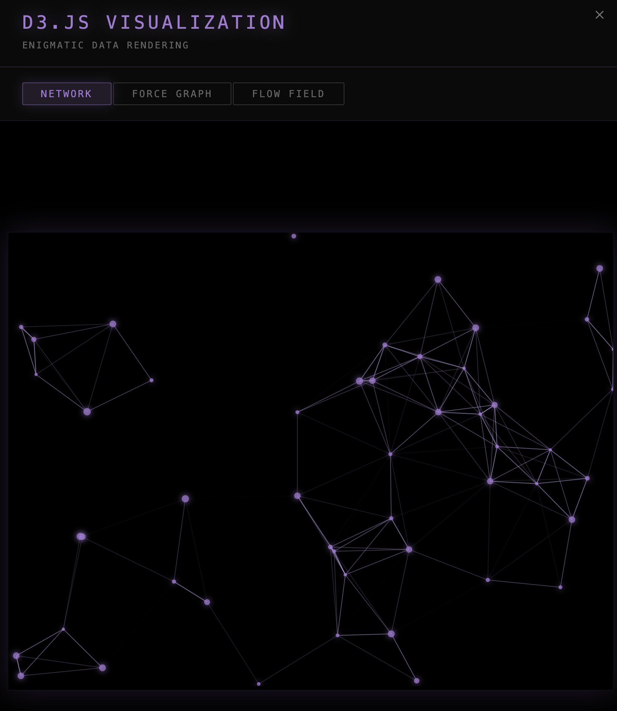
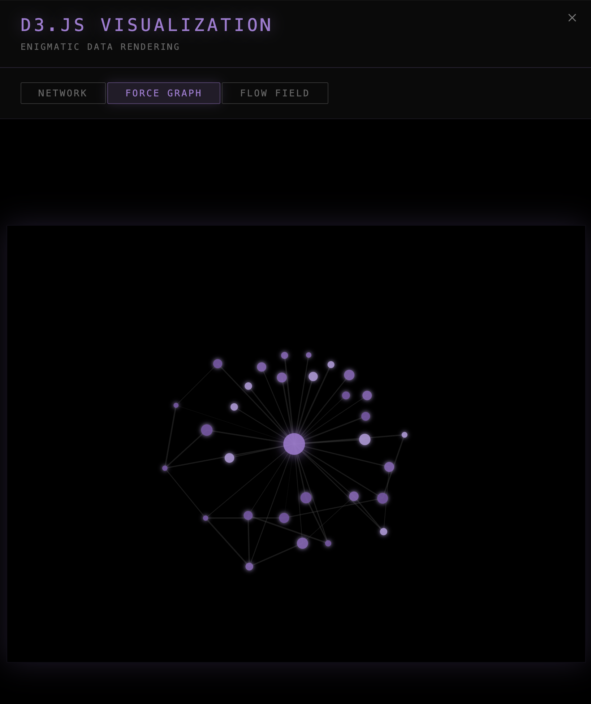
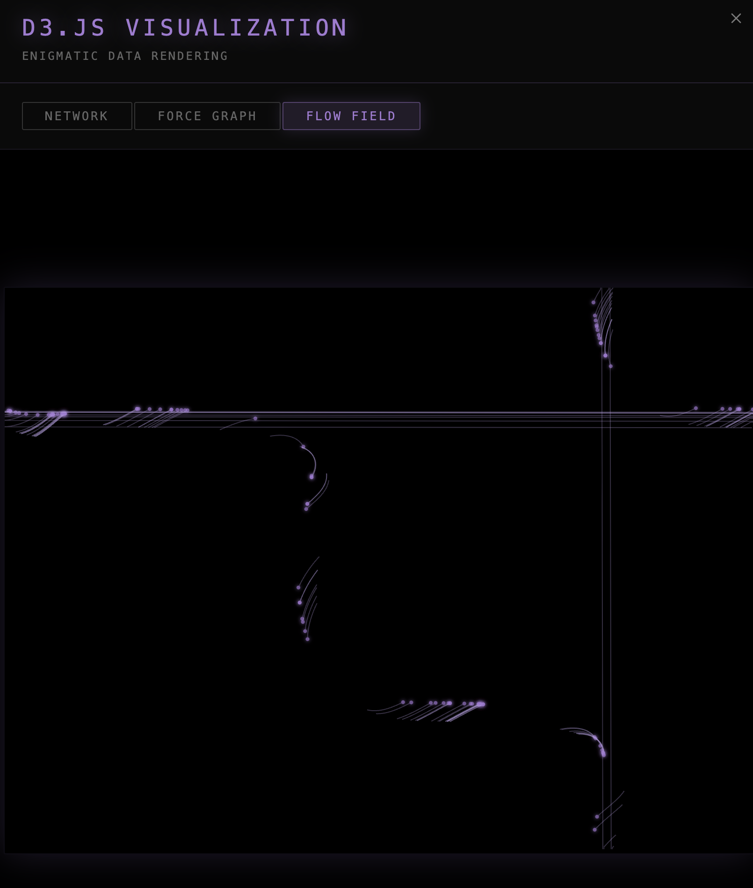

### Tab: D3.js Test

- **Description**: A powerful and immersive data visualization component that integrates the D3.js library directly into Obsidian. It provides a tabbed interface to switch between three distinct, animated graph types: a real-time proximity network, an interactive force-directed graph, and a generative particle flow field. The component is designed to run in a full-pane mode and now intelligently loads and caches its own dependencies for offline use.
   
- **Does**:

    - **Intelligent Dependency Loading & Caching**: Automatically checks for the D3.js library. If not present, it dynamically loads it from a CDN and **saves a copy to a local cache folder** (.datacore/script_cache) within the vault. All subsequent uses load the library instantly from the local cache, enabling **full offline functionality** and improving performance.
    - **Multi-Mode Visualizations**: Offers three distinct, self-contained visualization experiences accessible via a clean tabbed interface:
        - **Network Graph**: Renders a real-time animation of nodes moving within a bounded area, dynamically drawing and fading connections to other nodes based on proximity.
        - **Force-Directed Graph**: Creates a classic physics-based graph where nodes are repelled from each other and pulled together by links. Users can directly interact by clicking and dragging nodes to influence the simulation.
        - **Flow Field**: Generates a mesmerizing artistic visual of particles moving through a dynamic vector field, leaving luminous trails that illustrate the flow.
    - **Immersive Full-Pane UI**: Designed to run by default in a "Full-Tab Mode" that takes over the entire Obsidian view pane for a focused, distraction-free experience.
    - **Compact Fallback**: Includes a compact mode with a button to enter the full-pane view, allowing it to be neatly embedded in any note.

- **Can’t**:
   
    - **Visualize Vault Data**: This component is a demonstration of D3.js capabilities and uses procedurally generated sample data for its graphs. It **does not** read, parse, or visualize any data from your Obsidian vault, such as notes, tags, or links.  
    - **Function Offline on First Run**: It requires an active internet connection **the very first time it runs** in order to download and cache the D3.js library. After this initial setup, the component is fully offline-capable.
    - **Persist Graph State**: The position of nodes in the force-directed graph and the state of the other animations are not saved. The visualizations will reset every time the component is reloaded.
    - **Customize Visuals via Props**: The appearance and behavior of the graphs (e.g., number of nodes, colors, forces, particle count) are hard-coded within the component and cannot be configured through external properties.
    - **Export Visualizations**: There is no built-in functionality to save or export the generated SVG graphs as images or data files.

-----

### Components

###### [D3.JS Test Viewer](D.q.d3jstest.viewer.md)

###### [D3.JS Test Component](_RESOURCES/DATACORE/39%20DatacoreImporter/_resources/datacore/15%20D3JSTest/D.q.d3jstest.component.md)
