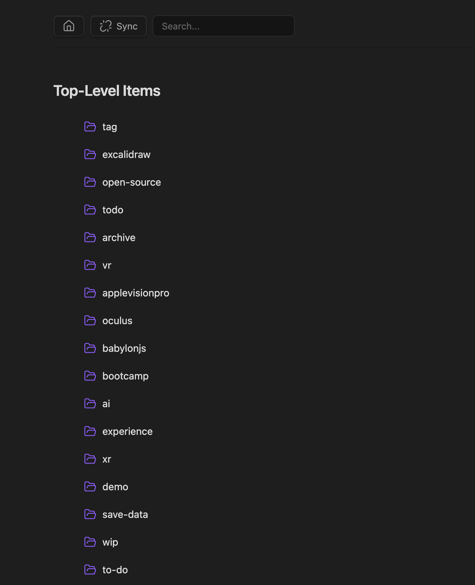

### Tab: Tag Viewer

- **Description**: A hierarchical tag browser that organizes notes into a navigable tree structure based on their tags. It essentially treats tags as folders, allowing users to drill down through nested tags (e.g., `#project/dev/react`) to find related content. It features drag-and-drop reordering to customize the view, a robust search filter, and a special mode to discover "untagged" notes within specific folders.

- **Does**:

    - **Hierarchical Tag Tree**:
        - **Auto-Structure**: Parses all tags in the vault (from frontmatter and inline `#tags`) to build a virtual folder structure.
        - **Navigation**: Users can click through tag levels (e.g., click project -> dev) to narrow down the view.
    - **Advanced Organization**:
        - **Drag-and-Drop Reordering**: Allows users to manually drag notes and tags to reorder them within the list.
        - **Persistence**: Remembers the custom sort order of items via a stored state.
    - **Smart Discovery**:
        - **Untagged Notes**: A dedicated button filters for notes in the PERMANENT folder that have no tags, helping users identify content that needs organizing.
        - **Search**: Real-time filtering of the current view by note name or tag.
    - **Context Sync**:
        - **Sync Mode**: When enabled, clicking a note shows all tags associated with that note in a "Sync" panel, allowing quick navigation to related tag contexts.
    - **Navigation**:
        - **Breadcrumbs**: Interactive path bar to jump back to higher levels.
        - **File Opening**: Clicking a note opens it in the active Obsidian leaf.

- **Can’t**:

    - **Rename/Delete Tags**: It is a browser. It cannot rename tags globally or delete them from files.        
    - **Create New Tags**: You cannot right-click to "New Tag". Tags must exist in a note to appear.
    - **Persist Order Across Reloads**: The custom drag-and-drop order is stored in the component's React state (storedOrder). If the component is unmounted or the note is closed, this custom order is lost (unless expanded to save to a file).

----

### Components

###### [Tag Viewer Viewer](D.q.tagviewer.viewer.md)

###### [Tag Viewer Component](D.q.tagviewer.component.md)