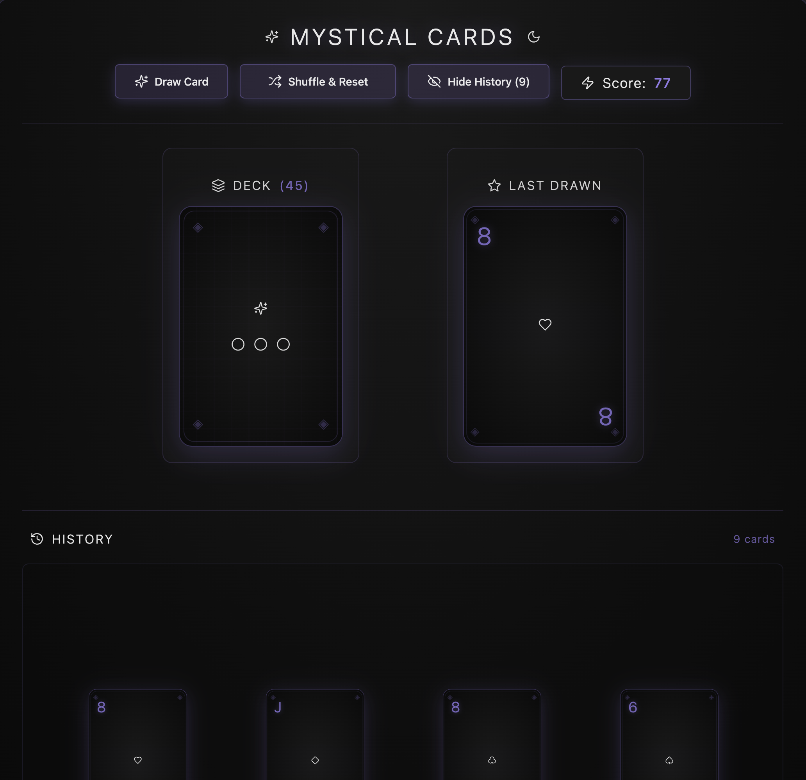

### Tab: Card Picker

- **Description**: An interactive and visually stunning digital card deck component with a mystical, enigmatic theme. It allows a user to draw cards from a shuffled deck, view the drawn card, and browse a history of previously drawn cards. The component features a persistent state, saving the deck's progress so the user can continue their session later.
   
- **Does**:

    - **Full 54-Card Deck**: Simulates a standard 54-card deck, including two distinct Jokers.
    - **Interactive Card Drawing**:
        - Displays a deck of face-down cards. Clicking the deck "draws" the top card.
        - The drawn card is revealed in a separate "Last Drawn" area.
        - The remaining card count is always visible on the deck.
    - **Persistent State**:
        - **Automatically saves** the state of the game after every action (drawing or resetting).
        - The current deck, the last drawn card, the history, and the score are saved to a JSON file (.datacore/cardpicker/card-deck-state.json) in the vault.
        - **Automatically loads** the saved state when the component is re-opened, allowing the user to seamlessly resume their session.
    - **Scoring & History**:
        - Calculates a score based on the value of each drawn card (Jokers are highest).
        - Includes a "Show History" toggle that reveals a scrollable, horizontal timeline of all cards drawn in the current session. Cards in the history can be hovered over for a larger preview.
    - **Shuffle & Reset**: A "Shuffle & Reset" button shuffles a full, fresh deck, clears the history and score, and saves the new state. The button shows a loading animation during the shuffling process.
    - **Immersive Theming & UI**:
        - Features a polished, dark, "enigmatic" theme with glowing purple accents and subtle background patterns.
        - The playing cards are custom-designed with mystical icons and a clean, modern aesthetic.
        - All interactions are accompanied by smooth animations and hover effects.
    - **Full-Tab Experience**: Designed to run in an immersive, full-pane mode that takes over the entire Obsidian view, with a compact fallback option.

- **Can’t**:
   
    - **Play Any Specific Card Game**: It is a simple card drawing simulator. It does not contain the logic for any specific card game like Poker or Blackjack.    
    - **Support Multiple Decks or Players**: It manages a single, shared deck state. It is not a multiplayer component and does not support separate decks for different users or notes.
    - **Be Customized via Props**: The appearance of the cards, the deck composition, and the scoring rules are all hard-coded within the component and cannot be changed through properties.

----

### Components

###### [Card Picker Viewer](D.q.cardpicker.viewer.md)

###### [Card Picker Component](D.q.cardpicker.component.md)

