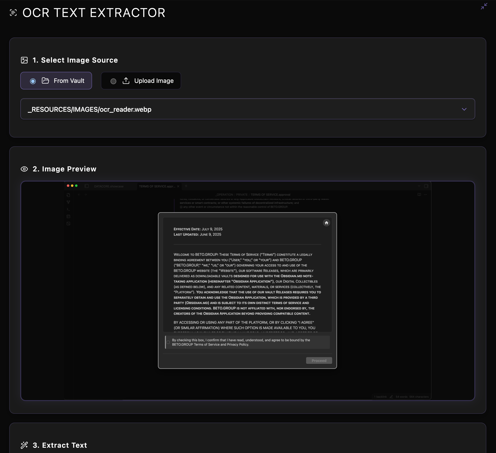

### Tab: OCR Reader

- **Description**: A comprehensive and user-friendly Optical Character Recognition (OCR) tool that runs directly inside Obsidian. It allows users to extract text from various image sources—including files from their vault, uploaded images, or pasted clipboard content—using the Tesseract.js library. The entire process is managed through a clean, modern, and immersive full-pane interface.

- **Does**:
   
    - **Multi-Source Image Input**:    
        - **Vault Integration**: Provides a dropdown menu to select any image file (.png, .jpg, .webp, etc.) directly from the Obsidian vault.
        - **File Upload & Drag-and-Drop**: Features a dedicated drop zone where users can drag and drop an image from their computer or click to open a file picker.
        - **Clipboard Pasting**: The drop zone also accepts images pasted directly from the clipboard (Ctrl/Cmd + V).
    - **Live Image Preview**: Immediately displays a preview of the selected, uploaded, or pasted image so the user can confirm their selection before processing.
    - **Powerful OCR Processing**:
        - Integrates the **Tesseract.js** library to perform high-quality text recognition directly in the browser.
        - Displays a live progress bar during the OCR process, providing real-time feedback on the extraction status.
    - **Dynamic Dependency Loading & Caching**:
        - Intelligently checks if the Tesseract.js library is available and, if not, dynamically loads it from a CDN.
        - Once downloaded, the script is **saved to a local cache** (.datacore/script_cache) within the vault, enabling **full offline functionality** and faster loads on subsequent uses.
    - **Interactive Results Display**:
        - Renders the extracted text in a large, readable text area.
        - Includes a one-click "Copy to Clipboard" button to easily transfer the extracted text for use in other notes or applications.
    - **Immersive Full-Tab UI**:
        - Designed to run by default in a "Full-Tab Mode" that takes over the entire Obsidian view pane.
        - Features a polished, dark-themed interface with purple accents, clear section-based workflow, and helpful status indicators.

- **Can’t**:
   
    - **Process PDFs or Other Document Types**: It is specifically designed for image files and cannot perform OCR on PDF documents, Word files, or other non-image formats.    
    - **Recognize Handwriting with High Accuracy**: Tesseract.js is primarily optimized for printed text. While it may have some success with neat handwriting, its accuracy will be significantly lower compared to typed or printed characters.
    - **Edit or Modify the Source Image**: The tool is for text extraction only; it does not include any image editing capabilities like cropping or rotating.
    - **Function Offline on First Run**: It requires an active internet connection **the very first time it runs** to download and cache the Tesseract.js library and its associated language data. All subsequent uses are fully offline-capable.

- **Disclaimer**:
   
    - This component is a proof-of-concept designed to showcase the integration of a complex, client-side machine learning library (Tesseract.js) within Datacore. The accuracy of the OCR process can vary significantly depending on the quality, language, and font of the source image. It serves as a powerful example of what is possible rather than a finished, production-ready tool.

-----

### Components

###### [OCR Reader Viewer](D.q.ocrreader.viewer.md)

###### [OCR Reader Component](D.q.ocrreader.component.md)

