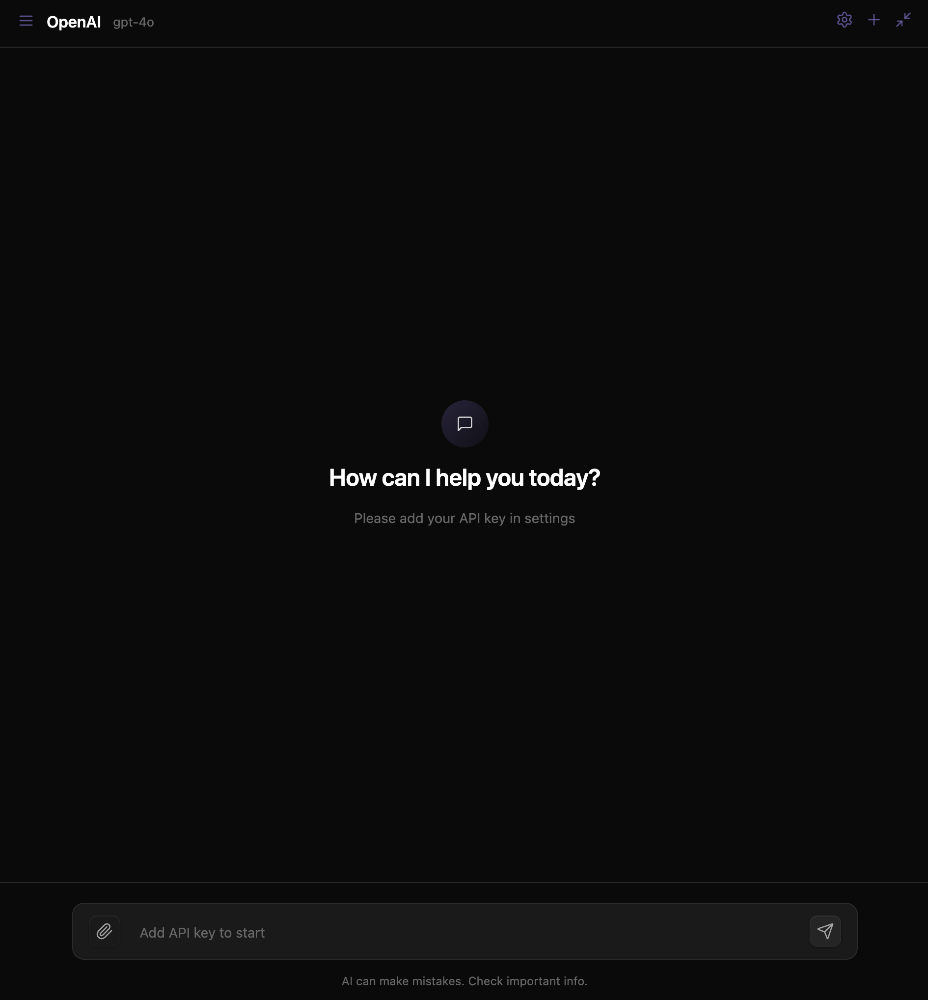

### Tab: Chat LLM

- **Description**: A sophisticated, self-contained AI chat client designed to run directly inside Obsidian. It features a modern, OpenAI-style user interface and supports connections to multiple major AI providers, including local models via Ollama. The component manages chat history, API keys, and model selection, providing a complete, persistent, and versatile conversational AI experience within the vault.

- **Does**:
   
    - **Multi-Provider & Multi-Model Support**:    
        - **Broad Compatibility**: Natively supports connections to a wide range of AI providers, including **OpenAI**, **Google Gemini**, **Anthropic Claude**, **Groq**, and local models via **Ollama**.
        - **Model Selection**: Within the settings, users can select from a list of popular and powerful models available from their chosen provider (e.g., GPT-4o, Claude 3.5 Sonnet, Llama 3.1).
    - **Advanced Chat Capabilities**:
        - **Vision (Image) Support**: Allows users to attach images to their prompts via drag-and-drop, pasting from the clipboard, or a file picker. The images are sent along with the text to vision-capable models (like GPT-4o and Gemini 1.5 Pro).
        - **Persistent Chat History**: Automatically saves every conversation to the vault's .datacore/chatllm/history/ directory. The chat history is persistent across sessions.
    - **Full-Featured UI & UX**:
        - **Modern Chat Interface**: Features a clean, polished UI reminiscent of modern chat applications, with distinct bubbles for user and AI messages, code block rendering, and loading indicators.
        - **Sidebar for History Management**: A slide-out sidebar allows users to browse, load, and delete previous conversations.
        - **Secure API Key Management**: API keys are securely stored in the .datacore/chatllm/.secret/ directory within the vault and are never exposed in the UI after being entered.
        - **Auto-Resizing Input**: The text input area automatically grows as the user types, providing a comfortable and fluid composition experience.
    - **Immersive Full-Tab Experience**:
        - Designed to run in a full-pane mode that takes over the entire Obsidian view, creating a dedicated, app-like environment for interacting with the AI.
        - Includes a compact mode for simple embedding in any note.

- **Can’t**:
   
    - **Function Without API Keys**: Except for Ollama (which runs locally), the component requires the user to provide their own API key for their chosen cloud AI provider.    
    - **Access Vault Content (by default)**: The AI model does not have direct access to the user's notes or vault content. All context must be manually provided by the user in the chat input.
    - **Guarantee AI Accuracy or Privacy**: The accuracy of the AI's responses and the privacy of the conversation data are subject to the terms and policies of the selected third-party AI provider.
    - **Stream Responses**: The component waits for the AI to generate its full response before displaying it. It does not currently support streaming the response token by token.

- **Disclaimer**:
   
    - This is an advanced component that connects to external, third-party AI services and executes local shell commands (for Ollama). It sends your prompts (including any attached images) to your selected provider. **Ensure you are comfortable with the privacy and data usage policies of your chosen AI service before using this component.** It serves as a powerful example of what is possible rather than a finished, production-ready tool.    

----

### Components

###### [Chat LLM Viewer](D.q.chatllm.viewer.md)

###### [Chat LLM Component](D.q.chatllm.component.md)

