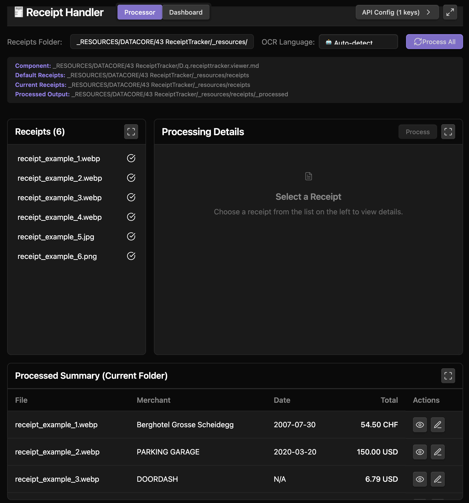
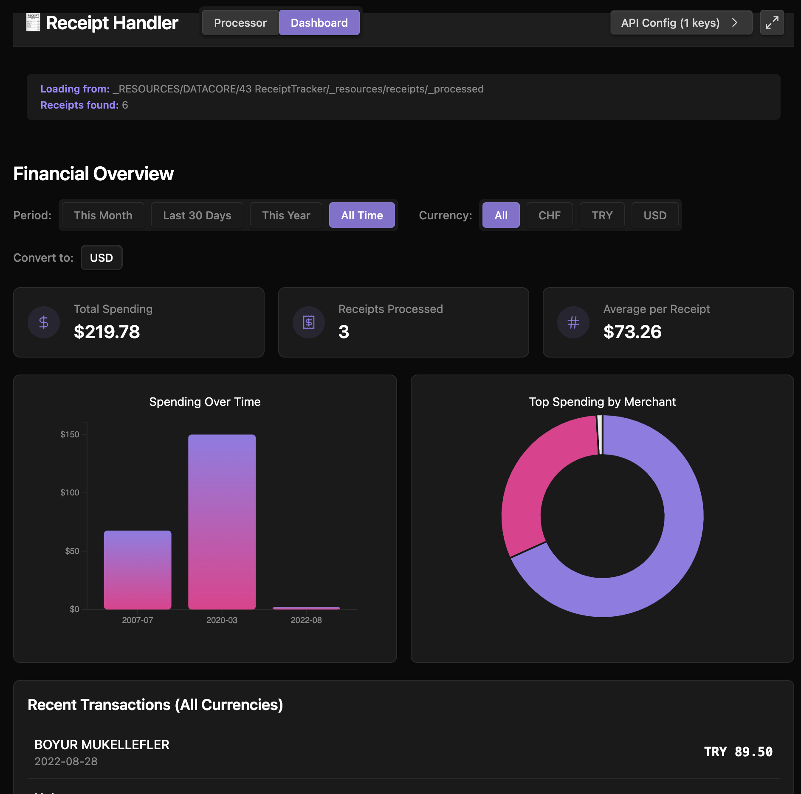

### Tab: Receipt Tracker

- **Description**: A comprehensive, multi-pane application that automates the entire workflow of processing receipt images. It uses local Optical Character Recognition (OCR) to extract raw text, sends that text to a powerful AI model (Groq's Llama 3) for structured data extraction, saves the results as new markdown notes, and then visualizes the aggregated financial data in an interactive dashboard.

- **Does**:
   
    - **End-to-End Automated Workflow**:    
        - **Image Processing**: Scans a user-configurable folder in the vault for receipt images (.png, .jpg, etc.).
        - **OCR Text Extraction**: Uses the **Tesseract.js** library to perform local OCR on a selected image, converting the image into raw text. It includes a language selector and an auto-detect feature for international receipts.
        - **AI-Powered Data Parsing**: Sends the raw text to the **Groq API** (running Llama 3) with a specialized prompt to parse it and return a structured JSON object containing the merchant name, date, total amount, currency, and a list of line items.
        - **Data Persistence**: Creates a new, organized markdown file for each processed receipt in a _processed subfolder. This file contains the extracted data in both YAML frontmatter and a JSON code block for easy querying by tools like Datacore.
    - **Interactive Processor UI**:
        - **Multi-Pane Layout**: Features a professional, resizable multi-pane interface including a file list, a processing panel (with image preview and data tabs), and a summary table.
        - **Focus Mode**: Each panel can be individually expanded to fill the screen for a focused view on files, processing, or the summary.
        - **Manual Editing**: If the AI makes a mistake, users can open an "Edit" modal to manually correct the extracted JSON data, which then overwrites the processed markdown file.
        - **Batch Processing**: Includes a "Process All" button to automatically run the OCR and AI pipeline on all unprocessed receipts in the current folder.
    - **Full Financial Dashboard**:
        - **Data Aggregation**: Switches to a "Dashboard" view that automatically finds and aggregates data from all processed receipt files.
        - **Live Currency Conversion**: When viewing totals across multiple currencies, it fetches real-time exchange rates to convert all amounts to a single base currency for accurate analysis.
        - **Rich Visualizations**: Uses **D3.js** to render interactive charts, including a "Monthly Spending" bar chart and a "Top Spending by Merchant" pie chart.
        - **Advanced Filtering**: Allows dashboard data to be filtered by date range (e.g., "This Month," "This Year") and by specific currencies.
    - **Self-Contained & Resilient**:
        - Dynamically loads its dependencies (Tesseract.js, D3.js) from a CDN and caches them in the vault for fast, offline use on subsequent loads.
        - Includes a secure popover for managing multiple Groq API keys.

- **Can’t**:
   
    - **Function Without API Keys & Internet**: The core AI data extraction requires a valid Groq API key and an active internet connection. The initial setup and the currency conversion feature also require internet access.    
    - **Process PDFs or Non-Image Files**: The OCR process is designed specifically for image files and cannot extract data from PDF documents or other file types.
    - **Guarantee 100% Accuracy**: The final data quality is dependent on both the accuracy of the Tesseract.js OCR and the AI model's ability to interpret the extracted text. Errors in either step can lead to incorrect data.
    - **Edit the Source Image Files**: It is a non-destructive tool that reads receipt images and creates new markdown files. It does not modify the original images in any way.

- **Disclaimer**:
   
    - This is a highly advanced and experimental component that connects to external, third-party AI services (Groq) and financial data APIs. It sends your receipt data to these services for processing. **Ensure you are comfortable with the privacy and data usage policies of these services before use.** It also directly creates and modifies files in your vault. It serves as a powerful example of what is possible rather than a finished, production-ready tool.

---

### COMPONENTS

###### [Receipt Tracker Viewer](D.q.receipttracker.viewer.md)

###### [Receipt Tracker Component](D.q.receipttracker.component.md)