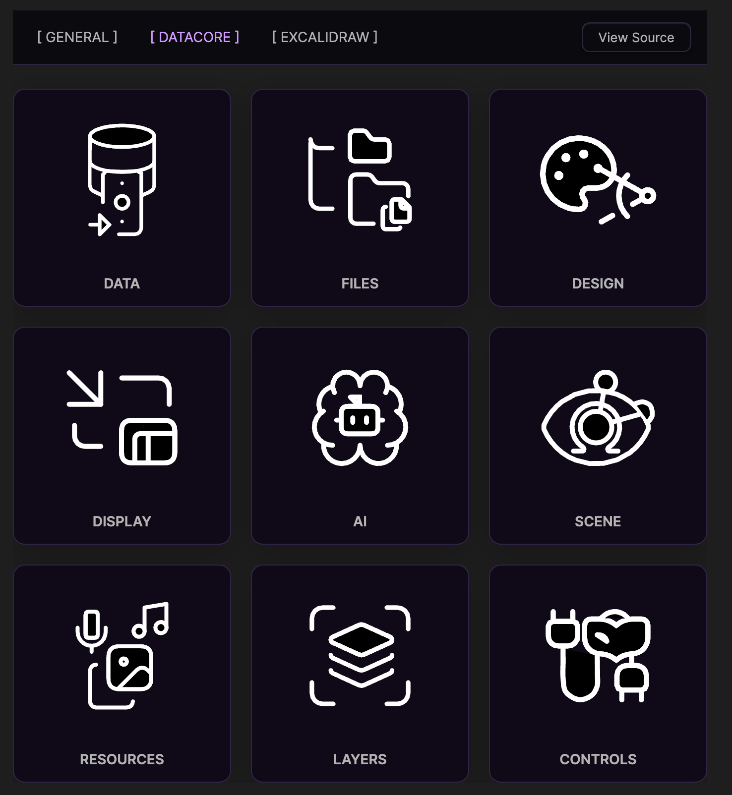
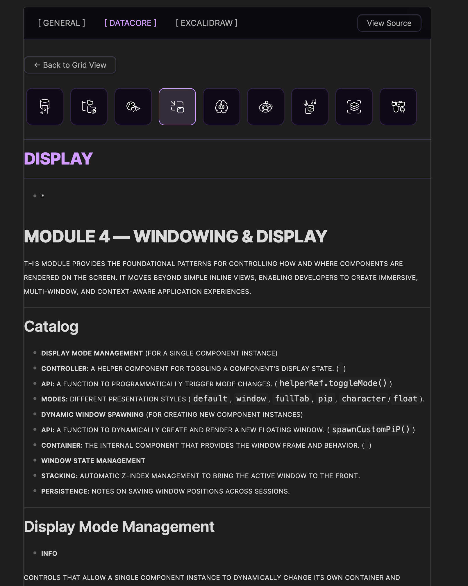

### Tab: Markdown Parser

- **Description**: A fully integrated, self-documenting suite that serves as the central knowledge base for a component library. It intelligently scans a master Markdown file (DOCS.bet8.md) to dynamically build an interactive interface for exploring component categories, viewing detailed documentation, and interacting with live code examples. It features a robust Markdown renderer, a live datacorejsx execution environment, and an elegant UI with a floating outline for easy navigation.

- **Does**:

    - **Dynamic Content Aggregation**:
        - Scans a master file to automatically discover and categorize all documented components without manual configuration.
        - Parses specially structured Markdown files to extract detailed information, including descriptions, usage examples, API signatures, and code blocks.
    - **Interactive Grid and Detail Views**:
        - Presents components in an animated, grid-based "Grid View" for easy browsing, with each component represented by a unique, self-drawing SVG icon.
        - Clicking a component transitions to a "Detail View" which displays its full documentation, including a horizontal icon scroller for quick navigation between related components in the same category.
    - **Advanced Markdown Rendering**:
        - Renders complex Markdown elements including tables, callouts (>[!info]), and internal Obsidian links.
        - Automatically syntax-highlights code blocks using the shiki library, complete with language labels and a one-click "copy" button.
    - **Live datacorejsx Execution**:
        - Identifies and executes datacorejsx code blocks directly within the documentation, using Babel for on-the-fly transpilation.
        - Renders live, interactive React components inside the note, allowing for dynamic examples and functional prototypes to live alongside their documentation.
    - **Intelligent Navigation Aids**:
        - Generates a floating, collapsible "On this page" outline that tracks the user's scroll position.
        - When collapsed, the outline transforms into a minimalist scroll progress indicator with interactive dots for quick jumps between sections.

- **Can’t**:

    - **Standalone Operation**: Function without a properly structured master documentation file (DOCS.bet8.md) to build its index.
    - **External Library Injection**: Execute datacorejsx code blocks that rely on external libraries not globally available in the Datacore environment.
    - **Automatic Documentation Generation**: Automatically generate documentation for components; the content must be manually written in the specified Markdown format.
    - **Direct File Editing**: Edit the documentation files directly; it is a read-only interface.

-----

### COMPONENTS

###### [Markdown Parser Viewer](D.q.markdownparser.viewer.md)

###### [Markdown Parser Component](D.q.markdownparser.component.md)

