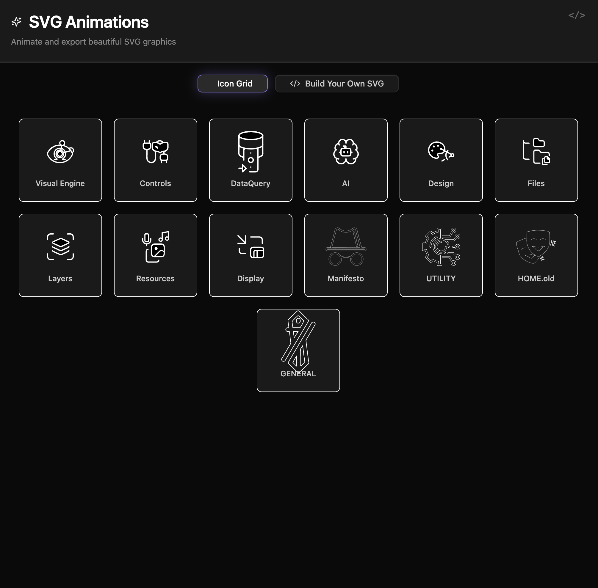
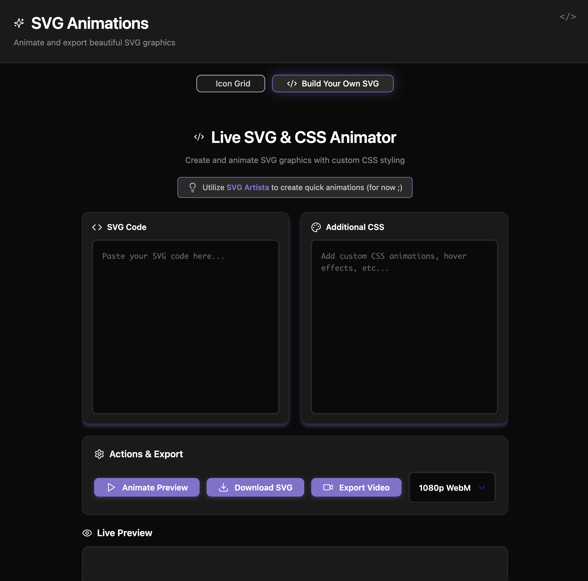

### Tab: SVG Animations

- **Description**: A comprehensive and interactive suite for showcasing and creating CSS-powered SVG animations. It features a gallery of pre-built, animated icons and includes an integrated "Build Your Own" environment where users can paste their own SVG and CSS code, live-preview the animation, and export the final result as either a self-animating SVG file or a WebM video.

- **Does**:
   
    - **Interactive Icon Gallery**:    
        - Displays a grid of SVG icons, each with a unique, pre-defined "line-drawing" animation.
        - **Lazy Animation**: Intelligently triggers the drawing animation for each icon only as it scrolls into the viewport, optimizing performance.
        - **Hover & Focus Interaction**: The animation loops continuously when a user hovers over an icon. Clicking an icon opens a full-screen modal overlay for an enlarged, focused view of the looping animation.
    - **"Build Your Own" SVG Animator**:
        - Provides a dedicated view with two text areas for users to paste their own SVG code and corresponding CSS animation rules.
        - A "Animate Preview" button instantly renders the custom SVG and applies the CSS, allowing for rapid iteration and live testing.
    - **Powerful Export Options**:
        - **Download Self-Animating SVG**: In the "Build Your Own" tool, users can download their creation as a single .svg file with the animation CSS automatically embedded within a `<style>` tag.
        - **Export to Video**: Can render the SVG animation to a .webm video file using the Canvg library. Users can select the output resolution (e.g., 720p, 1080p).
    - **Seamless Obsidian Integration**:
        - The entire UI is designed to respect Obsidian's theme, adapting to both light and dark modes.
        - Runs in an immersive, full-pane "Full Tab" mode by default for a focused experience.

- **Can’t**:
   
    - **Automatically Generate Animation CSS**: The component applies existing CSS to an SVG. It does not automatically create new animation keyframes or styles from a static SVG (though it recommends tools like SVG Artista for this purpose).
    - **Persist Custom Creations**: Any SVG or CSS code entered into the "Build Your Own" tool is for the current session only and is not saved.
    - **Function Offline (for Video Export)**: The video export feature requires an internet connection on its first use to download and cache the Canvg rendering library.
    - **Animate Raster Images**: The component is designed exclusively for vector-based SVG graphics and cannot animate formats like PNG or JPG.

- **Disclaimer**:
   
    - This component is an advanced proof-of-concept for showcasing complex CSS animations and client-side media rendering. The "Build Your Own" functionality is still a work-in-progress and may have some inconsistencies. It serves as a powerful example of what is possible rather than a finished, production-ready tool.

----

### Components

###### [SVG Animations Viewer](D.q.svganimations.viewer.md)

###### [SVG Animations Components](D.q.svganimations.component.md)
