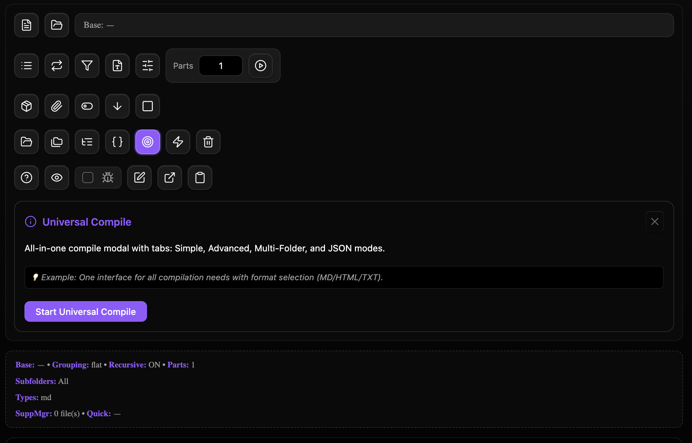

### Tab: Random File Controls

- **Description**: An advanced, all-in-one developer utility designed for complex file and folder operations within Obsidian. It functions as a powerful "Swiss Army knife" for developers, providing a rich UI for viewing, editing, compiling, and running batch operations on vault files. It includes multiple specialized modals for different tasks, from simple file compilation to advanced, rule-based batch processing.

- **Does**:
   
    - **Advanced File Compilation Engine**:    
        - **Multiple Compile Modes**: Includes several distinct methods for compiling multiple markdown files into a single output, accessible through a unified "Universal Compile" modal.
            - **Simple Mode**: Quickly combine all files in a folder, with options for recursion and output format (MD, TXT, HTML).
            - **Advanced Mode**: Offers fine-grained control, including splitting output into multiple parts, generating a table of contents, adding timestamps, and using templates.
            - **Multi-Folder & JSON Modes**: Supports compiling files from multiple, user-selected subfolders (grouped or separately) and can run compilations based on a user-provided JSON configuration.
        - **Supplement Management**: A powerful feature allowing users to "supplement" compilations by injecting content from other files (as headers/footers) or copying files (like CSS or images) alongside the compiled output.
    - **Powerful Batch Operations**:
        - A dedicated "Batch Operations" modal allows users to run commands on multiple selected files at once.
        - Supported operations include: **Rename** (with patterns like {name}-{index}), **Move**, **Delete**, **Copy**, **Archive** (to an _archive folder), and **Tag** (adding or removing frontmatter tags).
    - **Integrated File Explorer & Editor**:
        - Includes a built-in file explorer to navigate the vault, with full support for creating, renaming, moving (drag-and-drop), and deleting files and folders.
        - Features a simple, full-pane text editor to view and make quick modifications to any selected file. Changes can be saved directly back to the vault.
    - **Interactive UI & Helper Modals**:
        - The entire interface is driven by a series of context-aware buttons and specialized modals for each major function (e.g., file pickers, folder pickers, filter managers).
        - **Interactive Help System**: Each button is a "Help Button" that, on a single click, reveals a detailed panel explaining what the tool does and how to use it. A double-click executes the tool's action.
        - **Settings Inspector**: A persistent on-screen panel displays a summary of all currently active compilation settings (base folder, filters, grouping, etc.) for at-a-glance confirmation.
    - **Immersive Full-Tab Experience**: Designed to run in a full-pane mode that takes over the entire Obsidian view, creating a dedicated, IDE-like environment for file management and processing.

- **Can’t**:
   
    - **Provide a Rich Text Editor**: The built-in editor is a simple textarea for raw text/markdown. It does not offer rich text formatting, syntax highlighting, or live preview capabilities.    
    - **Manage Git Repositories**: While it performs many file operations, it is not a Git client and does not interact with version control systems.
    - **Resolve Compilation Conflicts**: If multiple source files have conflicting content (e.g., duplicate headers), the component will simply concatenate them. It does not include any conflict resolution logic.
    - **Persist UI State**: All settings and selections (like the base folder, filters, and supplements) are held in memory and are reset when the note is reloaded.

- **Disclaimer**:
   
    - This is a highly advanced developer tool that performs a wide range of direct file system operations (create, rename, move, delete) within your Obsidian vault. While it includes confirmations for destructive actions like deletion, it should be used with extreme care. Its primary purpose is to showcase the limits of what is possible with a custom file management UI inside Datacore. It serves as a powerful example rather than a finished, production-ready tool.

----

### Components
###### [Random File Controls Viewer](D.q.randomfilecontrols.viewer.md)

###### [Random File Controls Components](D.q.randomfilecontrols.component.md)

