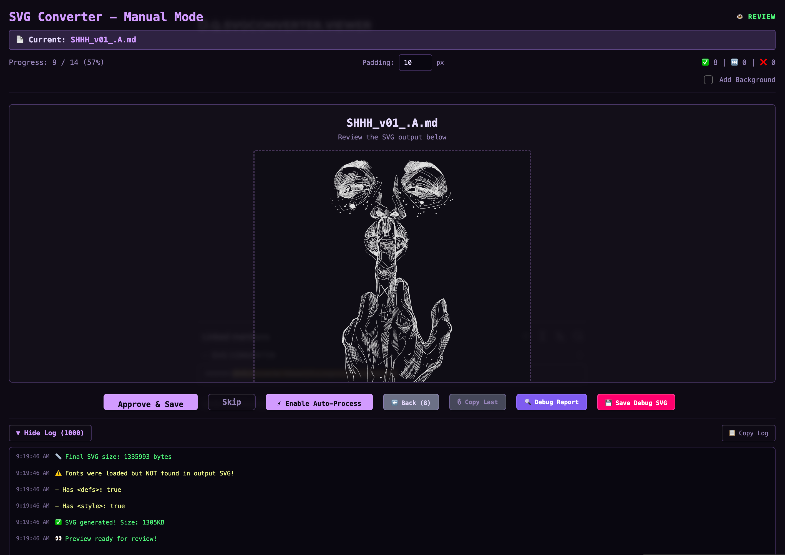

### Tab: SVG Converter

- **Description**: An advanced, automated pipeline for converting Obsidian Excalidraw (.md) files into clean, optimized, and self-contained SVG images. It provides an interactive "Manual Mode" UI that allows a user to step through each conversion, preview the output, and approve the final save. The component intelligently handles complex drawings with embedded SVG dependencies and automatically embeds fonts to ensure perfect, portable rendering.
   
- **Does**:

    - **Automated Batch Conversion Pipeline**:    
        - **File Discovery**: Automatically finds all .md Excalidraw files in a specified vault folder (e.g., svg_samples) that do not yet have a corresponding .svg output file.
        - **Dependency Resolution**: Scans files for embedded Excalidraw drawings (e.g., `![drawing.svg])`. It builds a dependency graph and uses a topological sort to process nested drawings in the correct order, ensuring that dependencies are converted before the files that use them.
        - **Data Parsing & SVG Generation**: Extracts and decompresses the JSON data from Excalidraw files and uses the official **Excalidraw library** to render the drawing data into a clean SVG. It intelligently handles outliers and centers the content to produce a perfectly cropped output.
    - **Self-Contained & Portable SVGs**:
        - **Font Embedding**: Automatically detects which custom fonts are used in a drawing, finds the font files in the vault using a fuzzy search, and **embeds them as base64 data** directly into the final SVG's `<style>` tag. This guarantees text renders perfectly on any device, even if the font isn't installed.
        - **Embedded SVG Resolution**: Correctly finds and renders other SVG files that are embedded within the main Excalidraw drawing, creating a complete, composite image.
    - **Interactive Manual Workflow**:
        - **Step-by-Step Processing**: Guides the user through a "Manual Mode" pipeline, presenting each file for conversion one by one.
        - **Live Preview & Approval**: Shows a live preview of the generated SVG. The user has full control to "Approve & Save" the file or "Skip" it.
        - **Auto-Process Mode**: Includes an "Auto-Process" toggle that will automatically approve valid conversions and skip files with errors, allowing for unattended batch processing.
    - **Advanced Debugging & Control**:
        - **Live Debug Console**: Features an expandable debug console that provides a detailed, color-coded log of every step, from file discovery and dependency loading to font embedding and file saving.
        - **Export Controls**: Allows the user to adjust the padding around the SVG content and add an optional background color.
    - **Self-Contained & Offline-Capable**: Dynamically loads all its dependencies (Excalidraw, Fuse.js, LZ-String) from a CDN and saves them to a local vault cache for fast, offline use on subsequent runs.

- **Can’t**:
   
    - **Edit Excalidraw Drawings**: It is a one-way conversion tool. It can render Excalidraw files but does not provide an interface to edit the drawings themselves.    
    - **Create New Drawings**: It only processes existing .md files found in the specified folder.
    - **Function Offline on First Run**: It requires an internet connection for its initial run to download and cache its core script dependencies (Excalidraw, etc.) and any necessary fonts.

- **Disclaimer**:
   
    - This is a highly advanced developer and automation tool. Its primary purpose is to showcase a complex file processing pipeline with dependency resolution and asset embedding. It directly interacts with your file system by creating new .svg files in your vault. While it is designed to be non-destructive, it should be used with care. It serves as a powerful example of what is possible rather than a finished, production-ready tool.

---

### Components

###### [SVG Converter Viewer](D.q.svgconverter.viewer.md)

###### [SVG Converter Components](D.q.svgconverter.component.md)
