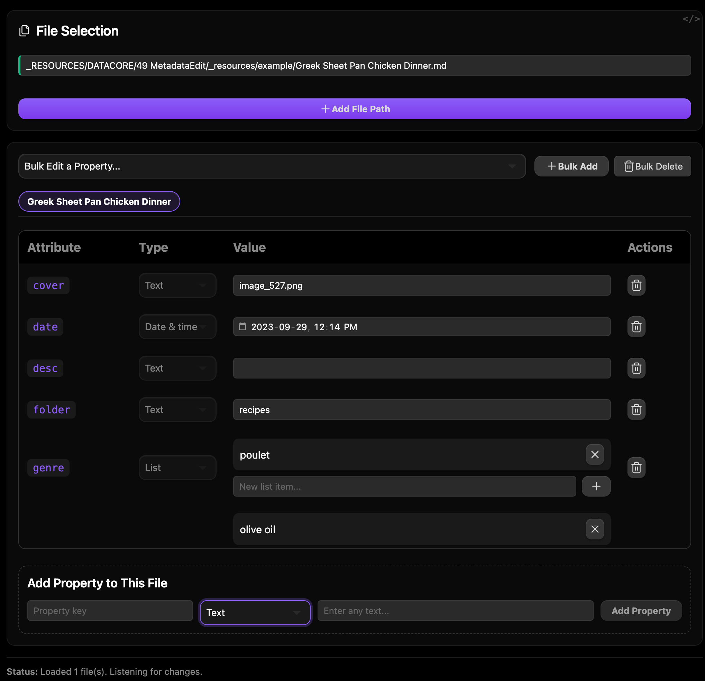

### Tab: Metadata Edit

- **Description**: A comprehensive, multi-file frontmatter editor designed for powerful bulk operations and precise, type-aware property management. It provides a sophisticated, IDE-like interface that allows users to select multiple markdown files and view, edit, add, or delete their YAML metadata properties simultaneously.
   
- **Does**:

    - **Multi-File Editing**:
        - Allows the user to add multiple file paths to a selection list. The component then aggregates the frontmatter from all selected files for editing.
        - Features a tabbed interface to switch between the frontmatter views of individual files in the selection.
    - **Powerful Bulk Operations**:
        - **Bulk Edit**: Select a property that exists across multiple files and update its value for all selected files at once.
        - **Bulk Add**: Add a new property (with a specified type and value) to the frontmatter of all selected files simultaneously.
        - **Bulk Delete**: Select and delete a specific property from the frontmatter of all selected files.
    - **Type-Aware Property Editing**:
        - **Automatic Type Detection**: Intelligently infers the data type of each frontmatter property (e.g., text, number, checkbox, date, list) based on its value.
        - **Specialized UI Controls**: Provides a unique and appropriate UI for editing each property type. This includes a dedicated, interactive **List Editor** for array properties, a checkbox for booleans, a date picker for dates, and standard text inputs for other types.
    - **Live, Two-Way Data Binding**:
        - All changes made in the UI are written **directly back to the YAML frontmatter** of the corresponding markdown files in real-time.
        - It actively watches for external changes to the files' metadata and automatically refreshes the UI to reflect the new state.
    - **Immersive Full-Tab UI**:
        - Designed to run by default in a "Full-Tab Mode" that takes over the entire Obsidian view pane, creating a dedicated, app-like environment for metadata management.            
        - Includes a polished, dark-themed interface with clear sections for file selection, bulk operations, and individual file editing.
           
- **Can’t**:

    - **Edit File Content**: This component is exclusively for editing the YAML frontmatter of markdown files. It does not provide any functionality to view or modify the main content of the notes.
    - **Create New Files**: It operates on existing files. The user must provide valid paths to the files they wish to edit.
    - **Merge or Resolve Conflicts**: If the same property is edited in two different places simultaneously (e.g., in this component and in Obsidian's native editor), the last saved change will overwrite the other. It does not have a conflict resolution system.

- **Disclaimer**:

    - This is an advanced data management tool that directly modifies your markdown files. While it includes confirmation prompts for destructive bulk operations, it should be used with care. It is a powerful proof-of-concept designed to showcase advanced file I/O and state management within Datacore.

----

### Components

###### [Metadata Edit Viewer](D.q.metadataedit.viewer.md)

###### [Metadata Edit Components](D.q.metadataedit.component.md)
