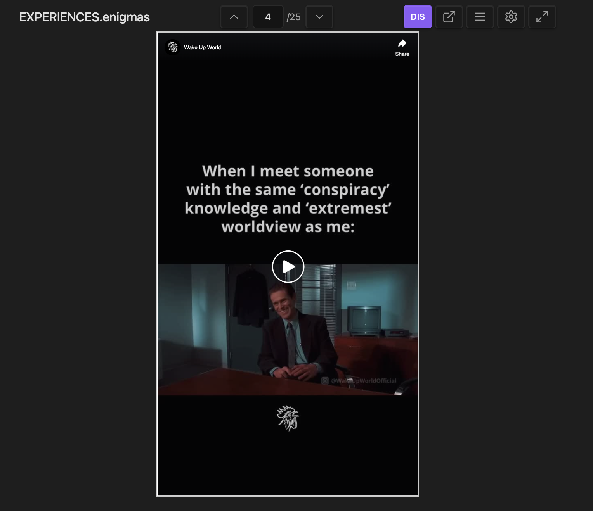

### Tab: Custom Feed

- **Description**: A highly specialized media viewer that parses a designated markdown file to create a browsable, "feed-like" experience for embedded content. It is uniquely designed to simulate the look and feel of various social media platforms by dynamically applying platform-specific styling to iframes. It combines this advanced presentation layer with robust navigation, inline editing, and highly configurable view modes.
 
- **Does**:

    - **Markdown-Powered Feed**: Parses a specified .md file, splitting its content by --- separators to create a navigable, vertical feed of content sections.
    - **Platform-Specific Iframe Styling**: Automatically applies a set of pre-configured "guidelines" (dimensions, scale, positioning) to iframes based on their source URL (e.g., YouTube, Instagram, TikTok, X). This creates an optimized, often mobile-like, viewing experience tailored to each platform.
    - **Advanced Interaction & Navigation**:
        - Navigate through feed items using on-screen buttons, keyboard shortcuts (Alt + W/S), or touch/swipe gestures.
        - Jump directly to any item in the feed using a numeric input.
        - Toggle iframe pointer events on or off to prevent accidental navigation while still allowing for simulated clicks within the embedded content.
    - **Live Inline Editing**: A slide-out editor drawer allows for modifying the raw text of the currently viewed section and saving changes directly back to the source markdown file.
    - **Fine-Grained Manual Control**: An "edit" mode reveals detailed controls to manually adjust all container and iframe dimensions in real-time, allowing for precise customization of the viewing frame.
    - **Configurable View Modes (spawnType)**: Offers complete control over its presentation via the spawnType prop. It can be spawned as:
        - A toggleable full-tab/compact view (fullTab or compact).
        - Locked into either mode, hiding the toggle button (fullTab.locked or compact.locked).
        - A simple inline component with the full-tab functionality completely disabled (disabled).

- **Can’t**:    

    - **Create New Content**: It can only view and edit existing sections within a pre-defined file; it cannot add new sections to or delete sections from the feed via its UI.
    - **Auto-Detect New Platforms**: The iframe styling "guidelines" are hard-coded. It cannot automatically create an optimized view for a new, unknown website; it will use a default layout for any unrecognized URL.
    - **Persist Manual Adjustments**: Any changes made using the "fine controls" (manual iframe/container dimensions) are for the current session only and will be lost on reload. To make them permanent, the IframesGuidelines code must be edited.
    - **Function Without a Correctly Formatted File**: The component is entirely dependent on a target markdown file that contains sections separated by --- and includes valid URLs or `<iframe>` tags. If the file is missing or malformed, the viewer will be empty.

----

### Components

###### [Custom Feed Viewer](D.q.customfeed.viewer.md)

###### [Custom Feed Component](D.q.customfeed.component.md)

